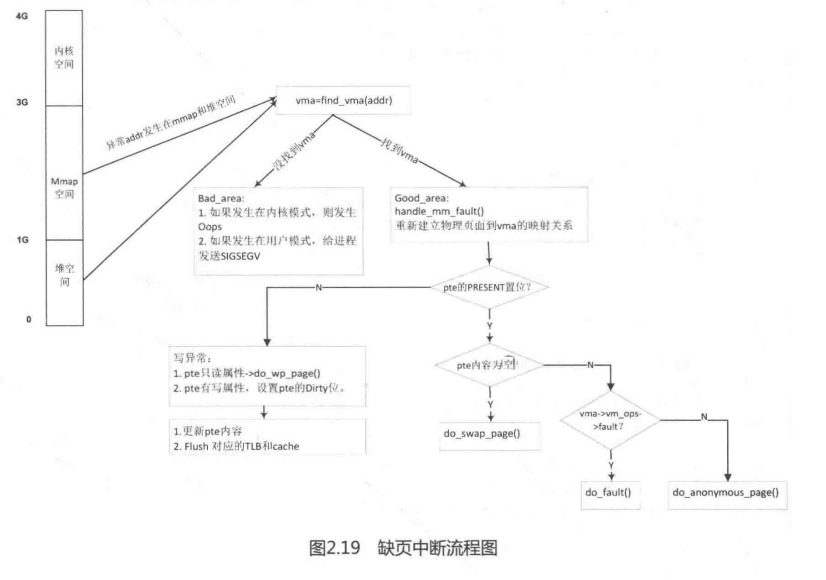

缺页中断处理的核心函数是do_page_fault()，该函数的实现和具体的体系结构相关。

```

static int __kprobes
do_page_fault(unsigned long addr, unsigned int fsr, struct pt_regs *regs)
{
	struct task_struct *tsk;
	struct mm_struct *mm;
	int fault, sig, code;
	unsigned int flags = FAULT_FLAG_ALLOW_RETRY | FAULT_FLAG_KILLABLE;

	if (notify_page_fault(regs, fsr))
		return 0;

	tsk = current;
	mm  = tsk->mm;

	/* Enable interrupts if they were enabled in the parent context. */
	if (interrupts_enabled(regs))
		local_irq_enable();

	/*
	 * If we're in an interrupt or have no user
	 * context, we must not take the fault..
	 */
	if (in_atomic() || !mm)
		goto no_context;

	if (user_mode(regs))
		flags |= FAULT_FLAG_USER;
	if (fsr & FSR_WRITE)
		flags |= FAULT_FLAG_WRITE;

	/*
	 * As per x86, we may deadlock here.  However, since the kernel only
	 * validly references user space from well defined areas of the code,
	 * we can bug out early if this is from code which shouldn't.
	 */
	if (!down_read_trylock(&mm->mmap_sem)) {
		if (!user_mode(regs) && !search_exception_tables(regs->ARM_pc))
			goto no_context;
retry:
		down_read(&mm->mmap_sem);
	} else {
		/*
		 * The above down_read_trylock() might have succeeded in
		 * which case, we'll have missed the might_sleep() from
		 * down_read()
		 */
		might_sleep();
#ifdef CONFIG_DEBUG_VM
		if (!user_mode(regs) &&
		    !search_exception_tables(regs->ARM_pc))
			goto no_context;
#endif
	}

	fault = __do_page_fault(mm, addr, fsr, flags, tsk);
}
```

do_page_fault()函数很长，下面分段来阅读。

第19行代码，in _atomic())判断当前状态是否处于中断上下文或禁止抢占状态，如果是，说明系统运行在原子上下文中（atomic context)，那么跳转到 `no_context`标签处的  __do_kernel_fault()函数。如果当前进程中没有struct mm_struct数据结构，说明这是一个内核线程，同样跳转到  __do_kernel_fault)函数中。

第22行代码，如果是用户模式，那么flags 置位FAULT_FLAG_USER。第32行代码，down_read_trylockO函数判断当前进程的mm->mmap_sem读写信号量是否可以获取，返回1则表示成功获得锁，返回0则表示锁已被别人占用。mm->mmap_sem锁被别人占用时要区分两种情况，一种是发生在内核空间，另外一种是发生在用户空间。发生在用户空间的情况可以调用down_read()来睡眠等待锁持有者释放该锁；发生在内核空间时，如果没有在exception tables 查询到该地址，那么跳转到no_context标签处的 __do kermel_fault()函数。

第46行代码调用__do _page_fault()函数，和do_page_fault()定义在同一个文件中。

```
[do_page_fault()->__do page_fault()]
	/* If we need to retry but a fatal signal is pending, handle the
	 * signal first. We do not need to release the mmap_sem because
	 * it would already be released in __lock_page_or_retry in
	 * mm/filemap.c. */
	if ((fault & VM_FAULT_RETRY) && fatal_signal_pending(current))
		return 0;

	/*
	 * Major/minor page fault accounting is only done on the
	 * initial attempt. If we go through a retry, it is extremely
	 * likely that the page will be found in page cache at that point.
	 */

	perf_sw_event(PERF_COUNT_SW_PAGE_FAULTS, 1, regs, addr);
	if (!(fault & VM_FAULT_ERROR) && flags & FAULT_FLAG_ALLOW_RETRY) {
		if (fault & VM_FAULT_MAJOR) {
			tsk->maj_flt++;
			perf_sw_event(PERF_COUNT_SW_PAGE_FAULTS_MAJ, 1,
					regs, addr);
		} else {
			tsk->min_flt++;
			perf_sw_event(PERF_COUNT_SW_PAGE_FAULTS_MIN, 1,
					regs, addr);
		}
		if (fault & VM_FAULT_RETRY) {
			/* Clear FAULT_FLAG_ALLOW_RETRY to avoid any risk
			* of starvation. */
			flags &= ~FAULT_FLAG_ALLOW_RETRY;
			flags |= FAULT_FLAG_TRIED;
			goto retry;
		}
	}

	up_read(&mm->mmap_sem);

	/*
	 * Handle the "normal" case first - VM_FAULT_MAJOR / VM_FAULT_MINOR
	 */
	if (likely(!(fault & (VM_FAULT_ERROR | VM_FAULT_BADMAP | VM_FAULT_BADACCESS))))
		return 0;

	/*
	 * If we are in kernel mode at this point, we
	 * have no context to handle this fault with.
	 */
	if (!user_mode(regs))
		goto no_context;

	if (fault & VM_FAULT_OOM) {
		/*
		 * We ran out of memory, call the OOM killer, and return to
		 * userspace (which will retry the fault, or kill us if we
		 * got oom-killed)
		 */
		pagefault_out_of_memory();
		return 0;
	}

	if (fault & VM_FAULT_SIGBUS) {
		/*
		 * We had some memory, but were unable to
		 * successfully fix up this page fault.
		 */
		sig = SIGBUS;
		code = BUS_ADRERR;
	} else {
		/*
		 * Something tried to access memory that
		 * isn't in our memory map..
		 */
		sig = SIGSEGV;
		code = fault == VM_FAULT_BADACCESS ?
			SEGV_ACCERR : SEGV_MAPERR;
	}

	__do_user_fault(tsk, addr, fsr, sig, code, regs);
	return 0;

no_context:
	__do_kernel_fault(mm, addr, fsr, regs);
	return 0;
}
```

__do_page_fault()函数返回值通常用VM_FAULT类型来表示，它们定义在include/linux/mm.h文件中。

```
[include/1inux/mm.h]
#define VM_FAULT_MINOR	0 /* For backwards compat. Remove me quickly. */

#define VM_FAULT_OOM	0x0001
#define VM_FAULT_SIGBUS	0x0002
#define VM_FAULT_MAJOR	0x0004
#define VM_FAULT_WRITE	0x0008	/* Special case for get_user_pages */
#define VM_FAULT_HWPOISON 0x0010	/* Hit poisoned small page */
#define VM_FAULT_HWPOISON_LARGE 0x0020  /* Hit poisoned large page. Index encoded in upper bits */
#define VM_FAULT_SIGSEGV 0x0040

#define VM_FAULT_NOPAGE	0x0100	/* ->fault installed the pte, not return page */
#define VM_FAULT_LOCKED	0x0200	/* ->fault locked the returned page */
#define VM_FAULT_RETRY	0x0400	/* ->fault blocked, must retry */
#define VM_FAULT_FALLBACK 0x0800	/* huge page fault failed, fall back to small */

#define VM_FAULT_HWPOISON_LARGE_MASK 0xf000 /* encodes hpage index for large hwpoison */

#define VM_FAULT_ERROR	(VM_FAULT_OOM | VM_FAULT_SIGBUS | VM_FAULT_SIGSEGV | \
			 VM_FAULT_HWPOISON | VM_FAULT_HWPOISON_LARGE | \
			 VM_FAULT_FALLBACK)
```

第86行代码，如果没有返回(VM_FAULT_ERROR I VM_FAULT_BADMAP|VM_FAULT_BADCCESS)错误类型，那么说明缺页中断就处理完成。

第93行代码，do_page_fault()函数返回错误且当前处于内核模式，那么跳转到do_kernel_fault())来处理。如果错误类型是VM_FAULT_OOM，说明当前系统没有足够的内存，那么调用pagefault_out_of_memory()函数来触发OOM机制。最后调用do_user_fault()来给用户进程发信号，因为这时内核已经无能为力了。do_user_fault()函数实现代码如下：

```
[do_page_fault()->__do_user_fault()]
static void
__do_user_fault(struct task_struct *tsk, unsigned long addr,
		unsigned int fsr, unsigned int sig, int code,
		struct pt_regs *regs)
{
	struct siginfo si;

#ifdef CONFIG_DEBUG_USER
	if (((user_debug & UDBG_SEGV) && (sig == SIGSEGV)) ||
	    ((user_debug & UDBG_BUS)  && (sig == SIGBUS))) {
		printk(KERN_DEBUG "%s: unhandled page fault (%d) at 0x%08lx, code 0x%03x\n",
		       tsk->comm, sig, addr, fsr);
		show_pte(tsk->mm, addr);
		show_regs(regs);
	}
#endif

	tsk->thread.address = addr;
	tsk->thread.error_code = fsr;
	tsk->thread.trap_no = 14;
	si.si_signo = sig;
	si.si_errno = 0;
	si.si_code = code;
	si.si_addr = (void __user *)addr;
	force_sig_info(sig, &si, tsk);
}
```

错误发生在内核模式，如果内核无法处理，那么只能调用__do_kernel_fault 函数来发送Oops 错误。__do_kermel_fault)函数实现代码如下：

```
[mm/memory.c]
static int __handle_mm_fault(struct mm_struct *mm, struct vm_area_struct *vma,
			     unsigned long address, unsigned int flags)
{
	pgd_t *pgd;
	pud_t *pud;
	pmd_t *pmd;
	pte_t *pte;

	if (unlikely(is_vm_hugetlb_page(vma)))
		return hugetlb_fault(mm, vma, address, flags);

	pgd = pgd_offset(mm, address);
	pud = pud_alloc(mm, pgd, address);
	if (!pud)
		return VM_FAULT_OOM;
	pmd = pmd_alloc(mm, pud, address);
	if (!pmd)
		return VM_FAULT_OOM;
	if (pmd_none(*pmd) && transparent_hugepage_enabled(vma)) {
		int ret = VM_FAULT_FALLBACK;
		if (!vma->vm_ops)
			ret = do_huge_pmd_anonymous_page(mm, vma, address,
					pmd, flags);
		if (!(ret & VM_FAULT_FALLBACK))
			return ret;
	} else {
		pmd_t orig_pmd = *pmd;
		int ret;

		barrier();
		if (pmd_trans_huge(orig_pmd)) {
			unsigned int dirty = flags & FAULT_FLAG_WRITE;

			/*
			 * If the pmd is splitting, return and retry the
			 * the fault.  Alternative: wait until the split
			 * is done, and goto retry.
			 */
			if (pmd_trans_splitting(orig_pmd))
				return 0;

			if (pmd_protnone(orig_pmd))
				return do_huge_pmd_numa_page(mm, vma, address,
							     orig_pmd, pmd);

			if (dirty && !pmd_write(orig_pmd)) {
				ret = do_huge_pmd_wp_page(mm, vma, address, pmd,
							  orig_pmd);
				if (!(ret & VM_FAULT_FALLBACK))
					return ret;
			} else {
				huge_pmd_set_accessed(mm, vma, address, pmd,
						      orig_pmd, dirty);
				return 0;
			}
		}
	}

	/*
	 * Use __pte_alloc instead of pte_alloc_map, because we can't
	 * run pte_offset_map on the pmd, if an huge pmd could
	 * materialize from under us from a different thread.
	 */
	if (unlikely(pmd_none(*pmd)) &&
	    unlikely(__pte_alloc(mm, vma, pmd, address)))
		return VM_FAULT_OOM;
	/* if an huge pmd materialized from under us just retry later */
	if (unlikely(pmd_trans_huge(*pmd)))
		return 0;
	/*
	 * A regular pmd is established and it can't morph into a huge pmd
	 * from under us anymore at this point because we hold the mmap_sem
	 * read mode and khugepaged takes it in write mode. So now it's
	 * safe to run pte_offset_map().
	 */
	pte = pte_offset_map(pmd, address);

	return handle_pte_fault(mm, vma, address, pte, pmd, flags);
}
```

第8行代码，pgd_offset(mm, addr)宏获取addr对应在当前进程页表的PGD页表目录项。

第9行代码，pud_alloc(mm, pgd, address)宏获取对应的PUD表项，如果PUD表项为空，则返回VM_FAULT_OOM错误。

第12行代码，用同样的方法获取pmd表项。

第36行代码，pte_offset_map()函数获取对应的pte表项，然后跳转到handle_pte_fault()中。

```
[do_page_fault()->handle_mm_fault()->handle_mm_fault()->handle_pte_fault()]
static int handle_pte_fault(struct mm_struct *mm,
		     struct vm_area_struct *vma, unsigned long address,
		     pte_t *pte, pmd_t *pmd, unsigned int flags)
{
	pte_t entry;
	spinlock_t *ptl;

	/*
	 * some architectures can have larger ptes than wordsize,
	 * e.g.ppc44x-defconfig has CONFIG_PTE_64BIT=y and CONFIG_32BIT=y,
	 * so READ_ONCE or ACCESS_ONCE cannot guarantee atomic accesses.
	 * The code below just needs a consistent view for the ifs and
	 * we later double check anyway with the ptl lock held. So here
	 * a barrier will do.
	 */
	entry = *pte;
	barrier();
	if (!pte_present(entry)) {
		if (pte_none(entry)) {
			if (vma->vm_ops) {
				if (likely(vma->vm_ops->fault))
					return do_fault(mm, vma, address, pte,
							pmd, flags, entry);
			}
			return do_anonymous_page(mm, vma, address,
						 pte, pmd, flags);
		}
		return do_swap_page(mm, vma, address,
					pte, pmd, flags, entry);
	}

	if (pte_protnone(entry))
		return do_numa_page(mm, vma, address, entry, pte, pmd);

	ptl = pte_lockptr(mm, pmd);
	spin_lock(ptl);
	if (unlikely(!pte_same(*pte, entry)))
		goto unlock;
	if (flags & FAULT_FLAG_WRITE) {
		if (!pte_write(entry))
			return do_wp_page(mm, vma, address,
					pte, pmd, ptl, entry);
		entry = pte_mkdirty(entry);
	}
	entry = pte_mkyoung(entry);
	if (ptep_set_access_flags(vma, address, pte, entry, flags & FAULT_FLAG_WRITE)) {
		update_mmu_cache(vma, address, pte);
	} else {
		/*
		 * This is needed only for protection faults but the arch code
		 * is not yet telling us if this is a protection fault or not.
		 * This still avoids useless tlb flushes for .text page faults
		 * with threads.
		 */
		if (flags & FAULT_FLAG_WRITE)
			flush_tlb_fix_spurious_fault(vma, address);
	}
unlock:
	pte_unmap_unlock(pte, ptl);
	return 0;
}
```

handle_pte_fault()函数中第7行的注释说明有的处理器体系结构会大于8Byte的pte表项，例如ppc44x定义了CONFIG_PTE_64BIT和CONFIG_32BIT，所以READ_ONCE()和ACCESS_ONCE()并不保证访问的原子性，所以这里需要一个内存屏障以保证正确读取了pte表项内容后才会执行后面的判断语句。

后续的代码可以分为三部分来理解：

1. 第17~29行代码是pte_present()为0的情况，页不在内存中，即pte表项中的LPTE_PRESENT位没有置位，所以pte还没有映射物理页面，这是真正的缺页。

（1）如果pte内容为空，即pte_none()。

- 对于文件映射，通常VMA的vm_ops操作函数定义了fault()函数指针，那么调用do_fault()函数。
- 对于匿名页面，调用do_anonymous_page()函数。

（2）如果pte内容不为空且PRESENT没有置位，说明该页被交换到swap分区，则调用do_swap_page()函数。

2. 第31~40行代码，这里是pte有映射物理贝面，但因为之前的pte改置只读，现在需要可写操作，所以触发了写时复制缺页中断。例如父子进程之间共享的内存，当其中一方需要写入新内容时，就会触发写时复制。

第35行代码，如果传进来的flag设置了可写的属性且当前pte是只读的，那么调用do_wp_page())函数并返回。

如果当前pte的属性是可写的，那么通过pte_mkdirty0函数来设置L_PTE_DIRTY比特位。页在内存中且pte也具有可写属性，什么情况下会运行到第39行代码呢？此问题留给读者思考。

3. 第41~53行代码，pte_mkyoung0对于×86体系结构是设置_PAGE_ACCESSED位的，这相对简单些。对于ARM体系结构是设置Linux版本的页表中PTE页表项的L_PTE_YOUNG位，是否需要写入ARM硬件版本的页表由set pte_at())函数来决定。

第42~43行代码，如果pte内容发生变化，则需要把新的内容写入到pte表项中，并且要flush对应的TLB和cache。

对于ARM32体系结构来说，上述内容是一个很重要且值得关注的地方，也是模拟Linux版本页表的L_PTE_YOUNG的关键点之一，读者可以结合第2.2.1节和第2.13.1节来阅读。
    缺页中断的整体流程图如图2.19所示。

