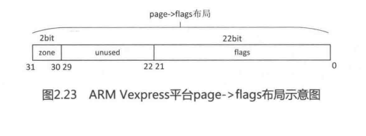

Linux内核内存管理的实现以struct page为核心，类似城市的地标（如上海的东方明珠），其他所有的内存管理设施都为之展开，例如VMA管理、缺页中断、反向映射、页面分配与回收等。struct page数据结构定义在include/linux/mm_types.h头文件中，大量使用了C语言的联合体Union来优化其数据结构的大小，因为每个物理页面都需要一个struct page数据结构，因此管理成本很高。page数据结构的主要成员如下：

```
[include/1inux/mm types.h]
struct page {
	/* First double word block */
	unsigned long flags;		/* Atomic flags, some possibly
					 * updated asynchronously */
	union {
		struct address_space *mapping;	/* If low bit clear, points to
						 * inode address_space, or NULL.
						 * If page mapped as anonymous
						 * memory, low bit is set, and
						 * it points to anon_vma object:
						 * see PAGE_MAPPING_ANON below.
						 */
		void *s_mem;			/* slab first object */
	};

	/* Second double word */
	struct {
		union {
			pgoff_t index;		/* Our offset within mapping. */
			void *freelist;		/* sl[aou]b first free object */
			bool pfmemalloc;	/* If set by the page allocator,
						 * ALLOC_NO_WATERMARKS was set
						 * and the low watermark was not
						 * met implying that the system
						 * is under some pressure. The
						 * caller should try ensure
						 * this page is only used to
						 * free other pages.
						 */
		};

		union {
#if defined(CONFIG_HAVE_CMPXCHG_DOUBLE) && \
	defined(CONFIG_HAVE_ALIGNED_STRUCT_PAGE)
			/* Used for cmpxchg_double in slub */
			unsigned long counters;
#else
			/*
			 * Keep _count separate from slub cmpxchg_double data.
			 * As the rest of the double word is protected by
			 * slab_lock but _count is not.
			 */
			unsigned counters;
#endif

			struct {

				union {
					/*
					 * Count of ptes mapped in
					 * mms, to show when page is
					 * mapped & limit reverse map
					 * searches.
					 *
					 * Used also for tail pages
					 * refcounting instead of
					 * _count. Tail pages cannot
					 * be mapped and keeping the
					 * tail page _count zero at
					 * all times guarantees
					 * get_page_unless_zero() will
					 * never succeed on tail
					 * pages.
					 */
					atomic_t _mapcount;

					struct { /* SLUB */
						unsigned inuse:16;
						unsigned objects:15;
						unsigned frozen:1;
					};
					int units;	/* SLOB */
				};
				atomic_t _count;		/* Usage count, see below. */
			};
			unsigned int active;	/* SLAB */
		};
	};

	/* Third double word block */
	union {
		struct list_head lru;	/* Pageout list, eg. active_list
					 * protected by zone->lru_lock !
					 * Can be used as a generic list
					 * by the page owner.
					 */
		struct {		/* slub per cpu partial pages */
			struct page *next;	/* Next partial slab */
#ifdef CONFIG_64BIT
			int pages;	/* Nr of partial slabs left */
			int pobjects;	/* Approximate # of objects */
#else
			short int pages;
			short int pobjects;
#endif
		};

		struct slab *slab_page; /* slab fields */
		struct rcu_head rcu_head;	/* Used by SLAB
						 * when destroying via RCU
						 */
		/* First tail page of compound page */
		struct {
			compound_page_dtor *compound_dtor;
			unsigned long compound_order;
		};

#if defined(CONFIG_TRANSPARENT_HUGEPAGE) && USE_SPLIT_PMD_PTLOCKS
		pgtable_t pmd_huge_pte; /* protected by page->ptl */
#endif
	};

	/* Remainder is not double word aligned */
	union {
		unsigned long private;		/* Mapping-private opaque data:
					 	 * usually used for buffer_heads
						 * if PagePrivate set; used for
						 * swp_entry_t if PageSwapCache;
						 * indicates order in the buddy
						 * system if PG_buddy is set.
						 */
#if USE_SPLIT_PTE_PTLOCKS
#if ALLOC_SPLIT_PTLOCKS
		spinlock_t *ptl;
#else
		spinlock_t ptl;
#endif
#endif
		struct kmem_cache *slab_cache;	/* SL[AU]B: Pointer to slab */
		struct page *first_page;	/* Compound tail pages */
	};

#ifdef CONFIG_MEMCG
	struct mem_cgroup *mem_cgroup;
#endif

	/*
	 * On machines where all RAM is mapped into kernel address space,
	 * we can simply calculate the virtual address. On machines with
	 * highmem some memory is mapped into kernel virtual memory
	 * dynamically, so we need a place to store that address.
	 * Note that this field could be 16 bits on x86 ... ;)
	 *
	 * Architectures with slow multiplication can define
	 * WANT_PAGE_VIRTUAL in asm/page.h
	 */
#if defined(WANT_PAGE_VIRTUAL)
	void *virtual;			/* Kernel virtual address (NULL if
					   not kmapped, ie. highmem) */
#endif /* WANT_PAGE_VIRTUAL */

#ifdef CONFIG_KMEMCHECK
	/*
	 * kmemcheck wants to track the status of each byte in a page; this
	 * is a pointer to such a status block. NULL if not tracked.
	 */
	void *shadow;
#endif

#ifdef LAST_CPUPID_NOT_IN_PAGE_FLAGS
	int _last_cpupid;
#endif
}
/*
 * The struct page can be forced to be double word aligned so that atomic ops
 * on double words work. The SLUB allocator can make use of such a feature.
 */
#ifdef CONFIG_HAVE_ALIGNED_STRUCT_PAGE
	__aligned(2 * sizeof(unsigned long))
#endif
;
```

struct page数据结构分为4部分，前3部分是双字（double word）大小，最后一个部分不是双字大小的。

flags成员是页面的标志位集合，标志位是内存管理非常重要的部分，具体定义在include/linux/page-flags.h文件中，重要的标志位如下：

```
enum pageflags {
	PG_locked,		/* Page is locked. Don't touch. */
	PG_error,
	PG_referenced,
	PG_uptodate,
	PG_dirty,
	PG_lru,
	PG_active,
	PG_slab,
	PG_owner_priv_1,	/* Owner use. If pagecache, fs may use*/
	PG_arch_1,
	PG_reserved,
	PG_private,		/* If pagecache, has fs-private data */
	PG_private_2,		/* If pagecache, has fs aux data */
	PG_writeback,		/* Page is under writeback */
#ifdef CONFIG_PAGEFLAGS_EXTENDED
	PG_head,		/* A head page */
	PG_tail,		/* A tail page */
#else
	PG_compound,		/* A compound page */
#endif
	PG_swapcache,		/* Swap page: swp_entry_t in private */
	PG_mappedtodisk,	/* Has blocks allocated on-disk */
	PG_reclaim,		/* To be reclaimed asap */
	PG_swapbacked,		/* Page is backed by RAM/swap */
	PG_unevictable,		/* Page is "unevictable"  */
#ifdef CONFIG_MMU
	PG_mlocked,		/* Page is vma mlocked */
#endif
#ifdef CONFIG_ARCH_USES_PG_UNCACHED
	PG_uncached,		/* Page has been mapped as uncached */
#endif
#ifdef CONFIG_MEMORY_FAILURE
	PG_hwpoison,		/* hardware poisoned page. Don't touch */
#endif
#ifdef CONFIG_TRANSPARENT_HUGEPAGE
	PG_compound_lock,
#endif
	__NR_PAGEFLAGS,

	/* Filesystems */
	PG_checked = PG_owner_priv_1,

	/* Two page bits are conscripted by FS-Cache to maintain local caching
	 * state.  These bits are set on pages belonging to the netfs's inodes
	 * when those inodes are being locally cached.
	 */
	PG_fscache = PG_private_2,	/* page backed by cache */

	/* XEN */
	/* Pinned in Xen as a read-only pagetable page. */
	PG_pinned = PG_owner_priv_1,
	/* Pinned as part of domain save (see xen_mm_pin_all()). */
	PG_savepinned = PG_dirty,
	/* Has a grant mapping of another (foreign) domain's page. */
	PG_foreign = PG_owner_priv_1,

	/* SLOB */
	PG_slob_free = PG_private,
};
```

- PG_locked表示页面已经上锁了。如果该比特位置位，说明页面已经被锁定，内存管理的其他模块不能访问这个页面，以防发生竞争。
- PG_error表示页面操作过程中发生错误时会设置该位。
- PG_referenced和PG_active 用于控制页面的活跃程度，在kswapd页面回收中使用。
- PG_uptodate表示页面的数据已经从块设备成功读取。
- PG_dirty 表示页面内容发生改变，这个页面为脏的，即页面的内容被改写后还没有和外部存储器进行过同步操作。
- PG_lru表示页面加入了LRU链表中。LRU是最近最少使用链表（least recently used)的简称。内核使用LRU链表来管理活跃和不活跃页面。
- PG_slab表示页面用于slab分配器。
- PG_writeback表示页面的内容正在向块设备进行回写。
- PG_swapcache表示页面处于交换缓存。
- PG_reclaim表示这个页面马上要被回收。
- PG_unevictable表示页面不可以回收。
- PG_mlocked表示页面对应的VMA处于mlocked状态。

内核定义了一些标准宏，用于检查页面是否设置了某个特定的标志位或者用于操作某些标志位。这些宏的名称都有一定的模式，具体如下。

- PageXXX()用于检查页面是否设置了PG_XXX标志位。例如，PageLRU(page)检查PG_lru标志位是否置位了，PageDirty(page)检查PG_dirty是否置位了。
- SetPageXXX()设置页中的PG_XXX标志位。例如，SetPageLRU(page)用于设置 PG_lru，SetPageDirty(page)用于设置PG_dirty标志位。
- ClearPageXXX()用于无条件地清除某个特定的标志位。

宏的实现在include/linux/page-flags.h文件中定义。

```
#define TESTPAGEFLAG(uname, lname)					\
static inline int Page##uname(const struct page *page)			\
			{ return test_bit(PG_##lname, &page->flags); }

#define SETPAGEFLAG(uname, lname)					\
static inline void SetPage##uname(struct page *page)			\
			{ set_bit(PG_##lname, &page->flags); }

#define CLEARPAGEFLAG(uname, lname)					\
static inline void ClearPage##uname(struct page *page)			\
			{ clear_bit(PG_##lname, &page->flags); }
```

flags这个成员除了存放上述重要的标志位之外，还有另外一个很重要的作用，就是存放SECTION编号、NODE节点编号、ZONE编号和LAST_CPUPID等。具体存放的内容与内核配置相关，例如SECTION编号和NODE节点编号与CONFIG_SPARSEMEM/CONFIG_SPARSEMEM_VMEMMAP配置相关，LAST_CPUPID与CONFIG_NUMA_BALANCING配置相关。

如图2.23所示，在ARMVexpress平台中page->flags的布局示意图，其中，bit[0:21]用于存放页面标志位，bit[22：29]保留使用，bit[30:31]用于存放zone编号。上述是一个简单的page->flags布局图，复杂的布局图见第3.5节中NUMA相关的内容。



可以通过set_page_zone()函数把zone编号设置到page->flags中，也可以通过 page_zone()函数知道某个页面所属的zone。

```
static inline struct zone *page_zone(const struct page *page)
{
	return &NODE_DATA(page_to_nid(page))->node_zones[page_zonenum(page)];
}
static inline void set_page_zone(struct page *page, enum zone_type zone)
{
	page->flags &= ~(ZONES_MASK << ZONES_PGSHIFT);
	page->flags |= (zone & ZONES_MASK) << ZONES_PGSHIFT;
}
```

回到struct page数据结构定义中，mapping成员表示页面