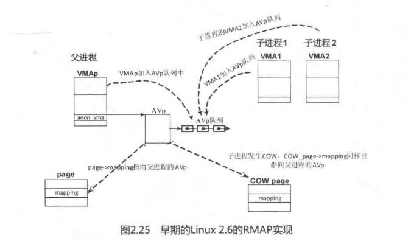
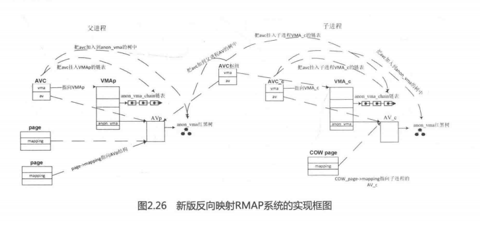

早期的Linux2.6的RMAP实现如图2.25所示，父进程的VMA中有一个struct anon_vma数据结构（简称AVp），page->mapping指向AVp数据结构，另外父进程和子进程所有映射了页面的VMAs都挂入到父进程的AVp的一个链表中。当需要从物理页面找出所有映射页面的VMA时，只需要从物理页面的page->mapping 找到AVp，再遍历AVp链表即可。当子进程的虚拟内存发生写时复制COW时，新分配的页面COW_Page->mapping依然指向父进程的AVp数据结构。这个模型非常简洁，而且通俗易懂，但也有致命的弱点，特别是在负载重的服务器中，例如父进程有1000个子进程，每个子进程都有一个VMA，这个VMA中有1000个匿名页面，当所有的子进程的VMA中的所有匿名页面都同时发生写时复制时，情况会很糟糕。因为在父进程的AVp队列中会有100万个匿名页面，扫描这个队列要耗费很长的时间。

Linux2.6.34内核对RMAP反向映射系统进行了优化，模型和现在Linux4.0内核中的模型相似，如图2.26所示，新增加了AVC数据结构（struct anon_vma_chain)，父进程和子进程都有各自的AV数据结构且都有一棵红黑树（简称AV红黑树），此外，父进程和子进程都有各自的AVC挂入进程的AV红黑树中。还有一个AVC作为纽带来联系父进程和子进程，我们暂且称它为AVC枢纽。AVC枢纽挂入父进程的AV红黑树中，因此所有子进程都有一个AVC枢纽用于挂入父进程的AV红黑树。需要反向映射遍历时，只需要扫描父进程中的AV红黑树即可。当子进程VMA发生COW时，新分配的匿名页面cowpage->mapping 指向子进程自己的AV数据结构，而不是指向父进程的AV数据结构，因此在反向映射遍历时不需要扫描所有的子进程。

