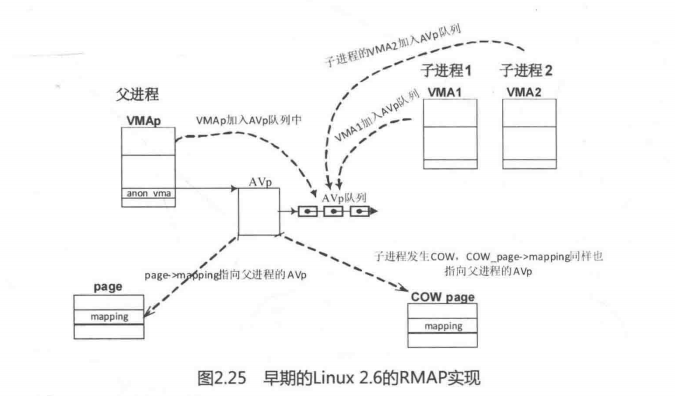
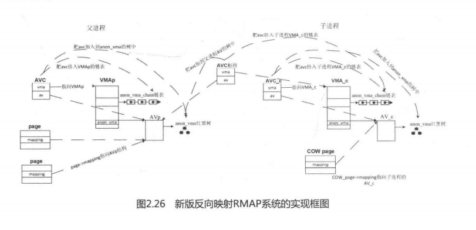

在阅读本节前请思考如下小问题。

- 在Linux2.4.x内核中，如何从一个page找到所有映射该页面的VMA？反向映射可以带来哪些便利？

早期的Linux2.6的RMAP实现如图2.25所示，父进程的VMA中有一个struct anon_vma数据结构（简称AVp），page->mapping指向AVp数据结构，另外父进程和子进程所有映射了页面的VMAs都挂入到父进程的AVp的一个链表中。当需要从物理页面找出所有映射页面的VMA时，只需要从物理页面的page->mapping 找到AVp，再遍历AVp链表即可。当子进程的虚拟内存发生写时复制COW时，新分配的页面COW_Page->mapping依然指向父进程的AVp数据结构。

- 阅读Linux4.0内核RMAP机制的代码，画出父子进程之间VMA、AVC、anon_vma和page等数据结构之间的关系图。

- 在Linux2.6.34中，RMAP机制采用了新的实现，在Linux2.6.33和之前的版本中称为旧版本RMAP机制。那么在旧版本RMAP机制中，如果父进程有1000个子进程，每个子进程都有一个VMA，这个VMA里面有1000个匿名页面，当所有的子进程的VMA同时发生写时复制时会是什么情况呢？

这个模型非常简洁，而且通俗易懂，但也有致命的弱点，特别是在负载重的服务器中，例如父进程有1000个子进程，每个子进程都有一个VMA，这个VMA中有1000个匿名页面，当所有的子进程的VMA中的所有匿名页面都同时发生写时复制时，情况会很糟糕。因为在父进程的AVp队列中会有100万个匿名页面，扫描这个队列要耗费很长的时间。

用户进程在使用虚拟内存过程中，从虚拟内存页面映射到物理内存页面，PTE页表项保留着这个记录，page数据结构中的_mapcount成员记录有多少个用户PTE页表项映射了物理页面。用户PTE页表项是指用户进程地址空间和物理页面建立映射的PTE页表项，不包括内核地址空间映射物理页面产生的PTE页表项。有的页面需要被迁移，有的页面长时间不使用需要被交换到磁盘。在交换之前，必须找出哪些进程使用这个页面，然后断开这些映射的PTE。一个物理页面可以同时被多个进程的虚拟内存映射，一个虚拟页面同时只能有一个物理页面与之映射。

在Linux2.4内核中，为了确定某一个页面是否被某个进程映射，必须遍历每个进程的页表，工作量相当大，效率很低。在Linux2.5开发期间，提出了反向映射（the object-basedreverse-mapping VM，RMAP)的概念。