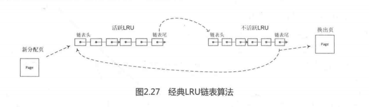

在最近几十年操作系统的发展过程中，有很多页面交换算法，其中每个算法都有各自的优点和缺点。Linux内核中采用的页交换算法主要是LRU算法和第二次机会法（second chance)。

## 1.LRU链表

LRU是least recently used（最近最少使用）的缩写，LRU假定最近不使用的页在较短的时间内也不会频繁使用。在内存不足时，这些页面将成为被换出的候选者。内核使用双向链表来定义LRU链表，并且根据页面的类型分为LRU_ANON和LRU_FILE。每种类型根据页面的活跃性分为活跃LRU和不活跃LRU，所以内核中一共有如下5个LRU链表。

- 不活跃匿名页面链表LRU_INACTIVE_ANON。
- 活跃匿名页面链表LRU_ACTIVE_ANON。
- 不活跃文件映射页面链表LRU_INACTIVE_FILE。
- 活跃文件映射页面链表LRU_ACTIVE_FILE。
- 不可回收页面链表LRU_UNEVICTABLE。

LRU链表之所以要分成这样，是因为当内存紧缺时总是优先换出page cache页面，而不是匿名页面。因为大多数情况page cache 页面下不需要回写磁盘，除非页面内容被修改了，而匿名页面总是要被写入交换分区才能被换出。LRU链表按照zone来配置，也就是每个zone中都有一整套LRU链表，因此zone数据结构中有一个成员lruvec指向这些链表。枚举类型变量lrulist列举出上述各种LRU链表的类型，struct lruvec数据结构中定义了上述各种LRU类型的链表。

```
#define LRU_BASE 0
#define LRU_ACTIVE 1
#define LRU_FILE 2

enum lru_list {
	LRU_INACTIVE_ANON = LRU_BASE,
	LRU_ACTIVE_ANON = LRU_BASE + LRU_ACTIVE,
	LRU_INACTIVE_FILE = LRU_BASE + LRU_FILE,
	LRU_ACTIVE_FILE = LRU_BASE + LRU_FILE + LRU_ACTIVE,
	LRU_UNEVICTABLE,
	NR_LRU_LISTS
};

struct lruvec {
	struct list_head lists[NR_LRU_LISTS];
	struct zone_reclaim_stat reclaim_stat;
};

struct zone {
	...
	struct lruvec lruec;
	...
}
```

LRU链表是如何实现页面老化的呢？

这需要从页面如何加入LRU链表，以及LRU链表摘取页面说起。加入LRU链表的常用API是lru_cache_add()。

```
[lru_cache_add() -> __lru_cache_add()]
static void __lru_cache_add(struct page *page)
{
	struct pagevec *pvec = &get_cpu_var(lru_add_pvec);

	page_cache_get(page);
	if (!pagevec_space(pvec))
		__pagevec_lru_add(pvec);
	pagevec_add(pvec, page);
	put_cpu_var(lru_add_pvec);
}
```

这里使用了页向量（pagevec）数据结构，借助一个数组来保存特定数目的页，可以对这些页面执行同样的操作。页向量会以“批处理的方式”执行，比单独处理一个页的方式效率要高。页向量数据结构的定义如下：

```
#define PAGEVEC_SIZE	14
struct pagevec {
	unsigned long nr;
	unsigned long cold;
	struct page *pages[PAGEVEC_SIZE];
};
```

\_Iru_cache_add()函数第5行代码判断页向量pagevec是否还有空间，如果没有空间，那么首先调用\__pagevec_lru_add()函数把原有的page加入到LRU链表中，然后把新页面添加到页向量pagevec中。

```
static void __pagevec_lru_add_fn(struct page *page, struct lruvec *lruvec,
				 void *arg)
{
	int file = page_is_file_cache(page);
	int active = PageActive(page);
	enum lru_list lru = page_lru(page);
	SetPageLRU(page);
	add_page_to_lru_list(page, lruvec, lru);
}
static __always_inline void add_page_to_lru_list(struct page *page,
				struct lruvec *lruvec, enum lru_list lru)
{
	int nr_pages = hpage_nr_pages(page);
	list_add(&page->lru, &lruvec->lists[lru]);
}
```

从add_page_to_lru_list()可以看到，一个page 最终通过list_add()函数来加入LRU链表，list_add()会将成员添加到链表头。

Iru_to_page(&lru_list)和list_del(&page->lru)函数组合实现从LRU链表摘取页面，其中，Iru_to_page()的实现如下：

```
[mm/vmscan.c]
#define lru_to_page(_head)(list_entry((_head)->prev,struct page,lru))
```

lru_to_page()使用了head->prev，从链表的末尾摘取页面，因此，LRU链表实现了先进先出（FIFO）算法。最先进入LRU链表的页面，在LRU中的时间会越长，老化时间也越长。

在系统运行过程中，页面总是在活跃LRU链表和不活跃LRU链表之间转移，不是每次访问内存页面都会发生这种转移。而是发生的时间间隔比较长，随着时间的推移，导致一种热平衡，最不常用的页面将慢慢移动到不活跃LRU链表的末尾，这些页面正是页面回收中最合适的候选者。

经典LRU链表算法如图2.27所示。



## 2.第二次机会法

第二次机会法（second chance）在经典LRU算法基础上做了一些改进。在经典LRU链表（FIFO)中，新产生的页面加入到LRU链表的开头，将LRU链表中现存的页面向后移动了一个位置。当系统内存短缺时，LRU链表尾部的页面将会离开并被换出。当系统再需要这些页面时，这些页面会重新置于LRU链表的开头。显然这个设计不是很巧妙，在换出页面时，没有考虑该页面的使用情况是频繁使用，还是很少使用。也就是说，频繁使用的页面依然会因为在LRU链表末尾而被换出。

第二次机会算法的改进是为了避免把经常使用的页面置换出去。当选择置换页面时，依然和LRU算法一样，选择最早置入链表的页面，即在链表末尾的页面。二次机会法设置了一个访问状态位（硬件控制的比特位），所以要检查页面的访问位。如果访问位是0，就淘汰这页面；如果访问位是1，就给它第二次机会，并选择下一个页面来换出。当该页面得到第二次机会时，它的访问位被清0，如果该页在此期间再次被访问过，则访问位置为1。这样给了第二次机会的页面将不会被淘汰，直至所有其他页面被淘汰过（或者也给了第二次机会）。因此，如果一个页面经常被使用，其访问位总保持为1，它一直不会被淘汰出去。


Linux 内核使用PG_active和PG_referenced这两个标志位来实现第二次机会法。PG_active表示该页是否活跃，PG_referenced表示该页是否被引用过，主要函数如下。

- mark_page_accessed()。

- page_referenced()。

- page_check_references();

  

## 3. mark_page_accessed()

下面来看mark_page_accessed()函数。

```
void mark_page_accessed(struct page *page)
{
	if (!PageActive(page) && !PageUnevictable(page) &&
			PageReferenced(page)) {
		if (PageLRU(page))
			activate_page(page);
		else
			__lru_cache_activate_page(page);
		ClearPageReferenced(page);
		if (page_is_file_cache(page))
			workingset_activation(page);
	} else if (!PageReferenced(page)) {
		SetPageReferenced(page);
	}
}
```

（1）如果PG_active=0&&PG_referenced=1,则：

- 把该页加入活跃LRU，并设置PG_active=1；
- 清PG_referenced标志位。

（2）如果PG_referenced=0，则：

- 设置PG_referenced标志位。


## 4. page_check_reference()

下面来看page_check_references()函数。

```
[mm/vmscan.c]
static enum page_references page_check_references(struct page *page,
						  struct scan_control *sc)
{
	int referenced_ptes, referenced_page;
	unsigned long vm_flags;

	referenced_ptes = page_referenced(page, 1, sc->target_mem_cgroup,
					  &vm_flags);
	referenced_page = TestClearPageReferenced(page);

	if (vm_flags & VM_LOCKED)
		return PAGEREF_RECLAIM;

	if (referenced_ptes) {
		if (PageSwapBacked(page))
			return PAGEREF_ACTIVATE;
			
		SetPageReferenced(page);

		if (referenced_page || referenced_ptes > 1)
			return PAGEREF_ACTIVATE;

		/*
		 * Activate file-backed executable pages after first usage.
		 */
		if (vm_flags & VM_EXEC)
			return PAGEREF_ACTIVATE;

		return PAGEREF_KEEP;
	}

	/* Reclaim if clean, defer dirty pages to writeback */
	if (referenced_page && !PageSwapBacked(page))
		return PAGEREF_RECLAIM_CLEAN;

	return PAGEREF_RECLAIM;
}
```

在扫描不活跃LRU链表时，page_check_references()会被调用，返回值是一个page_references的枚举类型。PAGEREF_ACTIVATE表示该页面会迁移到活跃链表，PAGEREF_KEEP 表示会继续保留在不活跃链表中，PAGEREF_RECLAIM和PAGEREF_RECLAIM_CLEAN表示可以尝试回收该页面。

第6行代码中的page_referenced()检查该页有多少个访问引用pte（referenced_ptes)。

第7行代码中的TestClearPageReferenced()函数返回该页面PG_referenced标志位的值（referenced page)，并且清该标志位。

