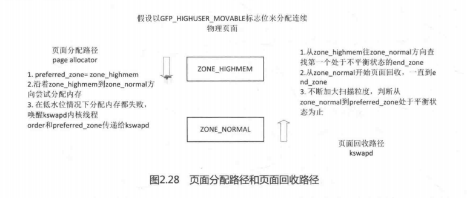

balance_pgdat 函数是回收页面的主函数。这个函数比较长，首先看一个框架，主体函数是一个很长的while循环，简化后的代码如下：

```
[balance_pgdat()函数总体框架]
static unsigned long balance_pgdat(pg_data_t *pgdat, int order,
							int *classzone_idx)
{
	struct scan_control sc = {
		.gfp_mask = GFP_KERNEL,
		.order = order,
		.priority = DEF_PRIORITY,
		.may_writepage = !laptop_mode,
		.may_unmap = 1,
		.may_swap = 1,
	};
	...
	do {
		//从高端zone往低端zone方向查找第一个处于不平衡的end_zone
		for (i = pgdat->nr_zones - 1; i >= 0; i--) {
			struct zone *zone = pgdat->node_zones + i;
			...
			if (!zone_balanced(zone, order, 0, 0)) {
				end_zone = i;
				break;
			}
		}
		
		//从最低端zone开始页面回收，一直到end_zone
		for (i = 0; i <= end_zone; i++) {
			struct zone *zone = pgdat->node_zones + i;
			kswapd_shrink_zone(zone, end_zone,
					       &sc, &nr_attempted);
		}
		//不断加大扫码粒度，并且检查最低端zone到classzone_idx的zone是否处于平衡状态
	}while (sc.priority >= 1 &&
		 !pgdat_balanced(pgdat, order, *classzone_idx));
}
```

struct scan_control数据结构用于控制页面回收的参数，例如要回收页面的个数nr_to_reclaim、分配掩码gfpmask、分配的阶数order（2order个页面）、扫描LRU链表的优先级priority等。priority成员表示扫描的优先级，用于计算每次扫描页面的数量，计算方法是total_size>>priority，初始值为12，依次递减。priority数值越低，扫描的页面数量越大，相当于逐步加大扫描粒度。struct_scan_control数据结构定义在mm/vmscan.c文件中。

```
[mm/vmscan.c]
struct scan_control {
	/* How many pages shrink_list() should reclaim */
	unsigned long nr_to_reclaim;

	/* This context's GFP mask */
	gfp_t gfp_mask;

	/* Allocation order */
	int order;

	/*
	 * Nodemask of nodes allowed by the caller. If NULL, all nodes
	 * are scanned.
	 */
	nodemask_t	*nodemask;

	/*
	 * The memory cgroup that hit its limit and as a result is the
	 * primary target of this reclaim invocation.
	 */
	struct mem_cgroup *target_mem_cgroup;

	/* Scan (total_size >> priority) pages at once */
	int priority;

	unsigned int may_writepage:1;

	/* Can mapped pages be reclaimed? */
	unsigned int may_unmap:1;

	/* Can pages be swapped as part of reclaim? */
	unsigned int may_swap:1;

	/* Can cgroups be reclaimed below their normal consumption range? */
	unsigned int may_thrash:1;

	unsigned int hibernation_mode:1;

	/* One of the zones is ready for compaction */
	unsigned int compaction_ready:1;

	/* Incremented by the number of inactive pages that were scanned */
	unsigned long nr_scanned;

	/* Number of pages freed so far during a call to shrink_zones() */
	unsigned long nr_reclaimed;
};
```

pgdat_balanced()需要注意参数classzone_idx，它表示在页面分配路径上计算出来第一个最合适内存分配的zone的编号，通过wake_all_kswapds()传递下来。

```
static bool pgdat_balanced(pg_data_t *pgdat, int order, int classzone_idx)
{
	unsigned long managed_pages = 0;
	unsigned long balanced_pages = 0;
	int i;

	/* Check the watermark levels */
	//遍历从最低端的zone到classzone_idx的页面是否处于平衡
	for (i = 0; i <= classzone_idx; i++) {
		struct zone *zone = pgdat->node_zones + i;

		if (!populated_zone(zone))
			continue;

		managed_pages += zone->managed_pages;

		/*
		 * A special case here:
		 *
		 * balance_pgdat() skips over all_unreclaimable after
		 * DEF_PRIORITY. Effectively, it considers them balanced so
		 * they must be considered balanced here as well!
		 */
		if (!zone_reclaimable(zone)) {
			balanced_pages += zone->managed_pages;
			continue;
		}

		if (zone_balanced(zone, order, 0, i))
			balanced_pages += zone->managed_pages;
		else if (!order)
			return false;
	}

	if (order)
		return balanced_pages >= (managed_pages >> 2);
	else
		return true;
}
```

注意参数classzone_idx是由页面分配路径上传递过来的。pgdat_balanced()判断一个内存节点上的物理页面是否处于平衡状态，返回true，则表示该内存节点处于平衡状态。注意第7行代码，遍历从最低端的zone到classzone_idx的页面是否处于平衡状态。

对于order为0的情况，所有的zone都是平衡的。对于order大于0的内存分配，需要统计从最低端zone到classzone_idx zone中所有处于平衡状态zone的页面数量（balanced_pages），当大于这个节点的所有管理的页面managed_pages的25%，那么就认为这个内存节点已处于平衡状态。如果这个zone的空闲页面高于WMARK_HIGH水位，那么这个zone所有管理的页面可以看作balanced pages。zone_balanced()函数用于判断zone的空闲页面是否处于WMARK_HIGH水位之上，返回true，则表示zone处于WMARK_HIGH之上。

```
[pgdat_balanced()->zone_balanced()]
static bool zone_balanced(struct zone *zone, int order,
			  unsigned long balance_gap, int classzone_idx)
{
	if (!zone_watermark_ok_safe(zone, order, high_wmark_pages(zone) +
				    balance_gap, classzone_idx, 0))
		return false;

	if (IS_ENABLED(CONFIG_COMPACTION) && order && compaction_suitable(zone,
				order, 0, classzone_idx) == COMPACT_SKIPPED)
		return false;

	return true;
}

bool zone_watermark_ok_safe(struct zone *z, unsigned int order,
			unsigned long mark, int classzone_idx, int alloc_flags)
{
	long free_pages = zone_page_state(z, NR_FREE_PAGES);

	if (z->percpu_drift_mark && free_pages < z->percpu_drift_mark)
		free_pages = zone_page_state_snapshot(z, NR_FREE_PAGES);

	return __zone_watermark_ok(z, order, mark, classzone_idx, alloc_flags,
								free_pages);
}
```

页面分配路径page allocator和页面回收路径kswapd之间有很多交互的地方，如图2.28所示，总结如下。



- 当页面分配路径page allocator 在低水位中分配内存失败时，会唤醒kswapd内核线程，把order和preferred_zone传递给kswapd，这两个参数是它们之间联系的纽带。
- 页面分配路径page allocator 和页面回收路径kswapd在扫描zone时的方向是相反的，页面分配路径page allocator 从ZONE_HIGHMEM往ZONE_NORMAL方向扫描zone，kswapd则相反。
- 如何判断kswapd应该停止页面回收呢?一个重要的条件是从zone_normal到preferred_zone处于平衡状态时，那么就认为这个内存节点处于平衡状态，可以停止页面回收。
- 页面分配路径page allocator和页面回收路径kswapd采用zone的水位标不同，pagealocator 采用低水位，即在低水位中无法分配内存，就唤醒kswapd；而kswapd判断是否停止页面回收采用的高水位。这两个标准的差别会导致一些问题，例如一个内存节点zone之间页面的老化速度不一致，为此内核提供了很多诡异的补丁，在后续章节会继续探讨。

上述内容是从整体角度来观察balance_pgdat()函数的实现框架，下面继续深入探讨该函数。

```
[kswapd()->balance_pgdat()]
static unsigned long balance_pgdat(pg_data_t *pgdat, int order,
							int *classzone_idx)
{
	int i;
	int end_zone = 0;	/* Inclusive.  0 = ZONE_DMA */
	unsigned long nr_soft_reclaimed;
	unsigned long nr_soft_scanned;
	struct scan_control sc = {
		.gfp_mask = GFP_KERNEL,
		.order = order,
		.priority = DEF_PRIORITY,
		.may_writepage = !laptop_mode,
		.may_unmap = 1,
		.may_swap = 1,
	};
	count_vm_event(PAGEOUTRUN);

	do {
		unsigned long nr_attempted = 0;
		bool raise_priority = true;
		bool pgdat_needs_compaction = (order > 0);

		sc.nr_reclaimed = 0;

		/*
		 * Scan in the highmem->dma direction for the highest
		 * zone which needs scanning
		 */
		 //从ZONE_HIGHEM->ZONE_NORMAL的方向对zone进行扫描，直到找出第一个不平衡的zone，即水位处于WMARK_HIGH之下的zone为止。
		for (i = pgdat->nr_zones - 1; i >= 0; i--) {
			struct zone *zone = pgdat->node_zones + i;

			if (!populated_zone(zone))
				continue;

			if (sc.priority != DEF_PRIORITY &&
			    !zone_reclaimable(zone))
				continue;

			/*
			 * Do some background aging of the anon list, to give
			 * pages a chance to be referenced before reclaiming.
			 */
			age_active_anon(zone, &sc);

			/*
			 * If the number of buffer_heads in the machine
			 * exceeds the maximum allowed level and this node
			 * has a highmem zone, force kswapd to reclaim from
			 * it to relieve lowmem pressure.
			 */
			if (buffer_heads_over_limit && is_highmem_idx(i)) {
				end_zone = i;
				break;
			}
			//同样使用zone_balanced()函数来计算zone是否处于WMARK_HIGH水位之上，找到之后保存到end_zone变量中。
			if (!zone_balanced(zone, order, 0, 0)) {
				end_zone = i;
				break;
			} else {
				/*
				 * If balanced, clear the dirty and congested
				 * flags
				 */
				clear_bit(ZONE_CONGESTED, &zone->flags);
				clear_bit(ZONE_DIRTY, &zone->flags);
			}
		}

		if (i < 0)
			goto out;
		//这段代码的for循环，是沿着normal zone到刚才的找到的end_zone 的方向进行扫描。	
		for (i = 0; i <= end_zone; i++) {
			struct zone *zone = pgdat->node_zones + i;

			if (!populated_zone(zone))
				continue;

			/*
			 * If any zone is currently balanced then kswapd will
			 * not call compaction as it is expected that the
			 * necessary pages are already available.
			 */
			 //判断是否需要内存规整，当order大于0且当前zone处于WMARK_LOW水位之上，则不需要内存规整
			if (pgdat_needs_compaction &&
					zone_watermark_ok(zone, order,
						low_wmark_pages(zone),
						*classzone_idx, 0))
				pgdat_needs_compaction = false;
		}

		/*
		 * If we're getting trouble reclaiming, start doing writepage
		 * even in laptop mode.
		 */
		if (sc.priority < DEF_PRIORITY - 2)
			sc.may_writepage = 1;
		
		
		/*
		 * Now scan the zone in the dma->highmem direction, stopping
		 * at the last zone which needs scanning.
		 *
		 * We do this because the page allocator works in the opposite
		 * direction.  This prevents the page allocator from allocating
		 * pages behind kswapd's direction of progress, which would
		 * cause too much scanning of the lower zones.
		 */
		 //第三个for循环，方向依然是ZONE_NORMAL到end_zone，为什么要从ZONE_NORMAL到end_zone的方向回收呢？因为伙伴分配系统是从ZONE_HIGHMEM到ZONE_NORMAL的方向，恰好和回收页面的方向相反，这样有利于减少对锁的争用。提高效率。
		for (i = 0; i <= end_zone; i++) {
			struct zone *zone = pgdat->node_zones + i;

			if (!populated_zone(zone))
				continue;

			if (sc.priority != DEF_PRIORITY &&
			    !zone_reclaimable(zone))
				continue;

			sc.nr_scanned = 0;

			nr_soft_scanned = 0;
			/*
			 * Call soft limit reclaim before calling shrink_zone.
			 */
			nr_soft_reclaimed = mem_cgroup_soft_limit_reclaim(zone,
							order, sc.gfp_mask,
							&nr_soft_scanned);
			sc.nr_reclaimed += nr_soft_reclaimed;

			/*
			 * There should be no need to raise the scanning
			 * priority if enough pages are already being scanned
			 * that that high watermark would be met at 100%
			 * efficiency.
			 */
			 //kswapd_shrink_zone()函数是真正的扫描和页面回收函数，扫描的参数和结果存放在struct scan_control sc中。kswapd_shrink_zone()返回true则表明已经回收了所需要的页面，且不需要再提高扫描优先级。
			if (kswapd_shrink_zone(zone, end_zone,
					       &sc, &nr_attempted))
				raise_priority = false;
		}

		/*
		 * If the low watermark is met there is no need for processes
		 * to be throttled on pfmemalloc_wait as they should not be
		 * able to safely make forward progress. Wake them
		 */
		if (waitqueue_active(&pgdat->pfmemalloc_wait) &&
				pfmemalloc_watermark_ok(pgdat))
			wake_up_all(&pgdat->pfmemalloc_wait);

		/*
		 * Fragmentation may mean that the system cannot be rebalanced
		 * for high-order allocations in all zones. If twice the
		 * allocation size has been reclaimed and the zones are still
		 * not balanced then recheck the watermarks at order-0 to
		 * prevent kswapd reclaiming excessively. Assume that a
		 * process requested a high-order can direct reclaim/compact.
		 */
		//sc.nr_reclaimed表示已经成功回收页面的数量，如果已经回收的页面大于2^order，为了避免页面碎片，这里设置order为0，以防止kswapd内核线程过于激进的回收。因为假设没有这一行的代码判断，并且回收了2^order个页面后pgdat_balanced()函数还是没有发现内存节点没有达到平衡状态，那么它会循环下去，知道sc.priority <= 0为止。注意要退出扫描，还需要判断当前内存节点
		if (order && sc.nr_reclaimed >= 2UL << order)
			order = sc.order = 0;

		/* Check if kswapd should be suspending */
		//判断kswapd内核线程是否要停止或者睡眠
		if (try_to_freeze() || kthread_should_stop())
			break;

		/*
		 * Compact if necessary and kswapd is reclaiming at least the
		 * high watermark number of pages as requsted
		 */
		 //判断是否需要对这个内存节点进行内存规整，优化内存碎片
		if (pgdat_needs_compaction && sc.nr_reclaimed > nr_attempted)
			compact_pgdat(pgdat, order);

		/*
		 * Raise priority if scanning rate is too low or there was no
		 * progress in reclaiming pages
		 */
		 //判断是否需要提高扫描的优先级和扫描粒度。变量raise_priority默认为true，当kswapd_shrink_zone()函数返回true，即成功回收了页面时，才会把raise_priority设置为false。如果扫描一轮后没有一个页面被回收释放，那也需要提高优先级来增加扫描页面的强度。
		if (raise_priority || !sc.nr_reclaimed)
			sc.priority--;
		} while (sc.priority >= 1 &&
		 !pgdat_balanced(pgdat, order, *classzone_idx));
```

前文讲述了从ZONE_NORMAL到end_zone扫描和回收一遍页面后判断是否已经满足页面回收的要求，是否需要继续扫描pgdat_balanced()以及加大扫描粒度（sc.priority）等。

下面来看kswapd_shrink_zone()函数的实现。

```
static bool kswapd_shrink_zone(struct zone *zone,
			       int classzone_idx,
			       struct scan_control *sc,
			       unsigned long *nr_attempted)
{
	int testorder = sc->order;
	unsigned long balance_gap;
	bool lowmem_pressure;

	/* Reclaim above the high watermark. */
	
	sc->nr_to_reclaim = max(SWAP_CLUSTER_MAX, high_wmark_pages(zone));

	/*
	 * Kswapd reclaims only single pages with compaction enabled. Trying
	 * too hard to reclaim until contiguous free pages have become
	 * available can hurt performance by evicting too much useful data
	 * from memory. Do not reclaim more than needed for compaction.
	 */
	if (IS_ENABLED(CONFIG_COMPACTION) && sc->order &&
			compaction_suitable(zone, sc->order, 0, classzone_idx)
							!= COMPACT_SKIPPED)
		testorder = 0;

	/*
	 * We put equal pressure on every zone, unless one zone has way too
	 * many pages free already. The "too many pages" is defined as the
	 * high wmark plus a "gap" where the gap is either the low
	 * watermark or 1% of the zone, whichever is smaller.
	 */
	balance_gap = min(low_wmark_pages(zone), DIV_ROUND_UP(
			zone->managed_pages, KSWAPD_ZONE_BALANCE_GAP_RATIO));

	/*
	 * If there is no low memory pressure or the zone is balanced then no
	 * reclaim is necessary
	 */
	lowmem_pressure = (buffer_heads_over_limit && is_highmem(zone));
	if (!lowmem_pressure && zone_balanced(zone, testorder,
						balance_gap, classzone_idx))
		return true;

	shrink_zone(zone, sc, zone_idx(zone) == classzone_idx);

	/* Account for the number of pages attempted to reclaim */
	*nr_attempted += sc->nr_to_reclaim;

	clear_bit(ZONE_WRITEBACK, &zone->flags);

	/*
	 * If a zone reaches its high watermark, consider it to be no longer
	 * congested. It's possible there are dirty pages backed by congested
	 * BDIs but as pressure is relieved, speculatively avoid congestion
	 * waits.
	 */
	if (zone_reclaimable(zone) &&
	    zone_balanced(zone, testorder, 0, classzone_idx)) {
		clear_bit(ZONE_CONGESTED, &zone->flags);
		clear_bit(ZONE_DIRTY, &zone->flags);
	}

	return sc->nr_scanned >= sc->nr_to_reclaim;
}
```


