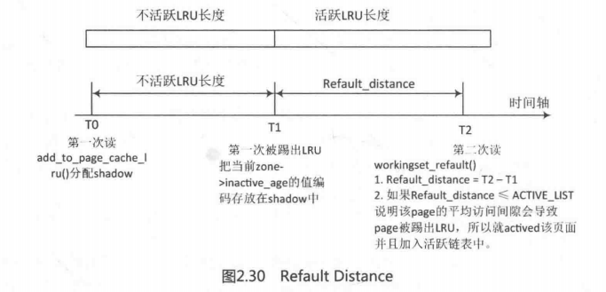

在学术界和Linux内核社区，页面回收算法的优化一直没有停止过，其中Refault Distance算法在Linux3.15版本中被加入，作者是社区专家Johannes Weiner，该算法目前只针对page cache类型的页面。

如图2.29所示，对于page cache类型的LRU链表来说，有两个链表值得关注，分别是活跃链表和不活跃链表。新产生的page总是加入到不活跃链表的头部，页面回收也总是从不活跃链表的尾部开始回收。不活跃链表的页面第二次访问时会升级（promote）到活跃链表，防止被回收；另一方面如果活跃链表增长太快，那么活跃的页面也会被降级（demote）到不活跃链表中。


实际上有一些场景，某些页面经常被访问，但是它们在下一次被访问之前就在不活跃链表中被回收并释放了，那么又必须从存储系统中读取这些page cache页面，这些场景下产生颠簸现象（thrashing）。

当我们观察文件缓存不活跃链表的行为特征时，会发现如下有趣特征。

- 当一个page cache页面第一次访问时，它加入到不活跃链表头，然后慢慢从链表头向链表尾方向移动，链表尾的page cache会被踢出LRU链表且释放页面，这个过程叫作eviction。
- 当第二次访问时，page cache 被升级到活跃LRU链表，这样不活跃链表也空出一个位子，在不活跃链表的页面整体移动了一个位置，这个过程叫作activation。
- 从宏观时间轴来看，eviction 过程处理的页数量与activation过程处理的页数量的和等于不活跃链表的长度NR_inactive
- 要从不活跃链表中释放一个页面，需要移动N个页面（N=不活跃链表长度）。

综合上面的一些行为特征，定义了Refault Distance的概念。第一次访问 page cache称为fault，第二次访问该页称为refault。page cache页面第一次被踢出LRU链表并回收（eviction）的时刻称为E，第二次再访问该页的时刻称为R，那么R-E的时间里需要移动的页面个数称为Refault Distance。

把Refault Distance概念再加上第一次读的时刻，可以用一个公式来概括第一次和第二次读之间的距离（read_distance)。

```
read_distance=nr_inactive+(R-E)
```

如果page想一直保持在LRU链表中，那么read distance不应该比内存的大小还长，否则该page永远都会被踢出LRU链表。因此公式可以推导为：

```
NR_inactive +(R-E)≤NR_inactive+NR_active 
(R-E)≤NR_active
```

换句话说，Refault Distance可以理解为不活跃链表的“财政赤字”，如果不活跃链表的长度至少再延长到Refault Distance，那么就可以保证该page cache 在第二次读之前不会被踢出LRU链表并释放内存，否则就要把该page cache重新加入活跃链表加以保护，以防内存颠簸。在理想情况下，page cache的平均访问距离要大于不活跃链表，小于总的内存大小。

上述内容讨论了两次读的距离小于等于内存大小的情况，即NR_inactive+(R-E）≤NR_inactive+NR_active,如果两次读的距离大于内存大小呢？这种特殊情况不是Refault Distance算法能解决的问题，因为它在第二次读时永远已经被踢出LRU链表，因为可以假设第二次读发生在遥远的未来，但谁都无法保证它在LRU链表中。其实Refault Distance算法是为了解决前者，在第二次读时，人为地把page cache添加到活跃链表从而防止该page_cache 被踢出LRU链表而带来的内存颠簸。

如图2.30所示，T0时刻表示一个page cache 第一次访问，这时会调用add_to page_cache_lru()函数来分配一个shadow用存储zone->inactive_age值，每当有页面被promote到活跃链表时，zone->inactive_age值会加1，每当有页面被踢出不活跃链表时，zone->inactive_age值也加1。T1时刻表示该页被踢出LRU链表并从LRU链表中回收释放，这时把当前T1时刻的zone->inactive_age的值编码存放到shadow中。T2时刻是该页第二次读，这时要计算Refault Distance，Refault Distance=T2-T1,如果Refault Distance≤NR_active,说明该page cache 极有可能在下一次读时已经被踢出LRU链表，因此要人为地actived该页面并且加入活跃链表中。



上面是Refault Distance算法的全部描述，下面来看代码实现。

（1）在struct zone数据结构中新增一个inactive_age原子变量成员，用于记录文件缓存不活跃链表中的 eviction操作和activation操作的计数。

```c
struct zone{
	....
	atomic_long_t inactive_age;
	.....
}
```

（2）page cache 第一次加入不活跃链表时代码如下：

```c
int add_to_page_cache_lru(struct page *page, struct address_space *mapping,
				pgoff_t offset, gfp_t gfp_mask)
{
	void *shadow = NULL;
	int ret;

	__set_page_locked(page);
	ret = __add_to_page_cache_locked(page, mapping, offset,
					 gfp_mask, &shadow);
	if (unlikely(ret))
		__clear_page_locked(page);
	else {
		/*
		 * The page might have been evicted from cache only
		 * recently, in which case it should be activated like
		 * any other repeatedly accessed page.
		 */
		if (shadow && workingset_refault(shadow)) {
			SetPageActive(page);
			workingset_activation(page);
		} else
			ClearPageActive(page);
		lru_cache_add(page);
	}
	return ret;
}
```

page cache第一次加入radix_tree时会分配一个slot来存放inactive_age，这里使用shadow 指向slot。因此第一次加入时shadow值为空，还没有Refault Distance，因此加入到不活跃LRU链表。

 （3）当在文件缓存不活跃链表里的页面被再一次读取时，会调用mark_page_accessed()函数。

```c
void mark_page_accessed(struct page *page)
{
	if (!PageActive(page) && !PageUnevictable(page) &&
			PageReferenced(page)) {

		/*
		 * If the page is on the LRU, queue it for activation via
		 * activate_page_pvecs. Otherwise, assume the page is on a
		 * pagevec, mark it active and it'll be moved to the active
		 * LRU on the next drain.
		 */
		if (PageLRU(page))
			activate_page(page);
		else
			__lru_cache_activate_page(page);
		ClearPageReferenced(page);
		if (page_is_file_cache(page))
			workingset_activation(page);
	} else if (!PageReferenced(page)) {
		SetPageReferenced(page);
	}
}
```

第二次读时会调用workingset_activation()函数来增加zone->inactive_age计数。

```c
void workingset_activation(struct page *page)
{
	atomic_long_inc(&page_zone(page)->inactive_age);
}
```

（4）在不活跃链表末尾的页面会被踢出LRU链表并被释放。

```c
static int __remove_mapping(struct address_space *mapping, struct page *page,
			    bool reclaimed)
{
	BUG_ON(!PageLocked(page));
	BUG_ON(mapping != page_mapping(page));

	spin_lock_irq(&mapping->tree_lock);
	/*
	 * The non racy check for a busy page.
	 *
	 * Must be careful with the order of the tests. When someone has
	 * a ref to the page, it may be possible that they dirty it then
	 * drop the reference. So if PageDirty is tested before page_count
	 * here, then the following race may occur:
	 *
	 * get_user_pages(&page);
	 * [user mapping goes away]
	 * write_to(page);
	 *				!PageDirty(page)    [good]
	 * SetPageDirty(page);
	 * put_page(page);
	 *				!page_count(page)   [good, discard it]
	 *
	 * [oops, our write_to data is lost]
	 *
	 * Reversing the order of the tests ensures such a situation cannot
	 * escape unnoticed. The smp_rmb is needed to ensure the page->flags
	 * load is not satisfied before that of page->_count.
	 *
	 * Note that if SetPageDirty is always performed via set_page_dirty,
	 * and thus under tree_lock, then this ordering is not required.
	 */
	if (!page_freeze_refs(page, 2))
		goto cannot_free;
	/* note: atomic_cmpxchg in page_freeze_refs provides the smp_rmb */
	if (unlikely(PageDirty(page))) {
		page_unfreeze_refs(page, 2);
		goto cannot_free;
	}

	if (PageSwapCache(page)) {
		swp_entry_t swap = { .val = page_private(page) };
		mem_cgroup_swapout(page, swap);
		__delete_from_swap_cache(page);
		spin_unlock_irq(&mapping->tree_lock);
		swapcache_free(swap);
	} else {
		void (*freepage)(struct page *);
		void *shadow = NULL;

		freepage = mapping->a_ops->freepage;
		/*
		 * Remember a shadow entry for reclaimed file cache in
		 * order to detect refaults, thus thrashing, later on.
		 *
		 * But don't store shadows in an address space that is
		 * already exiting.  This is not just an optizimation,
		 * inode reclaim needs to empty out the radix tree or
		 * the nodes are lost.  Don't plant shadows behind its
		 * back.
		 */
		if (reclaimed && page_is_file_cache(page) &&
		    !mapping_exiting(mapping))
			shadow = workingset_eviction(mapping, page);
		__delete_from_page_cache(page, shadow);
		spin_unlock_irq(&mapping->tree_lock);

		if (freepage != NULL)
			freepage(page);
	}

	return 1;

cannot_free:
	spin_unlock_irq(&mapping->tree_lock);
	return 0;
}
```

在被踢出LRU链时，通过workingset_eviction()函数把当前的zone->inactive_age 计数保存到该页对应的radix_tree的shadow中。

```c
void *workingset_eviction(struct address_space *mapping, struct page *page)
{
	struct zone *zone = page_zone(page);
	unsigned long eviction;

	eviction = atomic_long_inc_return(&zone->inactive_age);
	return pack_shadow(eviction, zone);
}
static void *pack_shadow(unsigned long eviction, struct zone *zone)
{
	eviction = (eviction << NODES_SHIFT) | zone_to_nid(zone);
	eviction = (eviction << ZONES_SHIFT) | zone_idx(zone);
	eviction = (eviction << RADIX_TREE_EXCEPTIONAL_SHIFT);

	return (void *)(eviction | RADIX_TREE_EXCEPTIONAL_ENTRY);
}
```

shadow值是经过简单编码的。

（5）当page cache第二次读取时，还会调用到add_to_page_cache_lru()函数。workingset_refault()会计算Refault Distance，并且判断是否需要把page cache加入到活跃链表中，以避免下一次读之前被踢出LRU链表。

```c
bool workingset_refault(void *shadow)
{
	unsigned long refault_distance;
	struct zone *zone;

	unpack_shadow(shadow, &zone, &refault_distance);
	inc_zone_state(zone, WORKINGSET_REFAULT);

	if (refault_distance <= zone_page_state(zone, NR_ACTIVE_FILE)) {
		inc_zone_state(zone, WORKINGSET_ACTIVATE);
		return true;
	}
	return false;
}
```

unpack_shadow()函数只把该page cache之前存放的shadow值重新解码，得出了图中T1时刻的inactive_age值，然后把当前的inactive_age值减去T1，得到Refault Distance。

```c
static void unpack_shadow(void *shadow,
			  struct zone **zone,
			  unsigned long *distance)
{
	unsigned long entry = (unsigned long)shadow;
	unsigned long eviction;
	unsigned long refault;
	unsigned long mask;
	int zid, nid;

	entry >>= RADIX_TREE_EXCEPTIONAL_SHIFT;
	zid = entry & ((1UL << ZONES_SHIFT) - 1);
	entry >>= ZONES_SHIFT;
	nid = entry & ((1UL << NODES_SHIFT) - 1);
	entry >>= NODES_SHIFT;
	eviction = entry;

	*zone = NODE_DATA(nid)->node_zones + zid;

	refault = atomic_long_read(&(*zone)->inactive_age);
	mask = ~0UL >> (NODES_SHIFT + ZONES_SHIFT +
			RADIX_TREE_EXCEPTIONAL_SHIFT);
	/*
	 * The unsigned subtraction here gives an accurate distance
	 * across inactive_age overflows in most cases.
	 *
	 * There is a special case: usually, shadow entries have a
	 * short lifetime and are either refaulted or reclaimed along
	 * with the inode before they get too old.  But it is not
	 * impossible for the inactive_age to lap a shadow entry in
	 * the field, which can then can result in a false small
	 * refault distance, leading to a false activation should this
	 * old entry actually refault again.  However, earlier kernels
	 * used to deactivate unconditionally with *every* reclaim
	 * invocation for the longest time, so the occasional
	 * inappropriate activation leading to pressure on the active
	 * list is not a problem.
	 */
	*distance = (refault - eviction) & mask;
}
```

回到workingset_refault()函数，第9行代码得到refault distance 后继续判断 refault_distance是否小于活跃LRU链表的长度，如果是，则说明该页在下一次访问前极有可能会被踢出LRU链表，因此返回true。在add_to page_cache_Iru()函数中调用SetPageActive(page)设置该页的PG acive标志位并加入到活跃LRU链表中，从而避免第三次访问时该页被踢出LRU链表所产生的内存颠簸。