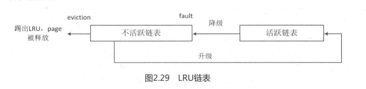

在学术界和Linux内核社区，页面回收算法的优化一直没有停止过，其中Refault Distance算法在Linux3.15版本中被加入，作者是社区专家Johannes Weiner，该算法目前只针对page cache类型的页面。

如图2.29所示，对于page cache类型的LRU链表来说，有两个链表值得关注，分别是活跃链表和不活跃链表。新产生的page总是加入到不活跃链表的头部，页面回收也总是从不活跃链表的尾部开始回收。不活跃链表的页面第二次访问时会升级（promote）到活跃链表，防止被回收；另一方面如果活跃链表增长太快，那么活跃的页面也会被降级（demote）到不活跃链表中。



实际上有一些场景，某些页面经常被访问，但是它们在下一次被访问之前就在不活跃链表中被回收并释放了，那么又必须从存储系统中读取这些page cache页面，这些场景下产生颠簸现象（thrashing）。

当我们观察文件缓存不活跃链表的行为特征时，会发现如下有趣特征。

- 当一个page cache页面第一次访问时，它加入到不活跃链表头，然后慢慢从链表头向链表尾方向移动，链表尾的page cache会被踢出LRU链表且释放页面，这个过程叫作eviction。
- 当第二次访问时，page cache 被升级到活跃LRU链表，这样不活跃链表也空出一个位子，在不活跃链表的页面整体移动了一个位置，这个过程叫作activation。
- 从宏观时间轴来看，eviction 过程处理的页数量与activation过程处理的页数量的和等于不活跃链表的长度NR_inactive
- 要从不活跃链表中释放一个页面，需要移动N个页面（N=不活跃链表长度）。

综合上面的一些行为特征，定义了Refault Distance的概念。第一次访问 page cache称为fault，第二次访问该页称为refault。page cache页面第一次被踢出LRU链表并回收（eviction）的时刻称为E，第二次再访问该页的时刻称为R，那么R-E的时间里需要移动的页面个数称为Refault Distance。

把Refault Distance概念再加上第一次读的时刻，可以用一个公式来概括第一次和第二次读之间的距离（read_distance)。

```
read_distance=nr_inactive+(R-E)
```

如果page想一直保持在LRU链表中，那么read distance不应该比内存的大小还长，否则该page永远都会被踢出LRU链表。因此公式可以推导为：

```
NR_inactive +(R-E)≤NR_inactive+NR_active 
(R-E)≤NR_active
```

换句话说，Refault Distance可以理解为不活跃链表的“财政赤字”，如果不活跃链表的长度至少再延长到Refault Distance，那么就可以保证该page cache 在第二次读之前不会被踢出LRU链表并释放内存，否则就要把该page cache重新加入活跃链表加以保护，以防内存颠簸。在理想情况下，page cache的平均访问距离要大于不活跃链表，小于总的内存大小。

