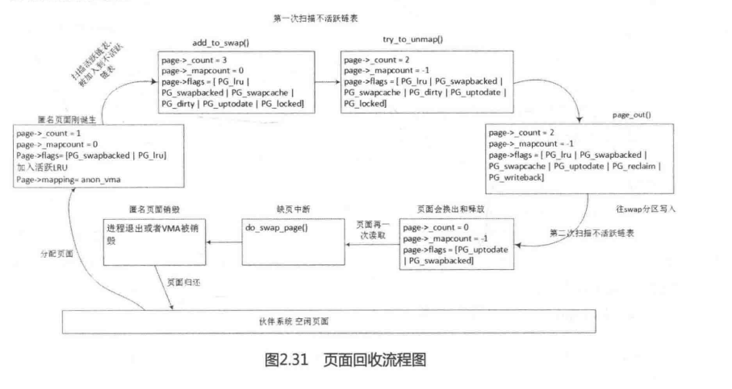
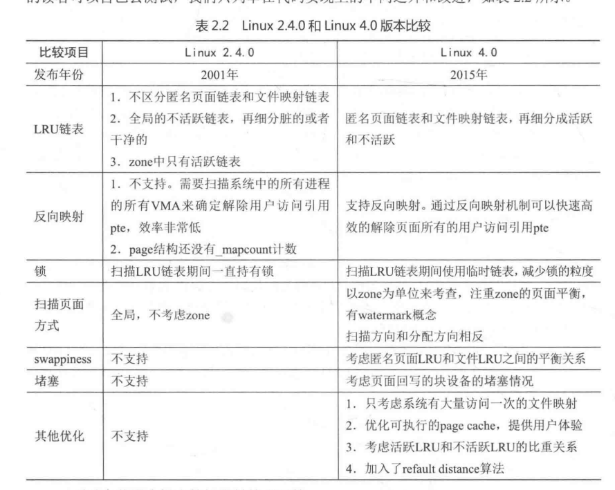

页面回收是Linux内核内存管理中比较难理解的一部分，因此Linux4.0内核的页面回收代码仍然基于zone的LRU扫描策略，和页面分配代码（page allocator）搭配产生了复杂的“化学反应”和很多诡异难懂的补丁。通常驱动开发者很少会触及到这部分代码，做系统优化的读者可能会涉及这部分代码。

Linux内核页面回收的示意图如图2.31所示，可以看到一个页面是如何添加到LRU链表的，如何在活跃LRU链表和不活跃LRU链表中移动的，以及如何让一个页面真正回收并被释放的过程。

	

笔者在2004年春开始接触Linux内核代码，看的第一个内核代码版本是Linux 2.4.0，Linux2.4.0内核发布于2001年。从2001年的Linux2.4.0到2015年的Linux4.0，14年间，我们的生活发生了翻天覆地的变化。如果2001年在上海购入房产，资产升值超过十几倍。

假设你是科技公司的老板，在2001年投资一个团队开发Linux内核，那么14年后，Linux内核是否也有十几倍的性能提升呢?下面来做一个比较，在此不列举实际的数据，有兴趣的读者可以自己去测试，我们只列举在代码实现上的不同之外和改进，如表2.2所示。

