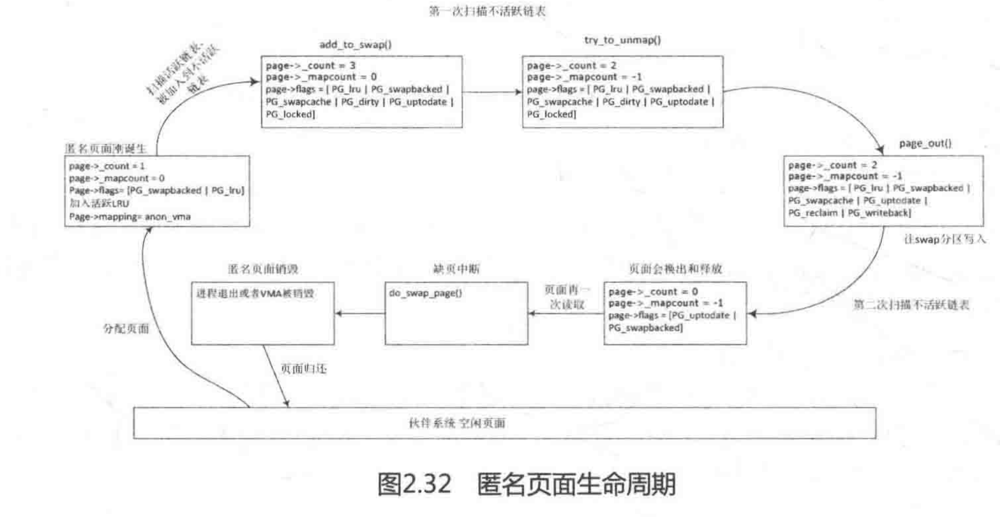

系统长时间运行后，页面变得越来越分散，分配一大块连续的物理内存变得越来越难，但有时系统就是需要一大块连续的物理内存，这就是内存碎片化（memory fragmentation）带来的问题。内存碎片化是操作系统内存管理的一大难题，系统运行时间越长，则内存碎片化越严重，最直接的影响就是分配大块内存失败。

在Linux 2.6.24内核中集成了社区专家MelGorman的Anti-fragmentation patch，其核心思想是把内存页面按照可移动、可回收、不可移动等特性进行分类。可移动的页面通常是指用户态程序分配的内存，移动这些页面仅仅是修改页表映射关系，代价很低；可回收的页面是指不可以移动但可以释放的页面。按照这些类型来分类页面后，就容易释放出大块的连续物理内存。

内存规整机制归纳起来也比较简单，如图2.33所示。有两个方向的扫描者，一个是从zone头部向zone尾部方向扫描，查找哪些页面是可以迁移的；另一个是从zone尾部向zone头部方面扫描，查找哪些页面是空闲页面。当这两个扫描者在zone中间碰头时，或者已经满足分配大块内存的需求时（能分配出所需要的大块内存并且满足最低的水位要求），就可以退出扫描了。内存规整机制除了人为地主动触发以外，一般是在分配大块内存失败时，首先尝试内存规整机制去尝试整理出大块连续的物理内存，然后才调用直接内存回收机制（Direct Reclaim)。这好比旅行时发现购买了太多的东西，那么我们通常会重新规整行李箱，看是否能腾出空间来。

自从内存规整机制加入内核之后一直饱受争议，一个最重要的问题就是效率。在LSFMM2014会议上，有不少人抱怨内存规整的效率太低、速度太慢，而且有bug不容易复现，需要特定的负载和特定的测试方法。