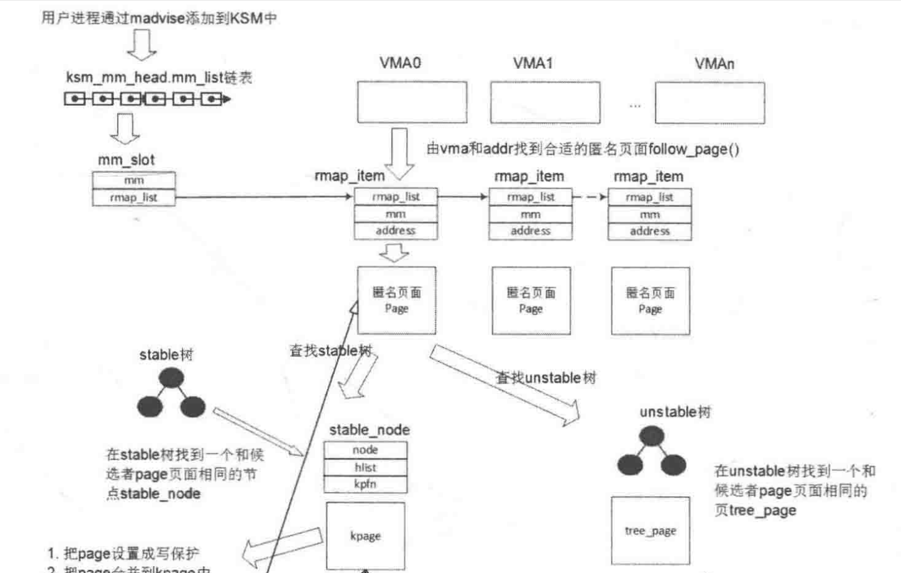

KSM的实现流程如图2.34所示。核心设计思想是基于写时复制机制COW,也就是内容相同的页面可以合并成一个只读页面,从而释放出来空闲页面。首先要思考怎么去查找,以及合并什么样类型的页面?哪些应用场景会有比较丰富的冗余的页面?

KSM最早是为了KVM虚拟机而设计的,KVM虚拟机在宿主机上使用的内存大部分是匿名页面,并且它们在宿主机中存在大量的冗余内存。对于典型的应用程序,KSM只考虑进程分配使用的匿名页面,暂时不考虑 page cache的情况。一个典型的应用程序可以由以下5个内存部分组成。

-   可执行文件的内存映射( page cache)
-   程序分配使用的匿名页面。
-   进程打开的文件映射(包括常用或者不常用,甚至只用一次 (page cache)。
-   进程访问文件系统产生的 cache。

进程访问内核产生的内核 buffer(如slab)等。

设计的关键是如何寻找和比较两个相同的页面,如何让这个过程变得高效而且占用系统资源最少,这就是一个好的设计人员应该思考的问题。首先要规避用哈希算法来比较两个页面的专利问题。KSM虽然使用了 memcmp来比较,最糟糕的情况是两个页面在最后的4Byte 不一样,但是KSM使用红黑树来设计了两棵树,分别是 stable树和 unstable树,可以有效地减少最糟糕的情况。另外KSM也巧妙地利用页面的校验值来比较 unstable树的页面最近是否被修改过,从而避开了该专利的“魔咒”,看上去很像足球场上的一个巧妙漂亮的挑射

页面分为物理页面和虚拟页面,多个虚拟页面可以同时映射到一个物理页面,因此需要把映射到该页的所有的pte都解除后,オ是算真正释放(这里说的pte是指用户进程地址空间VMA的虚拟地址映射到该页的pte,简称用户pte,因此page-> mapcount成员里描述的pte数量不包含内核线性映射的pte)。目前有两种做法,一种做法是扫描每个进程中VMA,由VMA的虚拟地址查询MMU页表找到对应的page数据结构,这样就找到了用户pte。然后对比KSM中的 stable树和 unstable树,如果找到页面内容相同的,就把该pte设置成COW,映射到KSM页面中,从而释放出一个pte,注意这里是释放出一个用户pte,而不是一个物理页面(如果该物理页面只有一个pte映射,那就是释放该页)。另外一种做法是直接扫描系统中的物理页面,然后通过反向映射来解除该页所有的用户pte,从而一次性地释放出物理页面。显然,目前 kernel的KSM是基于第一种做法。

KSM的作者在他的论文中有实测数据,但笔者依然觉得有一些情况下会比较糟糕。例如说在一个很大内存的服务器上,有很多的匿名页面都同时映射了多个虚拟页面。假设每个匿名页面都映射了1000个虚拟页面,这些虚拟页面又同时分布在不同的子进程中,那么要释放一个物理页面,需要扫描完1000个虚拟页面所在的VMA,每次都要 follow_page()査询页表,然后查询 stable树,还需要多次的 memcpy次比较,合并1000次pte页表项也就意味着 memcpy要1000次,这个过程会很漫长。

在实际项目中,有很多人抱怨KSM的效率低,在很多项目上是关闭该特性的。也有很多人在思考如何提高KSM的效率,包括新的软件算法或者利用硬件机制。