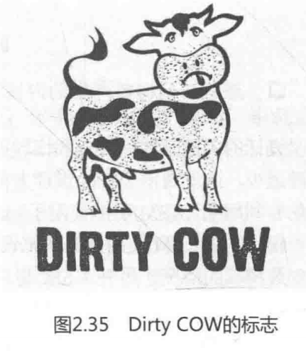
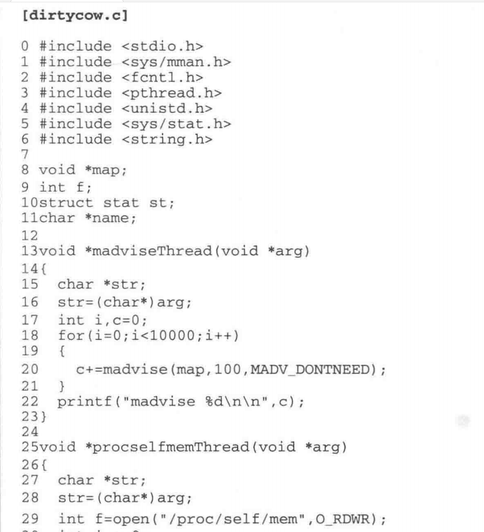
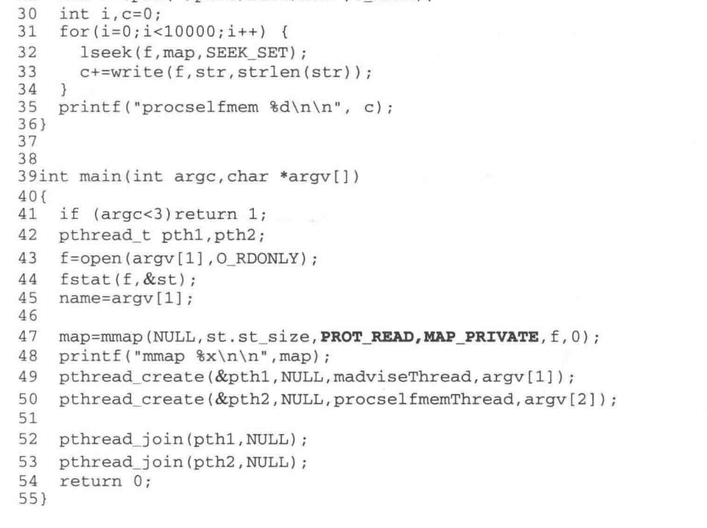
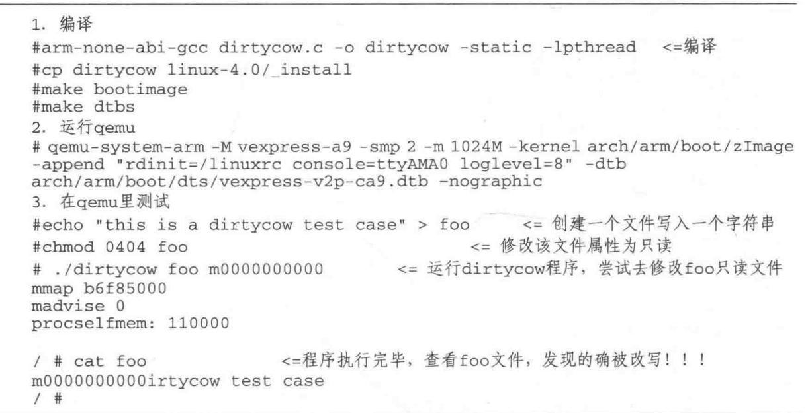

2016年10月,有关人员发现了一个存在近十年之久的非常严重的安全漏洞,该漏洞可以使低权限的用户利用内存写时复制机制的缺陷来提升系统权限,从而获取root权限,这样黑客可以利用该漏洞入侵服务器,现在大部分的服务器都部署着 Linux系统。这个漏洞称为 Dirty COW,代号为CVE-20165195。 Linux内核社区在2016年10月18日紧急修复了这个历史久远的bug,各大发型版 Linux发布紧急更新公告,要求用户尽快更新。这个bug影响的内核版本从 Linux2.6.22到 Linux4.8。如图2.35所示:

读者可以在qemu中的 ARM Express平台上测试。在 Ubuntu上可能已经测试不出来了,因为在你看到书稿时, Ubuntu系统可能已经安装了该漏洞的补丁。

