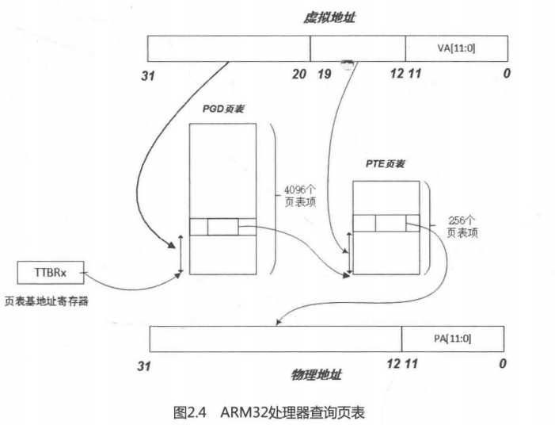

在32bit中的Linux内核中一般采用3层映射模型，第1层是页面目录（PGD)，第2层是页面中间目录（PMD）,第3层才是页面映射表（PTE）。**但在ARM32系统中只用到两层映射，因此在实际代码中就要3层映射模型中合并一层**。在ARM32架构中，可以按段（section）来映射，这时采用单层映射模式。使用页面映射需要两层映射结构，页面的选择可以是64KB的大页面或4KB的小页面，如图2.4所示。Linux内核通常使用4KB大小的小页面。

如果采用单层的段映射，内存中有一个段映射表，表中有4096个表项，每个表项的大小是4Byte，所以这个段映射表的大小是16KB，而且其位置必须与16KB边界对齐。每个段表项可以寻址1MB大小的地址空间。

