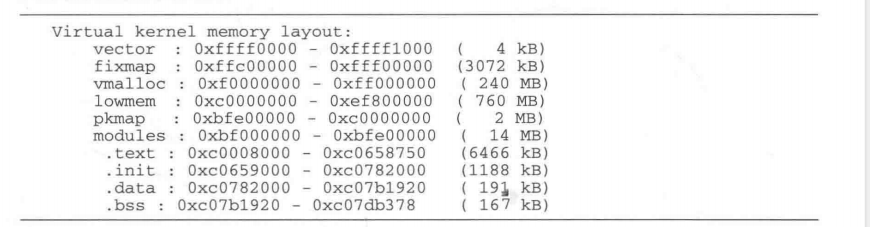
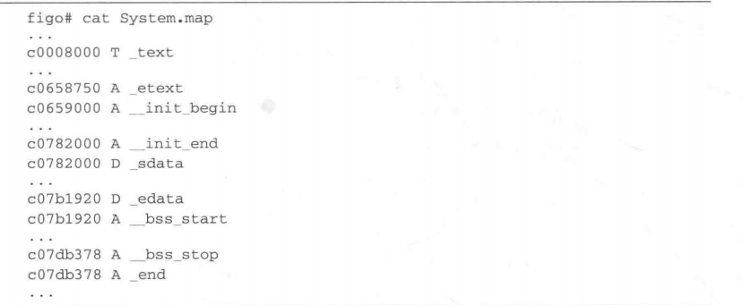
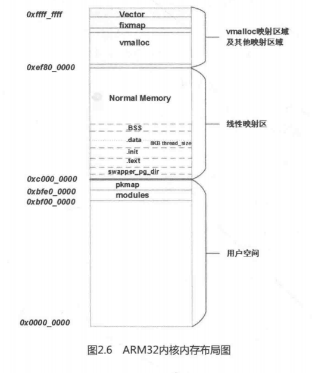

Linux内核在启动时会打印出内核内存空间的布局图，下面是ARM Vexpress平台打印出来的内存空间布局图：



这部分信息打印是在mem_init()函数中实现的。

```
[start_kernel->mm_init->mem_init]
	pr_notice("Virtual kernel memory layout:\n"
		  "    vmalloc : 0x%16lx - 0x%16lx   (%6ld GB)\n"
#ifdef CONFIG_SPARSEMEM_VMEMMAP
		  "    vmemmap : 0x%16lx - 0x%16lx   (%6ld GB maximum)\n"
		  "              0x%16lx - 0x%16lx   (%6ld MB actual)\n"
#endif
		  "    fixed   : 0x%16lx - 0x%16lx   (%6ld KB)\n"
		  "    PCI I/O : 0x%16lx - 0x%16lx   (%6ld MB)\n"
		  "    modules : 0x%16lx - 0x%16lx   (%6ld MB)\n"
		  "    memory  : 0x%16lx - 0x%16lx   (%6ld MB)\n"
		  "      .init : 0x%p" " - 0x%p" "   (%6ld KB)\n"
		  "      .text : 0x%p" " - 0x%p" "   (%6ld KB)\n"
		  "      .data : 0x%p" " - 0x%p" "   (%6ld KB)\n",
		  MLG(VMALLOC_START, VMALLOC_END),
#ifdef CONFIG_SPARSEMEM_VMEMMAP
		  MLG((unsigned long)vmemmap,
		      (unsigned long)vmemmap + VMEMMAP_SIZE),
		  MLM((unsigned long)virt_to_page(PAGE_OFFSET),
		      (unsigned long)virt_to_page(high_memory)),
#endif
		  MLK(FIXADDR_START, FIXADDR_TOP),
		  MLM(PCI_IO_START, PCI_IO_END),
		  MLM(MODULES_VADDR, MODULES_END),
		  MLM(PAGE_OFFSET, (unsigned long)high_memory),
		  MLK_ROUNDUP(__init_begin, __init_end),
		  MLK_ROUNDUP(_text, _etext),
		  MLK_ROUNDUP(_sdata, _edata));
```

编译器在编译目标文件并且链接完成之后，就可以知道内核映像文件最终的大小，接下来打包成二进制文件，该操作由`arch/arm/kernel/vmlinux.ld.S`控制，其中也划定了内核的内存布局。

内核image本身占据的内存空间从_text段到 _end段，并且分为如下几个段：

- 代码段：_text和 _etext为代码段的起始和结束地址，包含了编译后的内核代码。
- init段：`__init_begin` 和 `__init_end`为init段的起始和结束地址，包含了大部分的模块初始化的数据。
- 数据段：`_sdata`和`_edata`为数据段的起始和结束地址，包含了大部分内核的变量；
- BSS段：`__bss_start`和`__bss_stop`为BSS段的开始和结束地址，包含初始化为0的所有静态全局变量。

上述几个段的大小在编译链接时根据内核配置来确定，因为每种配置代码段和数据段长度都不相同，这取决与要编译哪些内核模块，但是起始地址`__text`总是相同的。内核编译完成后，会生成一个System.map文件，查询这个文件可以找到这些地址的具体数值。



内核使用虚拟地址从MODULES_VADDR到MODULES_END这段14MB大小的内存区域。

```
#define MODULES_VADDR		(PAGE_OFFSET - SZ_16M)
#ifdef CONFIG_HIGHMEM
#define MODULES_END		(PAGE_OFFSET - PMD_SIZE)
#else
#define MODULES_END		(PAGE_OFFSET)
#endif
```

用户空间和内核空间使用3:1的划分方法时，内核空间只有1GB大小。这1GB的映射空间，其中有一部分用于直接映射物理地址。这个区域称为线性映射区。在ARM32平台上，物理地址[0:760MB]的这一部分内存被线性映射到[3GB:3GB+768MB]的虚拟地址上。**线性映射区的虚拟地址和物理地址相差PAGE_OFFSET**，即3GB。内核中有相关的宏来实现线性映射区虚拟地址与物理地址的查找过程，例如`__pa(x)`和`__va(x)`

```
[arch/arm/include/asm/memory.h]
#define __pa(x)	__virt_to_phys((unsigned long)(x))
#define __va(x) ((void *)__phys_to_virt(phys_addr_t)(x))
static inline phys_addr_t __virt_to_phys(unsigned long x)
{
	return (phys_addr_t)x - PAGE_OFFSET + PHYS_OFFSET;
}

static inline unsigned long __phys_to_virt(phys_addr_t x)
{
	return x - PHYS_OFFSET + PAGE_OFFSET;
}

```

其中，__pa()把线性映射区的虚拟地址转换为物理地址，转换公式很简单，即用虚拟地址减去PAGE_OFFSET(3GB)，然后再加上PHYS_OFFSET（这个值在有的ARM平台上为0，在ARM Vexpress平台该值为0x6000_0000）。

那么高端内存的起始地址（760MB）如何确定呢？

在内核初始化内存时，在`santiy_check_meminfo()`函数中确定高端内存的起始地址，全局变量high_memory来存放高端内存的起始地址。

```
static void * __initdata vmalloc_min =
	(void *)(VMALLOC_END - (240 << 20) - VMALLOC_OFFSET);
void __init sanity_check_meminfo(void)
{
	phys_addr_t vmalloc_limit = __pa(vmalloc_min - 1) + 1;
	arm_lowmem_limit = vmalloc_limit;
	high_memory = __va(arm_lowmem_limit - 1) + 1;
}
```

vmalloc_min计算出来的结果是0x2F80_0000，即760MB；

为什么内核只线性映射760MB呢？剩下的264MB的虚拟地址空间用来做什么呢？

那是保留给vmallc，fixmap和高端向量等使用的。内核许多驱动使用vmalloc来分配连续的虚拟地址的内存，因为有的驱动不需要连续的物理地址的内存；除此之外，vmalloc还可以用于高端内存的临时映射。一个32bit系统中实际支持的内存数量会超过内核线性映射的长度，但是内核具有对所有内存的寻找能力。

```
/*
 * Just any arbitrary offset to the start of the vmalloc VM area: the
 * current 8MB value just means that there will be a 8MB "hole" after the
 * physical memory until the kernel virtual memory starts.  That means that
 * any out-of-bounds memory accesses will hopefully be caught.
 * The vmalloc() routines leaves a hole of 4kB between each vmalloced
 * area for the same reason. ;)
 */
#define VMALLOC_OFFSET		(8*1024*1024)
#define VMALLOC_START		(((unsigned long)high_memory + VMALLOC_OFFSET) & ~(VMALLOC_OFFSET-1))
#define VMALLOC_END		0xff000000UL
```

vmalloc区域在ARM32内核中，从VMALLOC_START开始到VMALLOC_END结束，即从0xf000_0000到0xff00_0000，大小为240MB。从VMALLOC_START开始之前有一个8MB的洞，用于捕捉越界访问。

内核通常把物理内存低于760MB的称为线性映射内存（Normal Memory），而高于760MB以上的称为高端内存（High Memory）。由于32位系统的寻址能力只有4GB，对于物理内存高于760MB而低于4GB的情况，我们可以从保留240MB的虚拟地址划出一部分用于动态映射高端内存，这样内核就可以访问到全部的4GB的内存了。如果物理内存高于4GB，那么在ARMv7-A架构中就要使用LPE机制来扩展物理内存访问了。用于映射高端内存的虚拟地址空间有限，所以又可以划分为两部分，一部分是临时映射区，另一部分为固定映射区。PKMAP指向的就是固定映射区。如图2.6所示是ARM Vexpress平台上画出内核空间的内存布局图，详细可以参考文档documentation/arm/memory.txt文件。



