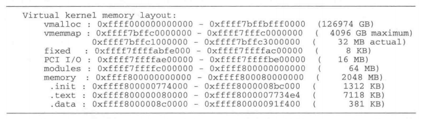
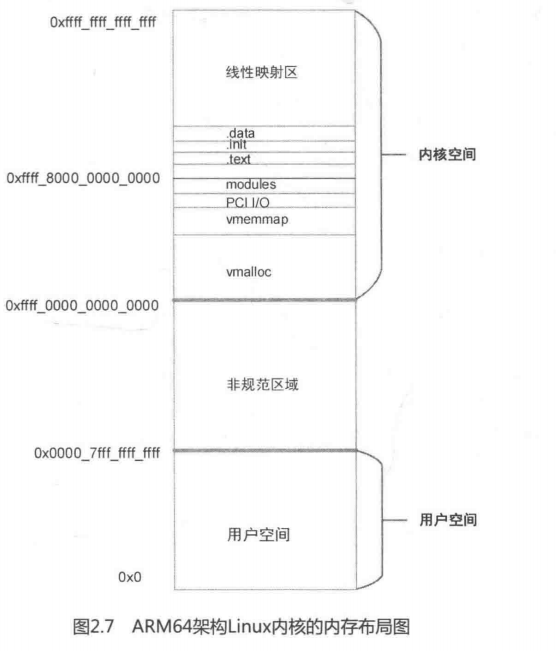

ARM64架构处理器采用48位物理寻址机制，最大可以寻找到256TB的物理地址空间。对于目前的应用来说已经足够了，不需要扩展到64位的物理地址寻址。虚拟地址也同样最大支持48位支持，所以在处理器的架构设计上，把虚拟地址空间划分为两个空间，每个空间最大支持256TB。Linux内核在大多数体系结构中都把两个地址空间划分为用户空间和内核空间。

- 用户空间：0x0000_0000_0000_0000到0x0000_ffff_ffff_ffff

- 内核空间：0xffff_0000_0000_0000到0xffff_ffff_ffff_ffff

64位的Linux内核已经没有高端内存的概念了，因为48位的寻址空间已经足够大了

在QEMU实验平台上，ARM64架构的LInux内核的内存分布图如下：

如图所示，ARM64架构处理器的Linux内核内存布局图。ARM64架构处理器的Linux内核内存布局如下：

（1）用户空间：0x0000_0000_0000_0000到0x0000_ffff_ffff_ffff，一共有256TB。

（2）非规范区域

（3）内核空间：0xffff_0000_0000_0000到0xffff_ffff_ffff_ffff。一共有256TB。

内核空间又做了如下细分：

- vmalloc区域：0xffff_0000_0000_0000到0xffff_7bff_bfff_0000，大小为126974GB。
- vmemmap区域：0xffff_7bff_c000_0000到0xffff_7fff_c000_0000，大小为4096GB。
- PCI I/O区域：0xffff_7fff_ae00_0000到0xffff_7fff_be00_0000，大小为16MB。
- Modules区域：0xffff_7fff_c000_0000到0xffff_8000_0000_0000，大小为64MB。
- normal memory线性映射区：0xffff_8000_0000_0000到0xffff_ffff_ffff_ffff，大小为128TB。