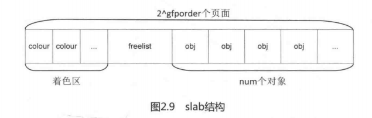

`struct kmem_cache`数据结构是slab分配器中的核心数据结构，我们把它称为slab描述符。struct kmem_cache数据结构定义如下：

```
[include/linux/slab_def.h]
struct kmem_cache {
    struct array_cache __percpu *cpu_cache;

/* 1) Cache tunables. Protected by slab_mutex */
    unsigned int batchcount;-----------------------------------表示当前CPU本地缓冲池array_cache为空时，从共享缓冲池或者slabs_partial/slabs_free列表中获取对象的数目。
    unsigned int limit;----------------------------------------表示当本地对象缓冲池空闲对象数目大于limit时就会主动释放batchcount个对象，便于内核回收和销毁slab。
    unsigned int shared;

    unsigned int size;-----------------------------------------align过后的对象长度
    struct reciprocal_value reciprocal_buffer_size;
/* 2) touched by every alloc & free from the backend */

    unsigned int flags;        /* constant flags */------------分配掩码
    unsigned int num;        /* # of objs per slab */----------slab中有多少个对象

/* 3) cache_grow/shrink */
    /* order of pgs per slab (2^n) */
    unsigned int gfporder;------------------------------------此slab占用z^gfporder个页面

    /* force GFP flags, e.g. GFP_DMA */
    gfp_t allocflags;

    size_t colour;            /* cache colouring range */----一个slab有几个不同的cache line
    unsigned int colour_off;    /* colour offset */----------一个cache order的长度，和L1 Cache Line长度相同
    struct kmem_cache *freelist_cache;
    unsigned int freelist_size;

    /* constructor func */
    void (*ctor)(void *obj);

/* 4) cache creation/removal */
    const char *name;----------------------------------------slab描述符的名称
    struct list_head list;
    int refcount;--------------------------------------------被引用的次数，供slab描述符销毁参考
    int object_size;-----------------------------------------对象的实际大小
    int align;-----------------------------------------------对齐的大小

/* 5) statistics */
#ifdef CONFIG_DEBUG_SLAB
    unsigned long num_active;
    unsigned long num_allocations;
    unsigned long high_mark;
    unsigned long grown;
    unsigned long reaped;
    unsigned long errors;
    unsigned long max_freeable;
    unsigned long node_allocs;
    unsigned long node_frees;
    unsigned long node_overflow;
    atomic_t allochit;
    atomic_t allocmiss;
    atomic_t freehit;
    atomic_t freemiss;

    /*
     * If debugging is enabled, then the allocator can add additional
     * fields and/or padding to every object. size contains the total
     * object size including these internal fields, the following two
     * variables contain the offset to the user object and its size.
     */
    int obj_offset;
#endif /* CONFIG_DEBUG_SLAB */
#ifdef CONFIG_MEMCG_KMEM
    struct memcg_cache_params memcg_params;
#endif

    struct kmem_cache_node *node[MAX_NUMNODES];-------slab对应的节点的struct kmem_cache_node数据结构
}
```

每一个slab描述符都由一个struct kmem_cache数据结构来抽象描述。

- cpu_cache：一个Per-CPU的struct array_cache数据结构，每个CPU一个，表示本地CPU的对象缓冲池。
- batchcount：表示当前CPU的本地对象缓冲池array_cache为空时，从共享的缓冲池或者slabs_partial/slab_free列表中获取对象的数目。
- limit：当本地对象缓冲池空闲对象数目大于limit时就会主动释放batchcount的个对象，便于内核回收和销毁slab。
- shared：用于多核系统。
- size：对象的长度，这个长度要加上align对齐字节。
- flags：对象的分配掩码。
- num：一个slab中最多可以有多少个对象。
- gfporder：一个slab占用2^gfporder个页面。
- colour：一个slab中有几个不同的cache line。
- colour_off：一个cache colour的长度，和L1 cache line大小相同。
- freelist_size：每个对象都要占用1Byte来存放freelist。
- name：slab描述符的名称
- object_size：对象的实际大小
- align：对齐的长度
- node：slab节点，在NUMA系统中每个节点有一个struct kmem_cache_node数据结构。在ARM Vexpress平台中，只有一个节点。

struct array_cache数据结构定义如下：

```
struct array_cache {
    unsigned int avail;-------------对象缓冲池中可用的对象数目
    unsigned int limit;
    unsigned int batchcount;
    unsigned int touched;----------从缓冲池移除一个对象时，touched置1；收缩缓存时，touched置0。
    void *entry[];-----------------保存对象的实体
};
```

slab描述符给每个CPU都提供一个对象缓冲池（array_cache）。

- batchcount/limit：和struct kmem_cache数据结构中的语义一样。
- avail：对象缓冲中可用的对象数目；
- touched：从缓冲池中移除一个对象时，将touched置1，而收缩缓存时，将touched置0；
- entry：保存对象的实体；

kmem_cache_create()(创建slab描述符kmem_cache，此时并没有真正分配内存)函数的实现则是在slab_common.c文件中。

```
[mm/slab_common.c]
struct kmem_cache *
kmem_cache_create(const char *name, size_t size, size_t align,
		  unsigned long flags, void (*ctor)(void *))
{
	struct kmem_cache *s;
	const char *cache_name;
	int err;

	get_online_cpus();
	get_online_mems();
	memcg_get_cache_ids();

	mutex_lock(&slab_mutex);

	err = kmem_cache_sanity_check(name, size);
	if (err) {
		s = NULL;	/* suppress uninit var warning */
		goto out_unlock;
	}

	/*
	 * Some allocators will constraint the set of valid flags to a subset
	 * of all flags. We expect them to define CACHE_CREATE_MASK in this
	 * case, and we'll just provide them with a sanitized version of the
	 * passed flags.
	 */
	flags &= CACHE_CREATE_MASK;

	s = __kmem_cache_alias(name, size, align, flags, ctor);
	if (s)
		goto out_unlock;

	cache_name = kstrdup_const(name, GFP_KERNEL);
	if (!cache_name) {
		err = -ENOMEM;
		goto out_unlock;
	}

	s = do_kmem_cache_create(cache_name, size, size,
				 calculate_alignment(flags, align, size),
				 flags, ctor, NULL, NULL);
	if (IS_ERR(s)) {
		err = PTR_ERR(s);
		kfree_const(cache_name);
	}

out_unlock:
	mutex_unlock(&slab_mutex);

	memcg_put_cache_ids();
	put_online_mems();
	put_online_cpus();

	if (err) {
		if (flags & SLAB_PANIC)
			panic("kmem_cache_create: Failed to create slab '%s'. Error %d\n",
				name, err);
		else {
			printk(KERN_WARNING "kmem_cache_create(%s) failed with error %d",
				name, err);
			dump_stack();
		}
		return NULL;
	}
	return s;
}
```

首先通过__kmem_cache_alias()函数查找是否现成的slab描述符可用复用，若没有，就通过do_kmem_cache_create()来创建一个新的slab描述符。

```
[kmem_cache_create() -> do_kmem_cache_create()]
static struct kmem_cache *
do_kmem_cache_create(const char *name, size_t object_size, size_t size,
		     size_t align, unsigned long flags, void (*ctor)(void *),
		     struct mem_cgroup *memcg, struct kmem_cache *root_cache)
{
	struct kmem_cache *s;
	int err;

	err = -ENOMEM;
	s = kmem_cache_zalloc(kmem_cache, GFP_KERNEL);
	if (!s)
		goto out;

	s->name = name;
	s->object_size = object_size;
	s->size = size;
	s->align = align;
	s->ctor = ctor;

	err = init_memcg_params(s, memcg, root_cache);
	if (err)
		goto out_free_cache;

	err = __kmem_cache_create(s, flags);
	if (err)
		goto out_free_cache;

	s->refcount = 1;
	list_add(&s->list, &slab_caches);
out:
	if (err)
		return ERR_PTR(err);
	return s;

out_free_cache:
	destroy_memcg_params(s);
	kmem_cache_free(kmem_cache, s);
	goto out;
}
```

do_kmem_cache_create()函数首先分配一个struct kmem_cache数据结构。

回到do_kmem_cache_create()函数中，分配好structt kmem_cache数据结构后把name、size、align等值填入struct kmem_cache相关成员中，然后调用__kmem_cache_create()来创建slab缓冲区，最后把这个新创建的slab描述符都加入全局链表slab_caches中。

```
[kmem_cache_create()->do_kmem_cache_create()->__kmem_cache_create()]

/**
 * __kmem_cache_create - Create a cache.
 * @cachep: cache management descriptor
 * @flags: SLAB flags
 *
 * Returns a ptr to the cache on success, NULL on failure.
 * Cannot be called within a int, but can be interrupted.
 * The @ctor is run when new pages are allocated by the cache.
 *
 * The flags are
 *
 * %SLAB_POISON - Poison the slab with a known test pattern (a5a5a5a5)
 * to catch references to uninitialised memory.
 *
 * %SLAB_RED_ZONE - Insert `Red' zones around the allocated memory to check
 * for buffer overruns.
 *
 * %SLAB_HWCACHE_ALIGN - Align the objects in this cache to a hardware
 * cacheline.  This can be beneficial if you're counting cycles as closely
 * as davem.
 */
int
__kmem_cache_create (struct kmem_cache *cachep, unsigned long flags)
{
	size_t left_over, freelist_size;
	size_t ralign = BYTES_PER_WORD;
	gfp_t gfp;
	int err;
	size_t size = cachep->size;

#if DEBUG
#if FORCED_DEBUG
	/*
	 * Enable redzoning and last user accounting, except for caches with
	 * large objects, if the increased size would increase the object size
	 * above the next power of two: caches with object sizes just above a
	 * power of two have a significant amount of internal fragmentation.
	 */
	if (size < 4096 || fls(size - 1) == fls(size-1 + REDZONE_ALIGN +
						2 * sizeof(unsigned long long)))
		flags |= SLAB_RED_ZONE | SLAB_STORE_USER;
	if (!(flags & SLAB_DESTROY_BY_RCU))
		flags |= SLAB_POISON;
#endif
	if (flags & SLAB_DESTROY_BY_RCU)
		BUG_ON(flags & SLAB_POISON);
#endif

	/*
	 * Check that size is in terms of words.  This is needed to avoid
	 * unaligned accesses for some archs when redzoning is used, and makes
	 * sure any on-slab bufctl's are also correctly aligned.
	 */
	if (size & (BYTES_PER_WORD - 1)) {
		size += (BYTES_PER_WORD - 1);
		size &= ~(BYTES_PER_WORD - 1);
	}

	if (flags & SLAB_RED_ZONE) {
		ralign = REDZONE_ALIGN;
		/* If redzoning, ensure that the second redzone is suitably
		 * aligned, by adjusting the object size accordingly. */
		size += REDZONE_ALIGN - 1;
		size &= ~(REDZONE_ALIGN - 1);
	}

	/* 3) caller mandated alignment */
	if (ralign < cachep->align) {
		ralign = cachep->align;
	}
	/* disable debug if necessary */
	if (ralign > __alignof__(unsigned long long))
		flags &= ~(SLAB_RED_ZONE | SLAB_STORE_USER);
	/*
	 * 4) Store it.
	 */
	cachep->align = ralign;

	if (slab_is_available())
		gfp = GFP_KERNEL;
	else
		gfp = GFP_NOWAIT;

#if DEBUG

	/*
	 * Both debugging options require word-alignment which is calculated
	 * into align above.
	 */
	if (flags & SLAB_RED_ZONE) {
		/* add space for red zone words */
		cachep->obj_offset += sizeof(unsigned long long);
		size += 2 * sizeof(unsigned long long);
	}
	if (flags & SLAB_STORE_USER) {
		/* user store requires one word storage behind the end of
		 * the real object. But if the second red zone needs to be
		 * aligned to 64 bits, we must allow that much space.
		 */
		if (flags & SLAB_RED_ZONE)
			size += REDZONE_ALIGN;
		else
			size += BYTES_PER_WORD;
	}
#if FORCED_DEBUG && defined(CONFIG_DEBUG_PAGEALLOC)
	if (size >= kmalloc_size(INDEX_NODE + 1)
	    && cachep->object_size > cache_line_size()
	    && ALIGN(size, cachep->align) < PAGE_SIZE) {
		cachep->obj_offset += PAGE_SIZE - ALIGN(size, cachep->align);
		size = PAGE_SIZE;
	}
#endif
#endif

	/*
	 * Determine if the slab management is 'on' or 'off' slab.
	 * (bootstrapping cannot cope with offslab caches so don't do
	 * it too early on. Always use on-slab management when
	 * SLAB_NOLEAKTRACE to avoid recursive calls into kmemleak)
	 */
	if ((size >= (PAGE_SIZE >> 5)) && !slab_early_init &&
	    !(flags & SLAB_NOLEAKTRACE))
		/*
		 * Size is large, assume best to place the slab management obj
		 * off-slab (should allow better packing of objs).
		 */
		flags |= CFLGS_OFF_SLAB;

	size = ALIGN(size, cachep->align);
	/*
	 * We should restrict the number of objects in a slab to implement
	 * byte sized index. Refer comment on SLAB_OBJ_MIN_SIZE definition.
	 */
	if (FREELIST_BYTE_INDEX && size < SLAB_OBJ_MIN_SIZE)
		size = ALIGN(SLAB_OBJ_MIN_SIZE, cachep->align);

	left_over = calculate_slab_order(cachep, size, cachep->align, flags);

	if (!cachep->num)
		return -E2BIG;

	freelist_size = calculate_freelist_size(cachep->num, cachep->align);

	/*
	 * If the slab has been placed off-slab, and we have enough space then
	 * move it on-slab. This is at the expense of any extra colouring.
	 */
	if (flags & CFLGS_OFF_SLAB && left_over >= freelist_size) {
		flags &= ~CFLGS_OFF_SLAB;
		left_over -= freelist_size;
	}

	if (flags & CFLGS_OFF_SLAB) {
		/* really off slab. No need for manual alignment */
		freelist_size = calculate_freelist_size(cachep->num, 0);

#ifdef CONFIG_PAGE_POISONING
		/* If we're going to use the generic kernel_map_pages()
		 * poisoning, then it's going to smash the contents of
		 * the redzone and userword anyhow, so switch them off.
		 */
		if (size % PAGE_SIZE == 0 && flags & SLAB_POISON)
			flags &= ~(SLAB_RED_ZONE | SLAB_STORE_USER);
#endif
	}

	cachep->colour_off = cache_line_size();
	/* Offset must be a multiple of the alignment. */
	if (cachep->colour_off < cachep->align)
		cachep->colour_off = cachep->align;
	cachep->colour = left_over / cachep->colour_off;
	cachep->freelist_size = freelist_size;
	cachep->flags = flags;
	cachep->allocflags = __GFP_COMP;
	if (CONFIG_ZONE_DMA_FLAG && (flags & SLAB_CACHE_DMA))
		cachep->allocflags |= GFP_DMA;
	cachep->size = size;
	cachep->reciprocal_buffer_size = reciprocal_value(size);

	if (flags & CFLGS_OFF_SLAB) {
		cachep->freelist_cache = kmalloc_slab(freelist_size, 0u);
		/*
		 * This is a possibility for one of the kmalloc_{dma,}_caches.
		 * But since we go off slab only for object size greater than
		 * PAGE_SIZE/8, and kmalloc_{dma,}_caches get created
		 * in ascending order,this should not happen at all.
		 * But leave a BUG_ON for some lucky dude.
		 */
		BUG_ON(ZERO_OR_NULL_PTR(cachep->freelist_cache));
	}

	err = setup_cpu_cache(cachep, gfp);
	if (err) {
		__kmem_cache_shutdown(cachep);
		return err;
	}

	return 0;
}
```

在__kmem_cache_create()函数中，第14~17行代码中首先检查size是否和系统的word长度对齐（BYTE_PER_WORD）。在ARM Vexpress平台中，BYTE_PER_WORD为4Byte，我们的例子的size为20Byte，所以和BYTES_PER_WORD对齐。

第20~25行代码，接着计算align对齐的大小。我们的例子中cachep->align值为8byte。

第31~34行代码，枚举类型slab_state用来表示slab系统中的状态，例如DOWN、PARTIAL、PATRIAL_NODE、UP和FULL等，当slab机制完全初始化完成后状态变成为FULL。slab_is_available()表示当slab状态在UP或者FULL时，分配掩码可以使用GFP_KERNEL，否则只能使用GFP_NOWAIT；

第42~48行代码中，当需要分配slab缓冲区对象大小大于128Byte时，slab系统认为对象的大小比较大，那么分配掩码要设置CFLGS_OFF_SLAB标志位。我们的例子会忽略CFLGS_OFF_SLAB这个标志位。

第50行代码中，根据size和align对齐关系，计算出最终的size大小。在我们例子中，size为20Byte，align为8Byte，所以最终大小为24byte。

第58行代码通过calculate_slab_order()函数计算相关的核心参数。

```
[kmem_cache_create()->do_kmem_cache_create()->__kmem_cache_create()->calculate_slab_order()]
/**
 * calculate_slab_order - calculate size (page order) of slabs
 * @cachep: pointer to the cache that is being created
 * @size: size of objects to be created in this cache.
 * @align: required alignment for the objects.
 * @flags: slab allocation flags
 *
 * Also calculates the number of objects per slab.
 *
 * This could be made much more intelligent.  For now, try to avoid using
 * high order pages for slabs.  When the gfp() functions are more friendly
 * towards high-order requests, this should be changed.
 */
static size_t calculate_slab_order(struct kmem_cache *cachep,
			size_t size, size_t align, unsigned long flags)
{
	unsigned long offslab_limit;
	size_t left_over = 0;
	int gfporder;

	for (gfporder = 0; gfporder <= KMALLOC_MAX_ORDER; gfporder++) {
		unsigned int num;
		size_t remainder;

		cache_estimate(gfporder, size, align, flags, &remainder, &num);
		if (!num)
			continue;

		/* Can't handle number of objects more than SLAB_OBJ_MAX_NUM */
		if (num > SLAB_OBJ_MAX_NUM)
			break;

		if (flags & CFLGS_OFF_SLAB) {
			size_t freelist_size_per_obj = sizeof(freelist_idx_t);
			/*
			 * Max number of objs-per-slab for caches which
			 * use off-slab slabs. Needed to avoid a possible
			 * looping condition in cache_grow().
			 */
			if (IS_ENABLED(CONFIG_DEBUG_SLAB_LEAK))
				freelist_size_per_obj += sizeof(char);
			offslab_limit = size;
			offslab_limit /= freelist_size_per_obj;

 			if (num > offslab_limit)
				break;
		}

		/* Found something acceptable - save it away */
		cachep->num = num;
		cachep->gfporder = gfporder;
		left_over = remainder;

		/*
		 * A VFS-reclaimable slab tends to have most allocations
		 * as GFP_NOFS and we really don't want to have to be allocating
		 * higher-order pages when we are unable to shrink dcache.
		 */
		if (flags & SLAB_RECLAIM_ACCOUNT)
			break;

		/*
		 * Large number of objects is good, but very large slabs are
		 * currently bad for the gfp()s.
		 */
		if (gfporder >= slab_max_order)
			break;

		/*
		 * Acceptable internal fragmentation?
		 */
		if (left_over * 8 <= (PAGE_SIZE << gfporder))
			break;
	}
	return left_over;
}
```

calculate_slab_order()函数会计算出一个slab需要多少个物理页面，同时也计算出slab可以容纳多少个对象。

如图所示，一个slab由2^gfporder个连续的物理页面组成，包含了num个slab对象、着色区和freelist区。



第7行代码，for循环中首先会从0开始计算最合适的gfporder值，最多支持的页面数是2^KMALLOC_MAX_ORDER，slab分配器中KMALLOC_MAX_ORDER为25，所以一个slab的大小最大为2^25个页面，即32MB大小。KMALLOC_MAX_ORDER的计算方法如下：

```
[include/linux/slab.h]
/*
 * The largest kmalloc size supported by the SLAB allocators is
 * 32 megabyte (2^25) or the maximum allocatable page order if that is
 * less than 32 MB.
 *
 * WARNING: Its not easy to increase this value since the allocators have
 * to do various tricks to work around compiler limitations in order to
 * ensure proper constant folding.
 */
#define KMALLOC_SHIFT_HIGH	((MAX_ORDER + PAGE_SHIFT - 1) <= 25 ? \
				(MAX_ORDER + PAGE_SHIFT - 1) : 25)
#define KMALLOC_SHIFT_MAX	KMALLOC_SHIFT_HIGH
#ifndef KMALLOC_SHIFT_LOW
#define KMALLOC_SHIFT_LOW	5
```

calculate_slab_order()函数调用cache_estimate()来计算2^gfporder个页面大小的情况下，可以容纳多少个obj对象，然后剩下的空间用于cache colour着色。

```
/*
 * Calculate the number of objects and left-over bytes for a given buffer size.
 */
static void cache_estimate(unsigned long gfporder, size_t buffer_size,
			   size_t align, int flags, size_t *left_over,
			   unsigned int *num)
{
	int nr_objs;
	size_t mgmt_size;
	size_t slab_size = PAGE_SIZE << gfporder;

	/*
	 * The slab management structure can be either off the slab or
	 * on it. For the latter case, the memory allocated for a
	 * slab is used for:
	 *
	 * - One unsigned int for each object
	 * - Padding to respect alignment of @align
	 * - @buffer_size bytes for each object
	 *
	 * If the slab management structure is off the slab, then the
	 * alignment will already be calculated into the size. Because
	 * the slabs are all pages aligned, the objects will be at the
	 * correct alignment when allocated.
	 */
	if (flags & CFLGS_OFF_SLAB) {
		mgmt_size = 0;
		nr_objs = slab_size / buffer_size;

	} else {
		nr_objs = calculate_nr_objs(slab_size, buffer_size,
					sizeof(freelist_idx_t), align);
		mgmt_size = calculate_freelist_size(nr_objs, align);
	}
	*num = nr_objs;
	*left_over = slab_size - nr_objs*buffer_size - mgmt_size;
}

static int calculate_nr_objs(size_t slab_size, size_t buffer_size,
				size_t idx_size, size_t align)
{
	int nr_objs;
	size_t remained_size;
	size_t freelist_size;
	int extra_space = 0;

	if (IS_ENABLED(CONFIG_DEBUG_SLAB_LEAK))
		extra_space = sizeof(char);
	/*
	 * Ignore padding for the initial guess. The padding
	 * is at most @align-1 bytes, and @buffer_size is at
	 * least @align. In the worst case, this result will
	 * be one greater than the number of objects that fit
	 * into the memory allocation when taking the padding
	 * into account.
	 */
	nr_objs = slab_size / (buffer_size + idx_size + extra_space);

	/*
	 * This calculated number will be either the right
	 * amount, or one greater than what we want.
	 */
	remained_size = slab_size - nr_objs * buffer_size;
	freelist_size = calculate_freelist_size(nr_objs, align);
	if (remained_size < freelist_size)
		nr_objs--;

	return nr_objs;
}

static size_t calculate_freelist_size(int nr_objs, size_t align)
{
	size_t freelist_size;

	freelist_size = nr_objs * sizeof(freelist_idx_t);
	if (IS_ENABLED(CONFIG_DEBUG_SLAB_LEAK))
		freelist_size += nr_objs * sizeof(char);

	if (align)
		freelist_size = ALIGN(freelist_size, align);

	return freelist_size;
}

```

cache_estimate()函数会调用calculate_nr_objs()，计算公式并不复杂。

```
obj_num = buffer_size / (obj_size + sizeof(freelist_idx_t))
```

最后在calculate_slab_order()中的第16~44行代码有一些判断条件，例如判断slab的对象数目、cache colour着色器是否满足条件。如果满足，就不需要继续尝试更大的gfporder了。在我们例子中，gfporder为0，满足第43行代码的条件判断，最终计算完成后slab对象个数为cachep->num=163，cachep->gfporder=0，left_over=16，freelist_size=168，有兴趣的同学可以验算一遍calculate_slab_order()函数。

回到__kmem_cache_create()函数，第76行代码cache_line_size()得出L1 cache行的大小，ARM Vexpress平台采用Cortex-A9处理器，L1 cache line大小可以配置成16B、32B或者64B。

第80行代码，计算cache colour的大小，用left_over除以L1 Cache行大小，即left_over可以包含多少个L1 Cache行。假设L1 Cache line大小为16Byte，在我们这个例子中，只能包含1个cache行，如果L1 cache line 大小配置为64Byte，cache colour就不起作用了。

最后调用setup_cpu_cache()函数来继续配置slab描述符。假设slab_state为FULL，即slab机制已经完成。内部直接调用enable_cpucache()函数。

```
[__kmem_cache_create()->setup_cpu_cache()->enable_cpucache()]
/* Called with slab_mutex held always */
static int enable_cpucache(struct kmem_cache *cachep, gfp_t gfp)
{
	int err;
	int limit = 0;
	int shared = 0;
	int batchcount = 0;

	if (!is_root_cache(cachep)) {
		struct kmem_cache *root = memcg_root_cache(cachep);
		limit = root->limit;
		shared = root->shared;
		batchcount = root->batchcount;
	}

	if (limit && shared && batchcount)
		goto skip_setup;
	/*
	 * The head array serves three purposes:
	 * - create a LIFO ordering, i.e. return objects that are cache-warm
	 * - reduce the number of spinlock operations.
	 * - reduce the number of linked list operations on the slab and
	 *   bufctl chains: array operations are cheaper.
	 * The numbers are guessed, we should auto-tune as described by
	 * Bonwick.
	 */
	if (cachep->size > 131072)
		limit = 1;
	else if (cachep->size > PAGE_SIZE)
		limit = 8;
	else if (cachep->size > 1024)
		limit = 24;
	else if (cachep->size > 256)
		limit = 54;
	else
		limit = 120;

	/*
	 * CPU bound tasks (e.g. network routing) can exhibit cpu bound
	 * allocation behaviour: Most allocs on one cpu, most free operations
	 * on another cpu. For these cases, an efficient object passing between
	 * cpus is necessary. This is provided by a shared array. The array
	 * replaces Bonwick's magazine layer.
	 * On uniprocessor, it's functionally equivalent (but less efficient)
	 * to a larger limit. Thus disabled by default.
	 */
	shared = 0;
	if (cachep->size <= PAGE_SIZE && num_possible_cpus() > 1)
		shared = 8;

#if DEBUG
	/*
	 * With debugging enabled, large batchcount lead to excessively long
	 * periods with disabled local interrupts. Limit the batchcount
	 */
	if (limit > 32)
		limit = 32;
#endif
	batchcount = (limit + 1) / 2;
skip_setup:
	err = do_tune_cpucache(cachep, limit, batchcount, shared, gfp);
	if (err)
		printk(KERN_ERR "enable_cpucache failed for %s, error %d.\n",
		       cachep->name, -err);
	return err;
}
```

在enable_cpucache()函数中，第7~16行代码根据对象大小来计算空闲对象的最大阈值limit，这里limit默认选择120；

第28行代码，在SMP系统中且slab对象大小不大于一个页面的情况下，shared这个变量设置为8；

第31行代码，计算batchcount数目，通常是最大阈值limit的一半，batchcount一般用于本地缓冲区和共享缓冲区之间来填充对象的数量。

继续调用do_tune_cpucache()函数来配置slab描述符。

```
__kmem_cache_create()->setup_cpu_cache()->enable_cpucache()->__do_tune_cpu_cache()
/* Always called with the slab_mutex held */
static int __do_tune_cpucache(struct kmem_cache *cachep, int limit,
				int batchcount, int shared, gfp_t gfp)
{
	struct array_cache __percpu *cpu_cache, *prev;
	int cpu;

	cpu_cache = alloc_kmem_cache_cpus(cachep, limit, batchcount);
	if (!cpu_cache)
		return -ENOMEM;

	prev = cachep->cpu_cache;
	cachep->cpu_cache = cpu_cache;
	kick_all_cpus_sync();

	check_irq_on();
	cachep->batchcount = batchcount;
	cachep->limit = limit;
	cachep->shared = shared;

	if (!prev)
		goto alloc_node;

	for_each_online_cpu(cpu) {
		LIST_HEAD(list);
		int node;
		struct kmem_cache_node *n;
		struct array_cache *ac = per_cpu_ptr(prev, cpu);

		node = cpu_to_mem(cpu);
		n = get_node(cachep, node);
		spin_lock_irq(&n->list_lock);
		free_block(cachep, ac->entry, ac->avail, node, &list);
		spin_unlock_irq(&n->list_lock);
		slabs_destroy(cachep, &list);
	}
	free_percpu(prev);

alloc_node:
	return alloc_kmem_cache_node(cachep, gfp);
}
```

在__do_tune_cpucache()函数中，首先通过allow_kmem_cpus()函数来分配Per-CPU类型的struct array_cache数据结构，我们称之为对象缓冲池。对象缓冲池包含了一个Per-CPU类型的struct array_cache指针，即系统中每个CPU有一个struct array_cache指针。当前CPU的array_cache称为本地对象缓冲池，另外还有一个概念为共享对象缓冲池。

```static struct array_cache __percpu *alloc_kmem_cache_cpus(
struct kmem_cache *cachep, int entries, int batchcount)
{
	int cpu;
	size_t size;
	struct array_cache __percpu *cpu_cache;

	size = sizeof(void *) * entries + sizeof(struct array_cache);
	cpu_cache = __alloc_percpu(size, sizeof(void *));

	if (!cpu_cache)
		return NULL;

	for_each_possible_cpu(cpu) {
		init_arraycache(per_cpu_ptr(cpu_cache, cpu),
				entries, batchcount);
	}

	return cpu_cache;
}
```

通过alloc_kmem_cache_cpus()函数来分配对象缓冲池，注意这里计算size时考虑对象缓冲池最大阈值limit，参数entries是指最大阈值limit，见第7行代码。

init_arraycache()设置对象缓冲池的limit和batchcount，其中limit为120，batchcount为60。

回到__do_tune_cpucache()函数，刚分配的对象缓冲池cpu_cache会被设置为slab描述符的本地对象缓冲池。调用alloc_kmem_cache_node()来继续初始化slab缓冲区cachep->kmem_cache_node数据结构。

```
[__kmem_cache_create()->setup_cpu_cache()->enable_cpucache()->__do_tune_cpu_cache()->alloc_kmem_cache_node()]
/*
 * This initializes kmem_cache_node or resizes various caches for all nodes.
 */
static int alloc_kmem_cache_node(struct kmem_cache *cachep, gfp_t gfp)
{
	int node;
	struct kmem_cache_node *n;
	struct array_cache *new_shared;
	struct alien_cache **new_alien = NULL;

	for_each_online_node(node) {

		if (use_alien_caches) {
			new_alien = alloc_alien_cache(node, cachep->limit, gfp);
			if (!new_alien)
				goto fail;
		}

		new_shared = NULL;
		if (cachep->shared) {
			new_shared = alloc_arraycache(node,
				cachep->shared*cachep->batchcount,
					0xbaadf00d, gfp);
			if (!new_shared) {
				free_alien_cache(new_alien);
				goto fail;
			}
		}

		n = get_node(cachep, node);
		if (n) {
			struct array_cache *shared = n->shared;
			LIST_HEAD(list);

			spin_lock_irq(&n->list_lock);

			if (shared)
				free_block(cachep, shared->entry,
						shared->avail, node, &list);

			n->shared = new_shared;
			if (!n->alien) {
				n->alien = new_alien;
				new_alien = NULL;
			}
			n->free_limit = (1 + nr_cpus_node(node)) *
					cachep->batchcount + cachep->num;
			spin_unlock_irq(&n->list_lock);
			slabs_destroy(cachep, &list);
			kfree(shared);
			free_alien_cache(new_alien);
			continue;
		}
		n = kmalloc_node(sizeof(struct kmem_cache_node), gfp, node);
		if (!n) {
			free_alien_cache(new_alien);
			kfree(new_shared);
			goto fail;
		}

		kmem_cache_node_init(n);
		n->next_reap = jiffies + REAPTIMEOUT_NODE +
				((unsigned long)cachep) % REAPTIMEOUT_NODE;
		n->shared = new_shared;
		n->alien = new_alien;
		n->free_limit = (1 + nr_cpus_node(node)) *
					cachep->batchcount + cachep->num;
		cachep->node[node] = n;
	}
	return 0;

fail:
	if (!cachep->list.next) {
		/* Cache is not active yet. Roll back what we did */
		node--;
		while (node >= 0) {
			n = get_node(cachep, node);
			if (n) {
				kfree(n->shared);
				free_alien_cache(n->alien);
				kfree(n);
				cachep->node[node] = NULL;
			}
			node--;
		}
	}
	return -ENOMEM;
}
```

在alloc_kmem_cache_node()函数中，第7~43行代码，for循环是遍历系统中所有的NUMA节点，在ARM Vexpress平台中只有一个节点；

如果cachep->shared大于0（在多核系统中cachep->shared会大于0，这个在enable_cpucache()函数中已经初始化了，cachep_shared为8），通过alloc_arrarycache()来分配一个共享对象缓冲池new_shared，为多核CPU之间共享空闲缓存对象。

第15~34行代码，获取系统中的kmem_cache_node节点。在我们例子中，kmem_cache_node节点还没分配，所以第35~42行代码新分配了一个kmem_cache_node节点，我们把kmem_cache_node节点简称为slab节点。

struct kmem_cache_node数据结构包括3个slab链表，分别表示部分空间，完全用尽、空闲。free_objects表示上述3个链表中空闲对象的总和，free_limit表示所有slab上容许空闲对象的最大数目。slab节点上还包含在一个NUMA节点中CPU之间共享的共享对象缓冲池new_shared。

struct kmem_cache_node数据结构定义如下：

```
struct kmem_cache_node {
	spinlock_t list_lock;

#ifdef CONFIG_SLAB
	struct list_head slabs_partial;	/* partial list first, better asm code */
	struct list_head slabs_full;
	struct list_head slabs_free;
	unsigned long free_objects;
	unsigned int free_limit;
	unsigned int colour_next;	/* Per-node cache coloring */
	struct array_cache *shared;	/* shared per node */
	struct alien_cache **alien;	/* on other nodes */
	unsigned long next_reap;	/* updated without locking */
	int free_touched;		/* updated without locking */
#endif

#ifdef CONFIG_SLUB
	unsigned long nr_partial;
	struct list_head partial;
#ifdef CONFIG_SLUB_DEBUG
	atomic_long_t nr_slabs;
	atomic_long_t total_objects;
	struct list_head full;
#endif
#endif

};
```

slab节点用于NUMA系统，在ARM Vexpress平台上只有一个内存节点。

- slabs_partial/slabs_full/slabs_free：slab节点上的3个链表，链表每个成员都是一个slab。
- free_objects：3个链表中所有空闲对象数目。
- free_limit：slab可容许的空闲对象数目最大阈值。
- shared：在多核CPU中，除了本地CPU外，其余CPU有一个共享的对象缓冲池

至此，slab描述符的建立已经完成，下面把slab分配器中的重要数据结构重新看一下，并且把我们例子中相关的数据结构的结构列出来，方便大家看代码可以自行验算。我们这个例子为在ARM Vexpress平台创建名为"figo_object"的slab描述符，大小为20Byte，align为8byte，flags为0，假设L1 cache line大小为16byte，其slab描述符相关成员的计算结果如下：

```
struct kmem_cache *cachep {
 .array_cache = {
 	.avail = 0,
 	.limit = 120,
 	.batchcount = 60,
 	.touched = 0,
 }
 .batchcount = 60,
 .limit = 120,
 .shared = 8,
 .size = 24,
 .flags = 0,
 .num = 163,
 .gfporder = 0,
 .colour = 1,
 .colour_off = 16,
 .freelist_size = 168,
 .object_size = 20,
 .align = 8,
 .kmem_cache_node = {
 	.free_object = 0,
 	.free_limit = 283,
 	.shared_array_cache = {
 		.avail = 0,
 		.limit = 480,
 	}
 }
}
```

