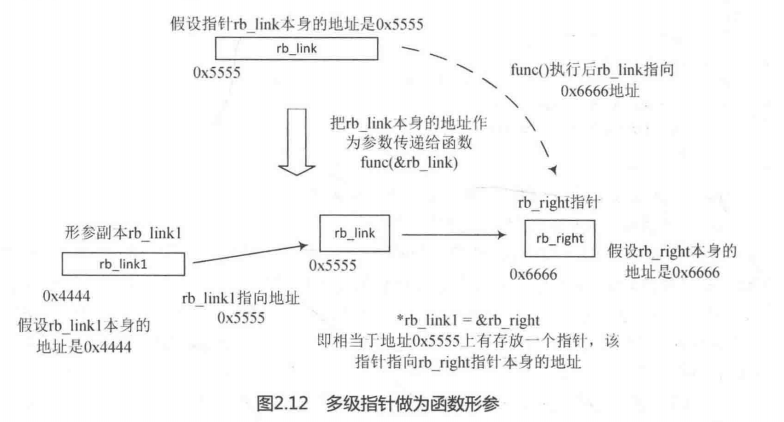

insert_vm_struct()是内核提供的插入VMA的核心API函数。

```
int insert_vm_struct(struct mm_struct *mm, struct vm_area_struct *vma)
{
	struct vm_area_struct *prev;
	struct rb_node **rb_link, *rb_parent;

	/*
	 * The vm_pgoff of a purely anonymous vma should be irrelevant
	 * until its first write fault, when page's anon_vma and index
	 * are set.  But now set the vm_pgoff it will almost certainly
	 * end up with (unless mremap moves it elsewhere before that
	 * first wfault), so /proc/pid/maps tells a consistent story.
	 *
	 * By setting it to reflect the virtual start address of the
	 * vma, merges and splits can happen in a seamless way, just
	 * using the existing file pgoff checks and manipulations.
	 * Similarly in do_mmap_pgoff and in do_brk.
	 */
	if (!vma->vm_file) {
		BUG_ON(vma->anon_vma);
		vma->vm_pgoff = vma->vm_start >> PAGE_SHIFT;
	}
	if (find_vma_links(mm, vma->vm_start, vma->vm_end,
			   &prev, &rb_link, &rb_parent))
		return -ENOMEM;
	if ((vma->vm_flags & VM_ACCOUNT) &&
	     security_vm_enough_memory_mm(mm, vma_pages(vma)))
		return -ENOMEM;

	vma_link(mm, vma, prev, rb_link, rb_parent);
	return 0;
}
```

insert_vm_struct()函数向VMA链表和红黑树插入一个新的VMA。参数mm是进程的内存描述符，vma是要插入的线性区VMA。

第5~8行代码，如果vma不是文件映射，设置vm_pgoff成员

第9行代码，find_vma_links()查找要插入的位置。

第16行代码，将vma插入链表和红黑树中。

```
static int find_vma_links(struct mm_struct *mm, unsigned long addr,
		unsigned long end, struct vm_area_struct **pprev,
		struct rb_node ***rb_link, struct rb_node **rb_parent)
{
	struct rb_node **__rb_link, *__rb_parent, *rb_prev;

	__rb_link = &mm->mm_rb.rb_node;
	rb_prev = __rb_parent = NULL;

	while (*__rb_link) {
		struct vm_area_struct *vma_tmp;

		__rb_parent = *__rb_link;
		vma_tmp = rb_entry(__rb_parent, struct vm_area_struct, vm_rb);

		if (vma_tmp->vm_end > addr) {
			/* Fail if an existing vma overlaps the area */
			if (vma_tmp->vm_start < end)
				return -ENOMEM;
			__rb_link = &__rb_parent->rb_left;
		} else {
			rb_prev = __rb_parent;
			__rb_link = &__rb_parent->rb_right;
		}
	}

	*pprev = NULL;
	if (rb_prev)
		*pprev = rb_entry(rb_prev, struct vm_area_struct, vm_rb);
	*rb_link = __rb_link;
	*rb_parent = __rb_parent;
	return 0;
}
```

find_vma_links()函数为新vma查找合适的插入位置。

第6行代码，__rb_link指向红黑树的根节点。

第9~24行代码，遍历这个红黑树来寻找合适的插入位置。如果addr小于某个节点VMA的结束地址，那么继续遍历当前VMA的左子树。如果要插入的vma恰好和现有的VMA有小部分重叠，那么返回错误码-ENOMEM。见第17~18行代码。如果addr大于节点的VMA结束地址，那么遍历这个节点的右子树。while循环一直遍历下去，直到某个节点没有子节点为止。

第28行代码，rb_prev指向待插入节点的前继节点，这里获取前继节点的结构体。

第29行代码，*rb_link指向__rb_parent->rb_right或 __rb_parent->rb_left指针本身的结构体

第30行代码，__rb_parent指向找到的待插入节点的父节点。

注意，这里是用来二级和三级指针作为形参，例如find_vma_links()函数的rb_parent是二级指针作为形参，rb_link是三级指针作为形参，这里很容易混淆，以rb_link为例，如图2.12所示，假设rb_link指针本身地址为0x5555，它在insert_vm_struct()函数中是一个二级指针，并且是局部变量，把rb_link指针的地址0x5555作为形参传递给find_vma_links()函数。指针函数作为函数形参调用时会分配一个副本，假设副本名字为rb_link1，这是rb_link1指向地址0x5555。find_vma_links()函数第29行代码让*rb_link1指向__rb_parent->rb_right或者 __rb_parent->rb_left指针本身的地址，可以理解为地址0x5555存在一个指针，该指针指向__rb_parent->rb_right或  __rb_parent->rb_left指针本身的地址。

所以find_vma_links()函数返回之后，rb_link指向__rb_parent->rb_right或  `__rb_parent->rb_left`指针本身的地址。*rb_link便可以指向`__rb_parent->rb_right`或  `__rb_parent->rb_left`指针指向的节点，在__vma_link()->__vma_link_rb()->rb_link_node()会使用到。

find_vma_links()函数主要贡献是精确的找到了新VMA要加入某个节点的子节点上，rb_parent指针指向要插入的节点的父节点；rb_link要指向要插入节点指针的本身地址；pprev指针指向要插入的节点的父节点的指向的VMA数据结构，如图2.13所示。

在Linux内核代码中经常使用二级指针，Linux内核创始人linus torvalds曾经公开批评过许多内核开发者不会使用指针的指针。可见二级指针在Linux内核中的重要性，二级指针在Linux内核中主要两种用法，一是作为函数形参，例如上述的find_vma_links()函数；二是链表操作，例如RCU的代码。下面是用二级指针实现的一个简单链表操作的例子，忽略了异常处理部分。



```
#include <stdio.h>
struct s_node {
	int val;
	struct s_node *next;
}
int slist_insert(struct s_node **root, int val)
{
	struct s_node **cur;
	struct s_node *entry, *new;
	cur = root;
	while((entry=*cur) != NULL && entry->val < val)  {
	 	cur = &entry->next;
	}
	new = malloc(sizeof(struct s_node));
	new->val = val;
	new->next = entry;
	*cur = new;
}
int slist_del_element(struct s_node **root, int val)
{
	struct s_node **cur;
	struct s_node entry;
	for(cur = root; *cur;) {
		entry = *cur;
		if(entry->val == val) {
			*cur = entry->next;
			free(entry);
		} else {
			cur = &entry->next;
		}
	}
}
int main()
{
	struct s_node head = {0, NULL};
	struct s_node *root = head;
	slist_insert(&root, 2);
	slist_insert(&root, 5);
	printf("del element\n");
	slist_del_element(&root, 5);
}
```

回到insert_vm_struct()函数中，找到要插入的节点后可以调用vma_link()函数加入红黑树中。

```
static void vma_link(struct mm_struct *mm, struct vm_area_struct *vma, struct vm_area_struct *prev, struct rb_node **rb_link, struct rb_node *rb_parent)
{
	struct address_space *mapping = NULL;
	
	if(vma->vm_file) {
		mapping = vma->vm_file->f_mapping;
		i_mmap_lock_write(mapping);
	}
	
	__vma_link(mm, vma, prev, rb_link, rb_parent);
	__vma_link_file(vma);
	
	if(mapping)
		i_mmap_unlock_write(mapping);
		
	mm->map_count++;
	validate_mm(mm);
}
```

vma_link()通过__vma_link()添加到红黑树和链表中，  \`__vma_link_file()` 把vma添加到文件的基数树（Radix Tree）上，我们先忽略它。

```
static void
__vma_link(struct mm_struct *mm, struct vm_area_struct *vma,
	struct vm_area_struct *prev, struct rb_node **rb_link,
	struct rb_node *rb_parent)
{
	__vma_link_list(mm, vma, prev, rb_parent);
	__vma_link_rb(mm, vma, rb_link, rb_parent);
}
```

__vma_link()函数调用  __vma_link_list()，把vma添加到mm->mmap链表中。

```
void __vma_link_list(struct mm_struct *mm, struct vm_area_struct *vma,
		struct vm_area_struct *prev, struct rb_node *rb_parent)
{
	struct vm_area_struct *next;

	vma->vm_prev = prev;
	if (prev) {
		next = prev->vm_next;
		prev->vm_next = vma;
	} else {
		mm->mmap = vma;
		if (rb_parent)
			next = rb_entry(rb_parent,
					struct vm_area_struct, vm_rb);
		else
			next = NULL;
	}
	vma->vm_next = next;
	if (next)
		next->vm_prev = vma;
}
```

__vma_link_rb()则是把vma插入红黑树中。

```
void __vma_link_rb(struct mm_struct *mm, struct vm_area_struct *vma,
		struct rb_node **rb_link, struct rb_node *rb_parent)
{
	/* Update tracking information for the gap following the new vma. */
	if (vma->vm_next)
		vma_gap_update(vma->vm_next);
	else
		mm->highest_vm_end = vma->vm_end;

	/*
	 * vma->vm_prev wasn't known when we followed the rbtree to find the
	 * correct insertion point for that vma. As a result, we could not
	 * update the vma vm_rb parents rb_subtree_gap values on the way down.
	 * So, we first insert the vma with a zero rb_subtree_gap value
	 * (to be consistent with what we did on the way down), and then
	 * immediately update the gap to the correct value. Finally we
	 * rebalance the rbtree after all augmented values have been set.
	 */
	rb_link_node(&vma->vm_rb, rb_parent, rb_link);
	vma->rb_subtree_gap = 0;
	vma_gap_update(vma);
	vma_rb_insert(vma, &mm->mm_rb);
}
```

最后通过调用红黑树的API接口rb_link_node()和__rb_insert()来完成，vma_rb_insert()最终会调用到__rb_insert()来完成插入动作。

```
static inline void rb_link_node(struct rb_node * node, struct rb_node * parent,
				struct rb_node ** rb_link)
{
	node->__rb_parent_color = (unsigned long)parent;
	node->rb_left = node->rb_right = NULL;

	*rb_link = node;
}
```

之前提到的rb_link指向要插入节点的指针本身的地址，而node是新插入的节点，因此"*rb_link=node"就把node节点插入红黑树中了。


