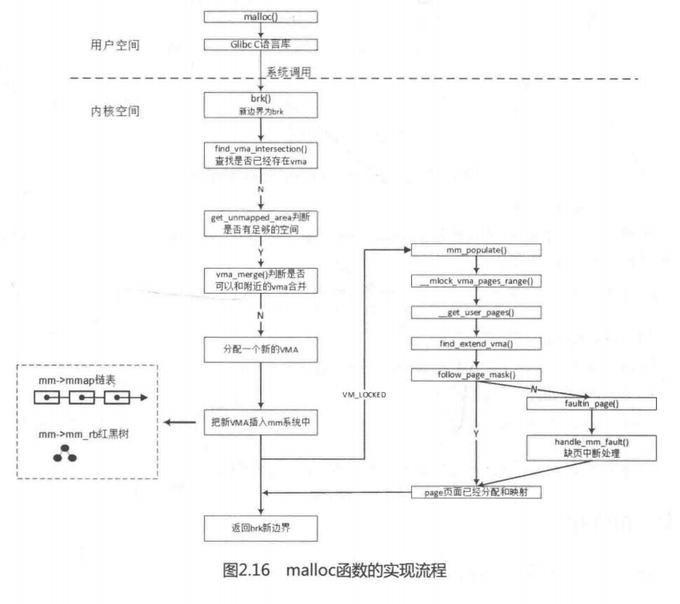

对于使用C语言的同学来说，malloc函数是很经典的函数，使用起来也很简单便捷，可是内核实现并不简单。回到本章开头的问题，malloc函数其实是为用户空间分配进程地址空间，用内核术语来说就是分配一块VMA（VMALLOC的高端内存并不是指的这个VMA，VMA是指进程中4G地址空间，包括了VMALLOC的高端内存）,相当于一个空的纸箱。那什么时候才往纸箱子里装东西呢？有两种方式，一种是真正使用箱子的时候才往里面装东西，另一种是分配箱子的时候就装你想要的东西。进程A立马的testA函数就是这种情况，当使用这段内存时，CPU去查询页表，发现页表为空，CPU触发缺页中断，然后在缺页中断里一页一页的分配内存，需要一页给一页。进程B里面的testB函数，是第二种情况，直接分配已经装满的纸箱子，你要的虚拟内存都已经分配了物理内存并建立了页表映射。

假设不考虑libc库的因素，malloc分配100Byte，那么内核会分配多少Byte呢？处理器MMU的硬件单元是最小单位是页，所以内核分配内存、建立虚拟地址和物理地址映射关系都是以页为单位，PAGE_ALIGN(addr)宏让地址addr按页面大小对齐。

使用printf打印两个进程的malloc分配的虚拟地址是一样的，那么内核两个虚拟地址空间会打架吗？其实每个用户进程都有自己的一份页表。每个进程有一个mm_struct数据结构，包含一个属于进程自己的页表、一个管理VMA的红黑树和链表。进程本身的VMA会挂入属于自己的红黑树和链表，所以即使进程A和进程B使用malloc分配内存返回相同的虚拟地址，但其实它们是两个不同的VMA，分别被不同的两套页表来管理。

如图2.16所示是mauoc函数实现流程，malloc的实现还涉及内存管理的几个重要的函数。

（1）get_user_pages()函数

用于把用户的虚拟内存空间传到内核空间，内核空间为其分配物理内存并建立相应的映射关系，实现过程如图2.17所示。例如，在camera驱动的V4L2核心架构中可以使用用户空间的内存类型（V4L2_MEMORY_USERPTR）来分配物理内存，其驱动的实现使用的是get_user_pages()函数。

```
long get_user_pages(struct task_struct *tsk, struct mm_struct *mm,
		unsigned long start, unsigned long nr_pages, int write,
		int force, struct page **pages, struct vm_area_struct **vmas)
{
	return __get_user_pages_locked(tsk, mm, start, nr_pages, write, force,
				       pages, vmas, NULL, false, FOLL_TOUCH);
}
```

函数实现框图.png)

（2）follow_page()函数

通过虚拟地址addr寻找相应的物理页面，返回normal mapping页面对应的struct page数据结构，该函数回去查询页表。

```
static inline struct page *follow_page(struct vm_area_struct *vma,
		unsigned long address, unsigned int foll_flags)
{
	unsigned int unused_page_mask;
	return follow_page_mask(vma, address, foll_flags, &unused_page_mask);
}
```

（3）vm_normal_page()函数

该函数pte返回的normal maping的struct page数据结构，主要目的是过滤掉那些令人讨厌的special mapping的页面。

```
struct page *vm_normal_page(struct vm_area_struct *vma, unsigned long addr,
				pte_t pte)
{
	unsigned long pfn = pte_pfn(pte);

	if (HAVE_PTE_SPECIAL) {
		if (likely(!pte_special(pte)))
			goto check_pfn;
		if (vma->vm_ops && vma->vm_ops->find_special_page)
			return vma->vm_ops->find_special_page(vma, addr);
		if (vma->vm_flags & (VM_PFNMAP | VM_MIXEDMAP))
			return NULL;
		if (!is_zero_pfn(pfn))
			print_bad_pte(vma, addr, pte, NULL);
		return NULL;
	}

	/* !HAVE_PTE_SPECIAL case follows: */

	if (unlikely(vma->vm_flags & (VM_PFNMAP|VM_MIXEDMAP))) {
		if (vma->vm_flags & VM_MIXEDMAP) {
			if (!pfn_valid(pfn))
				return NULL;
			goto out;
		} else {
			unsigned long off;
			off = (addr - vma->vm_start) >> PAGE_SHIFT;
			if (pfn == vma->vm_pgoff + off)
				return NULL;
			if (!is_cow_mapping(vma->vm_flags))
				return NULL;
		}
	}

	if (is_zero_pfn(pfn))
		return NULL;
check_pfn:
	if (unlikely(pfn > highest_memmap_pfn)) {
		print_bad_pte(vma, addr, pte, NULL);
		return NULL;
	}

	/*
	 * NOTE! We still have PageReserved() pages in the page tables.
	 * eg. VDSO mappings can cause them to exist.
	 */
out:
	return pfn_to_page(pfn);
}
```

