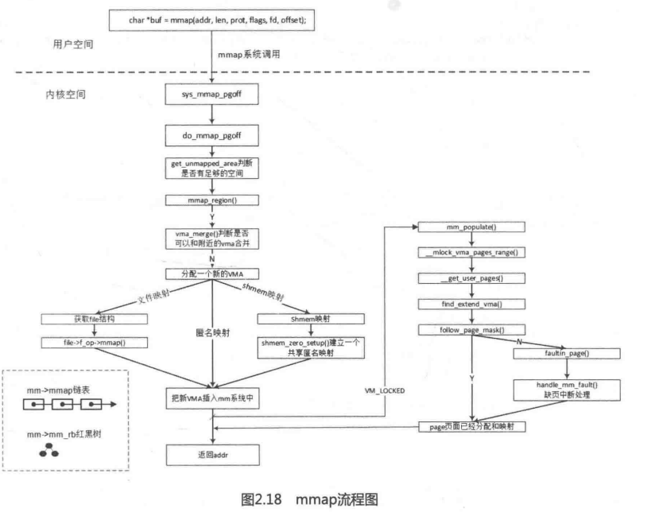

mmap机制在 Linux内核中实现的代码框架和brk机制非常类似,其中有很多关于VMA的操作,在第2.7节中已经详细介绍过。mmap机制和缺页中断机制结合在一起会变得复杂很多。 Dirty Cow,这个在2016年被发现的最恐怖的内存漏洞就是利用了mmap和缺页中断的相关漏洞,学习这个例子有助于加深对mmap和缺页中断机制的理解,详见第2.8节mmap机制在 Linux内核中的代码流程如图2.18所示。

除了 Dirty Cow之外,下面收集了几个有意思的小问题。

