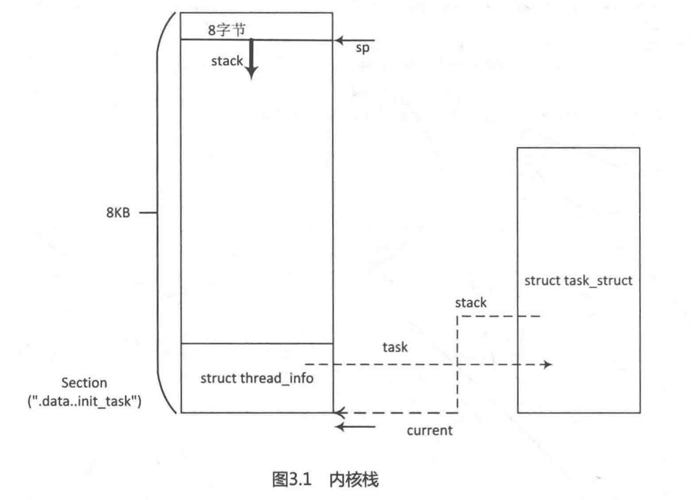

Linux内核在启动时会有一个init_task进程，它是系统所有进程的“鼻祖”，称为0号进程或idle进程，当系统没有进程需要调度时，调度器就会去执行 idle进程。idle进程在内核启动(start_kernel()函数）时静态创建，所有的核心数据结构都预先静态赋值。init_task进程的task_struct数据结构通过INIT_TASK宏来赋值，定义在 include/linux/init_task.h文件中。

```
[init/init_task.c]
struct task_struct init_task = INIT_TASK(init_task);
EXPORT_SYMBOL(init_task);
```

```

/*
 *  INIT_TASK is used to set up the first task table, touch at
 * your own risk!. Base=0, limit=0x1fffff (=2MB)
 */
#define INIT_TASK(tsk)	\
{									\
	INIT_TASK_TI(tsk)						\
	.state		= 0,						\
	.stack		= init_stack,					\
	.usage		= ATOMIC_INIT(2),				\
	.flags		= PF_KTHREAD,					\
	.prio		= MAX_PRIO-20,					\
	.static_prio	= MAX_PRIO-20,					\
	.normal_prio	= MAX_PRIO-20,					\
	.policy		= SCHED_NORMAL,					\
	.cpus_allowed	= CPU_MASK_ALL,					\
	.nr_cpus_allowed= NR_CPUS,					\
	.mm		= NULL,						\
	.active_mm	= &init_mm,					\
	.restart_block = {						\
		.fn = do_no_restart_syscall,				\
	},								\
	.se		= {						\
		.group_node 	= LIST_HEAD_INIT(tsk.se.group_node),	\
	},								\
	.rt		= {						\
		.run_list	= LIST_HEAD_INIT(tsk.rt.run_list),	\
		.time_slice	= RR_TIMESLICE,				\
	},								\
	.tasks		= LIST_HEAD_INIT(tsk.tasks),			\
	INIT_PUSHABLE_TASKS(tsk)					\
	INIT_CGROUP_SCHED(tsk)						\
	.ptraced	= LIST_HEAD_INIT(tsk.ptraced),			\
	.ptrace_entry	= LIST_HEAD_INIT(tsk.ptrace_entry),		\
	.real_parent	= &tsk,						\
	.parent		= &tsk,						\
	.children	= LIST_HEAD_INIT(tsk.children),			\
	.sibling	= LIST_HEAD_INIT(tsk.sibling),			\
	.group_leader	= &tsk,						\
	RCU_POINTER_INITIALIZER(real_cred, &init_cred),			\
	RCU_POINTER_INITIALIZER(cred, &init_cred),			\
	.comm		= INIT_TASK_COMM,				\
	.thread		= INIT_THREAD,					\
	.fs		= &init_fs,					\
	.files		= &init_files,					\
	.signal		= &init_signals,				\
	.sighand	= &init_sighand,				\
	.nsproxy	= &init_nsproxy,				\
	.pending	= {						\
		.list = LIST_HEAD_INIT(tsk.pending.list),		\
		.signal = {{0}}},					\
	.blocked	= {{0}},					\
	.alloc_lock	= __SPIN_LOCK_UNLOCKED(tsk.alloc_lock),		\
	.journal_info	= NULL,						\
	.cpu_timers	= INIT_CPU_TIMERS(tsk.cpu_timers),		\
	.pi_lock	= __RAW_SPIN_LOCK_UNLOCKED(tsk.pi_lock),	\
	.timer_slack_ns = 50000, /* 50 usec default slack */		\
	.pids = {							\
		[PIDTYPE_PID]  = INIT_PID_LINK(PIDTYPE_PID),		\
		[PIDTYPE_PGID] = INIT_PID_LINK(PIDTYPE_PGID),		\
		[PIDTYPE_SID]  = INIT_PID_LINK(PIDTYPE_SID),		\
	},								\
	.thread_group	= LIST_HEAD_INIT(tsk.thread_group),		\
	.thread_node	= LIST_HEAD_INIT(init_signals.thread_head),	\
	INIT_IDS							\
	INIT_PERF_EVENTS(tsk)						\
	INIT_TRACE_IRQFLAGS						\
	INIT_LOCKDEP							\
	INIT_FTRACE_GRAPH						\
	INIT_TRACE_RECURSION						\
	INIT_TASK_RCU_PREEMPT(tsk)					\
	INIT_TASK_RCU_TASKS(tsk)					\
	INIT_CPUSET_SEQ(tsk)						\
	INIT_RT_MUTEXES(tsk)						\
	INIT_PREV_CPUTIME(tsk)						\
	INIT_VTIME(tsk)							\
	INIT_NUMA_BALANCING(tsk)					\
	INIT_KASAN(tsk)							\
}
```

init_task进程的task_struct数据结构中stack成员指向thread_info数据结构。通常内核栈大小是8KB，即两个物理页面的大小，它存放在内核映像文件中 data 段中，在编译链接时预先分配好，具体见arch/arm/kernel/vmlinux.lds.S链接文件。

```
[arch/ arm/kerne1/ vmlinux.lds.s]
SECTIONS
{
...
.data : AT(__data_loc)
{
	_data = .;
	/*address in memory */
	_sdata = .;
    /*
    *first, the init task union,aligned*to an 8192 byte boundary .
    */
	INIT_TASK_DATA(THREAD_SIZE)
	…
	edata = .;
)
[arch/arm/include/asm/thread_info.h]
#define THREAD_SIZE_ORDER 1
#define THREAD_SIZE (PAGE_SIZE << THREAD_SIZE_ORDER)
#define THREAD_START_SP (THREAD_SIZE -8)

[include/asm-generic/vmlinux.lds.h]
#define INIT_TASK_DATA(align)
		= ALIGN(align) ;
		* ( .data..init_task)
```

由链接文件可以看到 data 段预留了8KB 的空间用于内核栈，存放在 data段的"“.data..init_task”中。_init task _data宏会直接读取“.data..init_task”段内存，并且存放了一个thread union 联合数据结构，从联合数据结构可以看出其分布情况:开始的地方存放了struct thread_info数据结构，顶部往下的空间用于内核栈空间。

```
[inc1ude/1inux/init_task.h]
/* Attach to the init task data structure for proper alignment */
#define_init_task_data _attribute_((_section__( ".data..init_task")))
[inc1ude/1inux/init_task.h]
union thread_union init_thread_union _init_task_data =
									 {INIT_THREAD_INFO(init_task) };
[include/1inux/sched.h]
union thread_union {
	struct thread_info thread_info;
	unsigned long stack[THREAD_SIZE/sizeof(long)];
};
```

> 内核栈大小通常和体系结构相关，ARM32 架构中内核栈大小是8KB
> ARM64架构中内核栈大小是16KB。

```
[arch/arm/inc1ude/asm/thread_info.h]
#define INIT_THREAD_ INFO(tsk)  \
{								\
	.task = &tsk,
	.exec_domain = &default_exec_domain,	\
	.flags = 0,					\
	.preempt_count = INIT_PREEMPT_COUNT,	\
	.addr_limit= KERNEL_DS，					\
	.cpu_domain = domain_val(DOMAIN_USER, DOMAIN_MANAGER) | 	\
				domain_val(DOMAIN_KERNEL， DOMAIN_MANAGER) |		\
				domain_val (DOMAIN_IO，DOMAIN_CLIENT),			\
}
```

\__init_task_data存放在".data..init_task"段中，\___init_task_data声明为thread_union类型,thread_union类型描述了整个内核栈stack[]，栈的最下面存放struct thread_info数据结构，因此也 \_init_task_data通过 INIT_THREAD_INFO宏来初始化 struct thread_info数据结构。init进程的task_struct数据结构通过INIT_TASK宏来初始化。

ARM32处理器从汇编代码跳转到C语言的入口点在 start_kernel()函数之前,设置了SP寄存器指向8KB内核栈顶部区域(要预留8Byte的空洞)。

```
[arch/arm/kerne1/head-common.S]
__mmap_switched:
	adr r3,__mmap_switched_data
	...
	ldmia r3!,{r4, r5, r6, r7}
	ARM( ldmia r3,  {r4, r5, r6, r7, sp} )
	...
	b start_kernel
ENDPROC (__mmap_switched)
	.align 2
	.type __mmap_switched_data,%object
__mmap_switched_data:
	.long __data_loc @r4
	.long _sdata	 @r5
	.long __bss_start @ r6
	.long _end		@ r7
	.long processor_id  @r4
	.long __machine_arch_type @r5
	.long __atags_pointer @r6
#ifdef CONFIG_CPU_CP15
	.long cr_alignment	@r7
#else
	.long 0	@r7
#endif
	.long init_thread_uint + THREAD_START_SP @sp
	.size __map_switched_data, .- __mmap_switched_data

[arch/arm/include/asm/thread_info.h]
#define THREAD_START_SP		(THREAD_SIZE - 8)
```

在汇编代码\__mmap_switched标签处设置相关的r3～r7以及SP寄存器，其中，SP寄存器指向 data段预留的 8KB空间的顶部（8KB-8)，然后跳转到start_kernel()。\_\_mmap_switched_data 标签处定义了r4 ~ sp寄存器的值。相当于一个表，通过adr指令把这表读取r3寄存器中，然后在通过ldmia指令写入相应寄存器中。


内核有一个常用的常量current用于获取当前进程task_struct数据结构，它利用了内核栈的特性。首先通过SP寄存器获取当前内核栈的地址，对齐后可以获取 struct thread _info数据结构指针，最后通过thread info->task成员获取 task_struct数据结构。如图3.1所示是Linux内核栈的结构图。

```
[include/asm-generic/ current.h]
#define get_current()  (current_thread_info()->task)
#define current get_current()

[arch/arm/include/asm/thread_info.h]
register unsigned long current_stack_pointer asm ("sp" );
static inline struct thread_info *current_thread_info(void)
{
	return (struct thread_info *)(current_stack_pointer &~(THREAD_SIZE - 1));
}
```

)

```
/*
 * low level task data that entry.S needs immediate access to.
 * __switch_to() assumes cpu_context follows immediately after cpu_domain.
 */
struct thread_info {
	unsigned long		flags;		/* low level flags */
	int			preempt_count;	/* 0 => preemptable, <0 => bug */
	__u32			cpu;		/* cpu */
	__u32			cpu_domain;	/* cpu domain */
	struct cpu_context_save	cpu_context;	/* cpu context */
	__u32			abi_syscall;	/* ABI type and syscall nr */
	unsigned long		tp_value[2];	/* TLS registers */
	union fp_state		fpstate __attribute__((aligned(8)));
	union vfp_state		vfpstate;
#ifdef CONFIG_ARM_THUMBEE
	unsigned long		thumbee_state;	/* ThumbEE Handler Base register */
#endif
};
```

