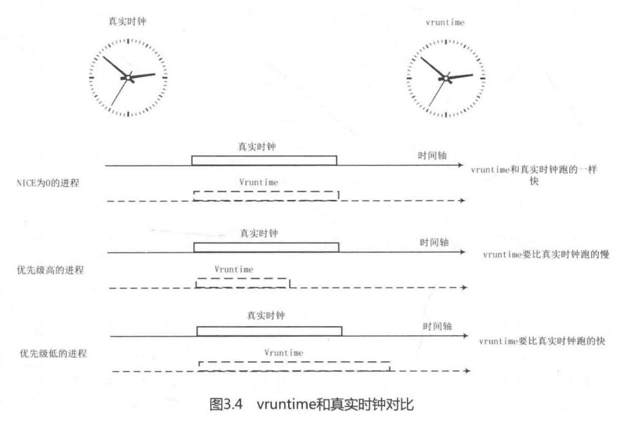

内核使用0～139的数值表示进程的优先级，数值越低优先级越高。优先级0~99给实时进程使用，100～139给普通进程使用。另外在用户空间有一个传统的变量nice值映射到普通进程的优先级，即100～139。

进程PCB描述符struct task_struct数据结构中有3个成员描述进程的优先级。

```
struct task_struct{
	...
	int prio, static_prio, normal_prio;
	unsigned int rt_priority;
	...
};

```

static_prio是静态优先级，在进程启动时分配。内核不存储nice值，取而代之的是static_prio。内核中的宏 NICE_TO_PRIO()实现由nice值转换成static_prio。它之所以被称为静态优先级是因为它不会随着时间而改变，用户可以通过nice或sched_setscheduler等系统调用来修改该值。normal_prio是基于 static_prio和调度策略计算出来的优先级，在创建进程时会继承父进程的 normal_prio。对于普通进程来说，normal_prio等同于static_prio，对于实时进程，会根据rt_priority重新计算normal_prio，详见 effective_prio()函数。prio保存着进程的动态优先级，是调度类考虑的优先级，有些情况下需要暂时提高进程优先级，例如实时互斥量等。rt _priority是实时进程的优先级。

内核使用struct load_weight 数据结构来记录调度实体的权重信息(weight)。

```
struct load_weight {
	unsigned long weight;
	u32 inv_weight;
}
```

其中，weight是调度实体的权重，inv_weight 是 inverse weight 的缩写，它是权重的一个中间计算结果，稍后会介绍如何使用。调度实体的数据结构中已经内嵌了struct load_weight 结构体，用于描述调度实体的权重。

```
struct sched_entity {
	struct load_weight	load;		/* for load-balancing */
}
```

因此代码中经常通过p->se.load来获取进程p的权重信息。nice值的范围是从-20～19,进程默认的nice值为0。这些值含义类似级别，可以理解成有40个等级，nice值越高，则优先级越低，反之亦然。例如一个CPU密集型的应用程序nice值从0增加到1，那么它相对于其他nice值为0的应用程序将减少10%的CPU时间。因此进程每降低一个nice级别,优先级则提高一个级别，相应的进程多获得10%的CPU时间;反之每提升一个nice级别,优先级则降低一个级别，相应的进程少获得10%的 CPU 时间。为了计算方便，内核约定nice值为0的权重值为1024，其他nice值对应的权重值可以通过查表的方式来获取，内核预先计算好了一个表prio_to_weight[40]，表下标对应nice值[-20～19]。

```
[kernel/sched/sched.h]
/*
 * Nice levels are multiplicative, with a gentle 10% change for every
 * nice level changed. I.e. when a CPU-bound task goes from nice 0 to
 * nice 1, it will get ~10% less CPU time than another CPU-bound task
 * that remained on nice 0.
 *
 * The "10% effect" is relative and cumulative: from _any_ nice level,
 * if you go up 1 level, it's -10% CPU usage, if you go down 1 level
 * it's +10% CPU usage. (to achieve that we use a multiplier of 1.25.
 * If a task goes up by ~10% and another task goes down by ~10% then
 * the relative distance between them is ~25%.)
 */
static const int prio_to_weight[40] = {
 /* -20 */     88761,     71755,     56483,     46273,     36291,
 /* -15 */     29154,     23254,     18705,     14949,     11916,
 /* -10 */      9548,      7620,      6100,      4904,      3906,
 /*  -5 */      3121,      2501,      1991,      1586,      1277,
 /*   0 */      1024,       820,       655,       526,       423,
 /*   5 */       335,       272,       215,       172,       137,
 /*  10 */       110,        87,        70,        56,        45,
 /*  15 */        36,        29,        23,        18,        15,
}
```

前文所述的10%的影响是相对及累加的，例如一个进程增加了10%的CPU时间，则另外一个进程减少10%，那么差距大约是20%，因此这里使用一个系数1.25来计算的。举个例子，进程A和进程B的nice值都为0，那么权重值都是1024，它们获得CPU的时间都是50%，计算公式为1024/(1024+1024)=50%。假设进程A增加一个nice值，即nice=1，进程B的nice值不变，那么进程B应该获得55%的CPU时间，进程A应该是45%。我们利用prio_to_weight[]]表来计算,进程A=820/(1024+820)=45%，而进程B=1024/(1024+820)=55%，注意是近似等于。

内核中还提供另外一个表prio_to_wmult[40]，也是预先计算好的。

```
/*
 * Inverse (2^32/x) values of the prio_to_weight[] array, precalculated.
 *
 * In cases where the weight does not change often, we can use the
 * precalculated inverse to speed up arithmetics by turning divisions
 * into multiplications:
 */
static const u32 prio_to_wmult[40] = {
 /* -20 */     48388,     59856,     76040,     92818,    118348,
 /* -15 */    147320,    184698,    229616,    287308,    360437,
 /* -10 */    449829,    563644,    704093,    875809,   1099582,
 /*  -5 */   1376151,   1717300,   2157191,   2708050,   3363326,
 /*   0 */   4194304,   5237765,   6557202,   8165337,  10153587,
 /*   5 */  12820798,  15790321,  19976592,  24970740,  31350126,
 /*  10 */  39045157,  49367440,  61356676,  76695844,  95443717,
 /*  15 */ 119304647, 148102320, 186737708, 238609294, 286331153,
}
```

prio_to_wmult[]表的计算公式如下:
$$
inv\_weight = 2^{32} / weight
$$
其中，inv_weight是 inverse weight的缩写，指权重被倒转了，作用是为后面计算方便。

内核提供一个函数来查询这两个表，然后把值存放在p->se.load数据结构中，即struct load_weight结构中。

在CFS调度器中有一个计算虚拟时间的核心函数calc_delta_fair()，它的计算公式为:
$$
vruntime = ({delta\_exec * nice\_0\_weight}) / weight
$$
其中,vruntime表示进程虚拟的运行时间, delta_exec表示实际运行时间, nice_0_weight表示nice为0的权重值，weight表示该进程的权重值。
vruntime该如何理解呢?如图3.4所示，假设系统中只有3个进程A、B和C，它们的NICE 都为0，也就是权重值都是1024。它们分配到的运行时间相同，即都应该分配到1/3的运行时间。如果A、B、C三个进程的权重值不同呢?



CFS 调度器抛弃以前固定时间片和固定调度周期的算法，而采用进程权重值的比重来量化和计算实际运行时间。另外引入虚拟时钟的概念，每个进程的虚拟时间是实际运行时间相对NICE值为0的权重的比例值。进程按照各自不同的速率比在物理时钟节拍内前进。NICE值小的进程，优先级高且权重大，其虚拟时钟比真实时钟跑得慢，但是可以获得比较多的运行时间;反之，NICE值大的进程，优先级低，权重也低，其虚拟时钟比真实时钟跑得快，反而获得比较少的运行时间。CFS 调度器总是选择虚拟时钟跑得慢的进程，它像一个多级变速箱，NICE为0的进程是基准齿轮，其他各个进程在不同的变速比下相互追赶，从而达到公正公平。

假设某个进程nice值为1，其权重值为820，delta_exec=10ms，导入公式计算 vrumtime=(10*1024)/820，这里会涉及浮点运算。为了计算高效，函数 calc_delta_fair()的计算方式变成乘法和移位运行公式如下:

```
vruntime = (delta_exec *nice_0_weight * inv_weight) >> shift
```

把inv_weight带入计算公式后，得到如下计算公式:
$$
vruntime = ((delta\_time* nice\_0\_weight * 2^{32}) / weght) >> 32
$$
这里巧妙地运用prio_to_wmult[]]表预先做了除法，因此实际的计算只有乘法和移位操作，2^32是为了预先做除法和移位操作。calc_delta_fair()函数等价于如下代码片段:

```
static inline u64 calc_delta_fair(u64 delta, struct sched_entity *se)
{
	if (unlikely(se->load.weight != NICE_0_LOAD))
		delta = __calc_delta(delta, NICE_0_LOAD, &se->load);

	return delta;
}

static u64 __calc_delta(u64 delta_exec, unsigned long weight, struct load_weight *lw)
{
	u64 fact = scale_load_down(weight);
	int shift = WMULT_SHIFT;

	__update_inv_weight(lw);

	if (unlikely(fact >> 32)) {
		while (fact >> 32) {
			fact >>= 1;
			shift--;
		}
	}

	/* hint to use a 32x32->64 mul */
	fact = (u64)(u32)fact * lw->inv_weight;

	while (fact >> 32) {
		fact >>= 1;
		shift--;
	}

	return mul_u64_u32_shr(delta_exec, fact, shift);
}
```

以上讲述了进程权重、优先级和 vruntime的计算方法。

下面来关注CPU的负载计算问题。计算一个CPU的负载，最简单的方法是计算 CPU上就绪队列上所有进程的权重。仅考虑优先级权重是有问题的，因为没有考虑该进程的行为，有的进程使用的CPU是突发性的，有的是恒定的，有的是CPU密集型，也有的是IO密集型。进程调度考虑优先级权重的方法可行，但是如果延伸到多CPU之间的负载均衡就显得不准确了，因此从 Linux 3.8内核°以后进程的负载计算不仅考虑权重，而且跟踪每个调度实体的负载情况，该方法称为PELT (Pre-entity Load Tracking)。调度实体数据结构中有一个struct sched_avg用于描述进程的负载。

```
struct sched_avg {
	/*
	 * These sums represent an infinite geometric series and so are bound
	 * above by 1024/(1-y).  Thus we only need a u32 to store them for all
	 * choices of y < 1-2^(-32)*1024.
	 */
	u32 runnable_avg_sum, runnable_avg_period;
	u64 last_runnable_update;
	s64 decay_count;
	unsigned long load_avg_contrib;
}
struct sched_entity {
	....
	struct sched_avg	avg
}
```

runnable_sum表示该调度实体在就绪队列里(se->on_rq=1)可运行状态（runnable)的总时间。调度实体在就绪队列中的时间包括两部分，一是正在运行的时间，称为 running时间，二是在就绪队列中等待的时间。runnable包括上述两部分时间。在后续Linux内核版本演变中，会计算进程运行的时间(running time)，但在 Linux 4.0内核中暂时还没有严格区分。

runnable_period可以理解为该调度实体在系统中的总时间，之所以称为period是因为以1024微秒为一个周期period，last_runnable_update用于计算时间间隔R。当一个进程fork出来之后，对于该进程来说，无论它是否在就绪队列中，还是被踢出就绪队列，runnable_period一直在递增。runnable_sum是指统计在就绪队列里的总时间，进程进入就绪队列时（调用enqueue_entity())，on_rq 会设置为1，但是该进程因为睡眠等原因退出就绪队列时（调用dequeue_entity()) on_rq会被清0，因此runnable_sum就是统计进程在就绪队列的时间（注意该时间不完全等于进程运行的时间，还包括在就绪队列里排队的时间)。

最后为了统计更精确，runnable_sum和runnable_period这两个变量要加上“\_avg_”变成runnable_avg_sum和 runnable_avg_period。考虑到历史数据对负载的影响，采用衰减系数来计算平均负载。

-   runnable_avg_sum:调度实体在就绪队列里可运行状态下总的衰减累加时间。
-   runnable_avg_period:调度实体在系统中总的衰减累加时间。

load_avg_contrib是进程平均负载的贡献度，后续会详细讲述该值如何计算。对于那些长时间不活动而突然短时间访问CPU的进程或者访问磁盘被阻塞等待的进程，它们的 load_avg_contrib 要比CPU密集型的进程小很多，例如做矩阵乘法运算的密集型进程。对于前者，runnable_avg_sum时间要远远小于runnable_avg_period可获得的时间,对于后者，它们几乎是相等的。

下面用经典的电话亭例子来说明问题。假设现在有一个电话亭（好比是 CPU)，有4个人要打电话(好比是进程)，电话管理员（好比是内核调度器）按照最简单的规则轮流给每个打电话的人分配Ⅰ分钟的时间，时间截止马上把电话亭使用权给下一个人，还需要继续打电话的人只能到后面排队(好比是就绪队列)。那么管理员如何判断哪个人是电话的重度使用者呢?可以使用如下式:
$$
电话使用率= \sum(\frac{active\_use\_time}{period} )
$$
电话的使用率计算公式就是每个分配到电话的使用者使用电话的时间除以分配时间。使用电话的时间和分配到时间是不一样的，例如在分配到的1分钟时间里，一个人查询电话本用了20秒，打电话只用了40秒，那么active_use_time是40秒，period是60秒。因此电话管理员通过计算一段统计时间里的每个人的电话平均使用率便可知道哪个人是电话重度使用者。

类似的情况有很多，例如现在很多人都是低头族，即手机重度使用者，现在你要比较在过去24小时内身边的人谁是最严重的低头族。那么以1小时为一个period，统计过去24个period 周期内的手机使用率相加，再比较大小，即可知道哪个人是最严重的低头族。runnable_period 好比是period 的总和，runnable_sum好比是一个人在每个 period里使用手机的时间总和。

cfs_rq数据结构中的成员runnable load avg 用于累加在该就绪队列上所有调度实体的load avg contrib总和，它在SMP负载均衡调度器中用于衡量CPU是否繁忙。另外内核还记录阻塞睡眠进程负载，当一个进程睡眠时，它的负载会记录在 blocked_load_avg成员中。

如果一个长时间运行的CPU密集型的进程突然不需要CPU了，那么尽管它之前是一个很占用CPU的进程，此刻该进程的负载是比较小的。

我们把1毫秒(准确来说是1024微秒，为了方便移位操作)的时间跨度算成一个周期,称为period，简称PI。一个调度实体（可以是一个进程，也可以定一个调度l社 ) H周期内对系统负载的贡献除了权重外，还有在PI周期内可运行的时间〈runnable _time .,包括运行时间或等待CPU时间。一个理想的计算方式是:统计多个实际的PI周期，并使
$$
L = L0+ L1*y + L2*y^2 + L3*y^3 + ....+L32*y^32 + ...
$$
这个公式用于计算调度实体的最近的负载，过去的负载也是影响因素，它是一个衰减因子。因此调度实体的负载需要考虑时间的因素，不能只考虑当前的负载，还要考虑其在过去一段时间的表现。衰减的意义类似于信号处理中的采样，距离当前时间点越远，衰减系数越大，对总体影响越小。其中，y是一个预先选定好的衰减系数，y约等于0.5，因此统计过去第32个周期的负载可以被简单地认为负载减半。

该计算公式还有简化计算方式,内核不需要使用数组来存放过去PI个周期的负载贡献,只需要用过去周期贡献总和乘以衰减系数y，并加上当前时间点的负载L0即可。内核定义了表runnable_avg_yN_inv[]来方便使用衰减因子3。

```
/* Precomputed fixed inverse multiplies for multiplication by y^n */
static const u32 runnable_avg_yN_inv[] = {
	0xffffffff, 0xfa83b2da, 0xf5257d14, 0xefe4b99a, 0xeac0c6e6, 0xe5b906e6,
	0xe0ccdeeb, 0xdbfbb796, 0xd744fcc9, 0xd2a81d91, 0xce248c14, 0xc9b9bd85,
	0xc5672a10, 0xc12c4cc9, 0xbd08a39e, 0xb8fbaf46, 0xb504f333, 0xb123f581,
	0xad583ee9, 0xa9a15ab4, 0xa5fed6a9, 0xa2704302, 0x9ef5325f, 0x9b8d39b9,
	0x9837f050, 0x94f4efa8, 0x91c3d373, 0x8ea4398a, 0x8b95c1e3, 0x88980e80,
	0x85aac367, 0x82cd8698,
}
```

\_\_compute_runnable_contrib()会使用该表来计算连续n个PI周期的负载累计贡献值。

```
/*
 * For updates fully spanning n periods, the contribution to runnable
 * average will be: \Sum 1024*y^n
 *
 * We can compute this reasonably efficiently by combining:
 *   y^PERIOD = 1/2 with precomputed \Sum 1024*y^n {for  n <PERIOD}
 */
static u32 __compute_runnable_contrib(u64 n)
{
	u32 contrib = 0;

	if (likely(n <= LOAD_AVG_PERIOD))
		return runnable_avg_yN_sum[n];
	else if (unlikely(n >= LOAD_AVG_MAX_N))
		return LOAD_AVG_MAX;

	/* Compute \Sum k^n combining precomputed values for k^i, \Sum k^j */
	do {
		contrib /= 2; /* y^LOAD_AVG_PERIOD = 1/2 */
		contrib += runnable_avg_yN_sum[LOAD_AVG_PERIOD];

		n -= LOAD_AVG_PERIOD;
	} while (n > LOAD_AVG_PERIOD);

	contrib = decay_load(contrib, n);
	return contrib + runnable_avg_yN_sum[n];
}
```

\_\_compute_runnable_contrib()函数中的参数n表示 PI周期的个数。如果n小于等于LOAD_AVG_PERIOD(32个周期)，那么直接查表runnable_avg_yN_sum[]取值，如果n大于等于LOAD_AVG_MAX_N(345个周期)，那么直接得到极限值LOAD_AVG_MAX(47742)。如果n的范围为32~345，那么每次递进32个衰减周期进行计算，然后把不能凑成32个周期的单独计算并累加，见第9～18行代码。

下面来看计算负载中的一个重要函数\_\_update_entity_runnable_avg()。

```
static __always_inline int __update_entity_runnable_avg(u64 now,
							struct sched_avg *sa,
							int runnable)
{
	u64 delta, periods;
	u32 runnable_contrib;
	int delta_w, decayed = 0;

	delta = now - sa->last_runnable_update;
	/*
	 * This should only happen when time goes backwards, which it
	 * unfortunately does during sched clock init when we swap over to TSC.
	 */
	if ((s64)delta < 0) {
		sa->last_runnable_update = now;
		return 0;
	}

	/*
	 * Use 1024ns as the unit of measurement since it's a reasonable
	 * approximation of 1us and fast to compute.
	 */
	delta >>= 10;
	if (!delta)
		return 0;
	sa->last_runnable_update = now;

	/* delta_w is the amount already accumulated against our next period */
	delta_w = sa->runnable_avg_period % 1024;
	if (delta + delta_w >= 1024) {
		/* period roll-over */
		decayed = 1;

		/*
		 * Now that we know we're crossing a period boundary, figure
		 * out how much from delta we need to complete the current
		 * period and accrue it.
		 */
		delta_w = 1024 - delta_w;
		if (runnable)
			sa->runnable_avg_sum += delta_w;
		sa->runnable_avg_period += delta_w;

		delta -= delta_w;

		/* Figure out how many additional periods this update spans */
		periods = delta / 1024;
		delta %= 1024;

		sa->runnable_avg_sum = decay_load(sa->runnable_avg_sum,
						  periods + 1);
		sa->runnable_avg_period = decay_load(sa->runnable_avg_period,
						     periods + 1);

		/* Efficiently calculate \sum (1..n_period) 1024*y^i */
		runnable_contrib = __compute_runnable_contrib(periods);
		if (runnable)
			sa->runnable_avg_sum += runnable_contrib;
		sa->runnable_avg_period += runnable_contrib;
	}

	/* Remainder of delta accrued against u_0` */
	if (runnable)
		sa->runnable_avg_sum += delta;
	sa->runnable_avg_period += delta;

	return decayed;
}
```


\_\_update_entity_runnable_avg()函数参数now表示当前的时间点，由就绪队列rq->clock_task得到, sa表示该调度实体的struct sched_avg数据结构，runnable表示该进程是否在就绪队列上接受调度(se->on rq)。第8行代码，delta表示上一次更新到本次更新的时间差，单位是纳秒。第22行代码，delta时间转换成微秒，注意这里为了计算效率右移10位，相当于除以1024。runnable_avg_period记录上一次更新时的总周期数（一个周期是1毫秒，准确来说是1024微秒)，第28行代码，delta w是上一次总周期数中不能凑成一个周期（1024微秒）的剩余的时间，如图3.5所示的T0时间。第29~59行代码，表示如果上次剩余delta w加上本次时间差delta大于一个周期，那么就要进行衰减计算。第62~64行代码，如果不能凑成一个周期，不用衰减计算，直接累加runnable_avg_sum和runnable_avg_period的值,最后返回是否进行了衰减运算。
$$
running\_avg\_sum = pre\_avg\_sum + \sum_{period}{deacay}
$$
其中，period是指上一次统计到当前统计经历的周期个数，prev_avg_sum是指上一次统计时runnable_avg_sum值在 period+1个周期的衰减值，decay 指 period个周期的衰减值和。runnable_avg_period计算方法类似。

如果一个进程在就绪队列里等待了很长时间才被调度，那么该如何计算它的负载呢?假设该进程等待了1000个period,即1024毫秒,之前sa->runnable_avg_sum和 sa->runnable_avg_period值为48000，唤醒之后在\_\update_entity_runnable_avg()函数中的第49~51行代码，因为 period值很大，decay_load()函数计算结果为0，相当于sa->runnable avg sum和sa->runnable_avg_period值被清0了。第55行代码，_compute_runnable_contrib()函数计算整个时间的负载贡献值，因为 period大于LOAD_AVG_MAX_N，直接返回LOAD_AVG_MAX。当period 比较大时，衰减后的可能变成0，相当于之前的统计值被清0了

```
/* Update a sched_entity's runnable average */
static inline void update_entity_load_avg(struct sched_entity *se,
					  int update_cfs_rq)
{
	struct cfs_rq *cfs_rq = cfs_rq_of(se);
	long contrib_delta;
	u64 now;

	/*
	 * For a group entity we need to use their owned cfs_rq_clock_task() in
	 * case they are the parent of a throttled hierarchy.
	 */
	if (entity_is_task(se))
		now = cfs_rq_clock_task(cfs_rq);
	else
		now = cfs_rq_clock_task(group_cfs_rq(se));

	if (!__update_entity_runnable_avg(now, &se->avg, se->on_rq))
		return;

	contrib_delta = __update_entity_load_avg_contrib(se);

	if (!update_cfs_rq)
		return;

	if (se->on_rq)
		cfs_rq->runnable_load_avg += contrib_delta;
	else
		subtract_blocked_load_contrib(cfs_rq, -contrib_delta);
}
```

update_entity_load_avg()函数计算进程最终的负载贡献度load_avg_contrib。首先通过\_\_update_entity_runnable_avg()函数计算runnable_avg_sum这个可运行时间的累加值。注意\_\_update_entity_runnable_avg()函数如果返回0，表示上次更新到本次更新的时间间隔不足1024微秒,不做衰减计算，那么本次不计算负载贡献度。然后通过_update_entity_load_avg_contrib()函数计算本次更新的贡献度，最后累加到CFS运行队列的 cfs_rq->runnable_load_avg 中。

```
static long __update_entity_load_avg_contrib(struct sched_entity *se)
{
	long old_contrib = se->avg.load_avg_contrib;

	if (entity_is_task(se)) {
		__update_task_entity_contrib(se);
	} else {
		__update_tg_runnable_avg(&se->avg, group_cfs_rq(se));
		__update_group_entity_contrib(se);
	}

	return se->avg.load_avg_contrib - old_contrib;
}
```

load_avg_contrib 的计算公式如下:
$$
load\_avg\_contrib =\frac{runnable\_avg\_sim * weight}{runnable\_avg\_period}
$$
可见一个调度实体的平均负载和以下3个因素相关。

-   调度实体的权重值weight。
-   调度实体的可运行状态下的总衰减累加时间runnable_avg_sum.
-   调度实体在调度器中的总衰减累加时间runnable_avg_period。

runnable_avg_sum越接近runnable_avg_period，则平均负载越大，表示该调度实体一直在占用CPU。

