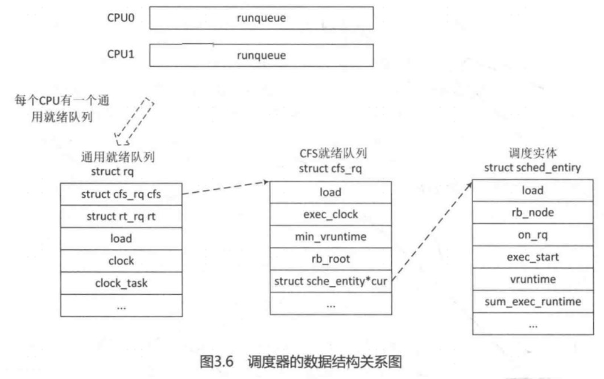

进程的创建通过do_fork()函数来完成，do_fork()在执行过程中就参与了进程调度相关的初始化。进程调度有一个非常重要的数据结构 struct sched_entity，称为调度实体，该数据结构描述进程作为一个调度实体参与调度所需要的所有信息，例如 load表示该调度实体的权重，run_node表示该调度实体在红黑树中的节点，on_rq表示该调度实体是否在就绪队列中接受调度，vruntime表示虚拟运行时间。exec_start、sum_exec_runtime和 prev_sumexec_runtime是计算虚拟时间需要的信息，avg表示该调度实体的负载信息。

```
struct sched_entity {
	struct load_weight	load;		/* for load-balancing */
	struct rb_node		run_node;
	struct list_head	group_node;
	unsigned int		on_rq;

	u64			exec_start;
	u64			sum_exec_runtime;
	u64			vruntime;
	u64			prev_sum_exec_runtime;

	u64			nr_migrations;

#ifdef CONFIG_SCHEDSTATS
	struct sched_statistics statistics;
#endif

#ifdef CONFIG_FAIR_GROUP_SCHED
	int			depth;
	struct sched_entity	*parent;
	/* rq on which this entity is (to be) queued: */
	struct cfs_rq		*cfs_rq;
	/* rq "owned" by this entity/group: */
	struct cfs_rq		*my_q;
#endif

#ifdef CONFIG_SMP
	/* Per-entity load-tracking */
	struct sched_avg	avg;
#endif
}
```

\_\_sched_fork()函数会把新创建进程的调度实体se 相关成员初始化为0，因为这些值不能复用父进程，子进程将来要加入调度器中参与调度，和父进程“分道扬镳”。

```
[do_fork( )->sched_fork()->___sched_fork()]
static void __sched_fork(unsigned long clone_flags, struct task_struct *p)
{
	p->on_rq			= 0;

	p->se.on_rq			= 0;
	p->se.exec_start		= 0;
	p->se.sum_exec_runtime		= 0;
	p->se.prev_sum_exec_runtime	= 0;
	p->se.nr_migrations		= 0;
	p->se.vruntime			= 0;
#ifdef CONFIG_SMP
	p->se.avg.decay_count		= 0;
#endif
	INIT_LIST_HEAD(&p->se.group_node);

}
```

继续看sched_fork()函数，设置子进程运行状态为TASK_RUNNING，这里不是真正开始运行，因为还没添加到调度器里。

```
int sched_fork(unsigned long clone_flags, struct task_struct *p)
{
	unsigned long flags;
	int cpu = get_cpu();

	__sched_fork(clone_flags, p);
	/*
	 * We mark the process as running here. This guarantees that
	 * nobody will actually run it, and a signal or other external
	 * event cannot wake it up and insert it on the runqueue either.
	 */
	p->state = TASK_RUNNING;

	/*
	 * Make sure we do not leak PI boosting priority to the child.
	 */
	p->prio = current->normal_prio;

	/*
	 * Revert to default priority/policy on fork if requested.
	 */
	if (unlikely(p->sched_reset_on_fork)) {
		if (task_has_dl_policy(p) || task_has_rt_policy(p)) {
			p->policy = SCHED_NORMAL;
			p->static_prio = NICE_TO_PRIO(0);
			p->rt_priority = 0;
		} else if (PRIO_TO_NICE(p->static_prio) < 0)
			p->static_prio = NICE_TO_PRIO(0);

		p->prio = p->normal_prio = __normal_prio(p);
		set_load_weight(p);

		/*
		 * We don't need the reset flag anymore after the fork. It has
		 * fulfilled its duty:
		 */
		p->sched_reset_on_fork = 0;
	}

	if (dl_prio(p->prio)) {
		put_cpu();
		return -EAGAIN;
	} else if (rt_prio(p->prio)) {
		p->sched_class = &rt_sched_class;
	} else {
		p->sched_class = &fair_sched_class;
	}

	if (p->sched_class->task_fork)
		p->sched_class->task_fork(p);

	/*
	 * The child is not yet in the pid-hash so no cgroup attach races,
	 * and the cgroup is pinned to this child due to cgroup_fork()
	 * is ran before sched_fork().
	 *
	 * Silence PROVE_RCU.
	 */
	raw_spin_lock_irqsave(&p->pi_lock, flags);
	set_task_cpu(p, cpu);
	raw_spin_unlock_irqrestore(&p->pi_lock, flags);

#if defined(CONFIG_SCHEDSTATS) || defined(CONFIG_TASK_DELAY_ACCT)
	if (likely(sched_info_on()))
		memset(&p->sched_info, 0, sizeof(p->sched_info));
#endif
#if defined(CONFIG_SMP)
	p->on_cpu = 0;
#endif
	init_task_preempt_count(p);
#ifdef CONFIG_SMP
	plist_node_init(&p->pushable_tasks, MAX_PRIO);
	RB_CLEAR_NODE(&p->pushable_dl_tasks);
#endif

	put_cpu();
	return 0;
}
```

每个调度类都定义了一套操作方法集，调用CFS 调度器的 task fork方法做些fork相关的初始化。CFS调度器调度类定义的操作方法集如下:

```
const struct sched_class fair_sched_class = {
	.next			= &idle_sched_class,
	.enqueue_task		= enqueue_task_fair,
	.dequeue_task		= dequeue_task_fair,
	.yield_task		= yield_task_fair,
	.yield_to_task		= yield_to_task_fair,

	.check_preempt_curr	= check_preempt_wakeup,

	.pick_next_task		= pick_next_task_fair,
	.put_prev_task		= put_prev_task_fair,

#ifdef CONFIG_SMP
	.select_task_rq		= select_task_rq_fair,
	.migrate_task_rq	= migrate_task_rq_fair,

	.rq_online		= rq_online_fair,
	.rq_offline		= rq_offline_fair,

	.task_waking		= task_waking_fair,
#endif

	.set_curr_task          = set_curr_task_fair,
	.task_tick		= task_tick_fair,
	.task_fork		= task_fork_fair,

	.prio_changed		= prio_changed_fair,
	.switched_from		= switched_from_fair,
	.switched_to		= switched_to_fair,

	.get_rr_interval	= get_rr_interval_fair,

	.update_curr		= update_curr_fair,

#ifdef CONFIG_FAIR_GROUP_SCHED
	.task_move_group	= task_move_group_fair,
#endif
}
```

task_fork方法实现在kernel/fair.c文件中。

```
[do_fork()->sched_fork()->task_fork_fair()]
static void task_fork_fair(struct task_struct *p)
{
	struct cfs_rq *cfs_rq;
	struct sched_entity *se = &p->se, *curr;
	int this_cpu = smp_processor_id();
	struct rq *rq = this_rq();
	unsigned long flags;

	raw_spin_lock_irqsave(&rq->lock, flags);

	update_rq_clock(rq);

	cfs_rq = task_cfs_rq(current);
	curr = cfs_rq->curr;

	/*
	 * Not only the cpu but also the task_group of the parent might have
	 * been changed after parent->se.parent,cfs_rq were copied to
	 * child->se.parent,cfs_rq. So call __set_task_cpu() to make those
	 * of child point to valid ones.
	 */
	rcu_read_lock();
	__set_task_cpu(p, this_cpu);
	rcu_read_unlock();

	update_curr(cfs_rq);

	if (curr)
		se->vruntime = curr->vruntime;
	place_entity(cfs_rq, se, 1);

	if (sysctl_sched_child_runs_first && curr && entity_before(curr, se)) {
		/*
		 * Upon rescheduling, sched_class::put_prev_task() will place
		 * 'current' within the tree based on its new key value.
		 */
		swap(curr->vruntime, se->vruntime);
		resched_curr(rq);
	}

	se->vruntime -= cfs_rq->min_vruntime;

	raw_spin_unlock_irqrestore(&rq->lock, flags);
}
```

task_fork_fair()函数的参数p表示新创建的进程。进程 task_struct数据结构中内嵌了调度实体 struct sched_entity 结构体，因此由 task_struct可以得到该进程的调度实体。smp_processor_id()从当前进程thread_info结构中的cpu成员获取当前CPU id。系统中每个CPU有一个就绪队列（runqueue)，它是Per-CPU类型，即每个CPU有一个struct rq数据结构。this rq()可以获取当前CPU的就绪队列数据结构struct rq.

```
[kernel/sched/sched.h]
DECLARE_PER_CPU_SHARED_ALIGNED(struct rq, runqueues);

#define cpu_rq(cpu)		(&per_cpu(runqueues, (cpu)))
#define this_rq()		this_cpu_ptr(&runqueues)
#define task_rq(p)		cpu_rq(task_cpu(p))
#define cpu_curr(cpu)		(cpu_rq(cpu)->curr)
#define raw_rq()		raw_cpu_ptr(&runqueues
```

struct rq数据结构是描述CPU 的通用就绪队列，rq数据结构中记录了一个就绪队列所需要的全部信息，包括一个CFS调度器就绪队列数据结构struct cfs_rq、一个实时进程调度器就绪队列数据结构struct rt rq和一个deadline调度器就绪队列数据结构struct dl_rq,以及就绪队列的权重load等信息。struct rq重要的数据结构定义如下:

```
struct rq {
	unsigned int nr_running;
	struct load_weight load;
	struct cfs_rq cfs;
	struct rt_rq rt;
	struct dl_rq dl;
	struct task_struct *curr, *idle, *stop;
	u64 clock;
	u64 clock_task;
	/* cpu of this runqueue: */
	int cpu;
	int online;
	....
};
```

struct cfs_rq是CFS 调度器就绪队列的数据结构，定义如下:

```
struct cfs_rq {
	struct load_weight load;
	unsigned int nr_running, h_nr_running;
	u64 exec_clock;
	u64 min_vruntime;
	struct sched_entity *curr, *next, *last, *skip;
	unsigned long runnable_load_avg, blocked_load_avg;
	...
}
```

内核中调度器相关数据结构的关系如图3.6所示，看起来很复杂，其实它们是有关联的。



回到task_fork_fair()函数中，第3行代码，se表示新进程的调度实体，第12行代码，由current变量取得当前进程对应的CFS调度器就绪队列的数据结构(cfs_rq)。调度器代码中经常有类似的转换，例如取出当前CPU的通用就绪队列struct rq数据结构，取出当前进程对应的通用就绪队列，取出当前进程对应的CFS 调度器就绪队列等。

task_cfs_rq())函数可以取出当前进程对应的CFS 就绪队列:

```
#define task_thread_info(task)	((struct thread_info *)(task)->stack)
static inline unsigned int task_cpu(const struct task_struct *p)
{
	return task_thread_info(p)->cpu;
}
#define cpu_rq(cpu)		(&per_cpu(runqueues, (cpu))
#define task_rq(p)		cpu_rq(task_cpu(p)
static inline struct cfs_rq *task_cfs_rq(struct task_struct *p)
{
	return &task_rq(p)->cfs;
}
```

第22行代码，\_set_task_cpu()把当前CPU绑定到该进程中，p->wake_cpu在后续唤醒该进程时会用到这个成员。

```

static inline void __set_task_cpu(struct task_struct *p, unsigned int cpu)
{
	set_task_rq(p, cpu);
#ifdef CONFIG_SMP
	/*
	 * After ->cpu is set up to a new value, task_rq_lock(p, ...) can be
	 * successfuly executed on another CPU. We must ensure that updates of
	 * per-task data have been completed by this moment.
	 */
	smp_wmb();
	task_thread_info(p)->cpu = cpu;
	p->wake_cpu = cpu;
#endif
}
```

第25行代码，update_curr()函数是CFS调度器中比较核心的函数。

```
static void update_curr(struct cfs_rq *cfs_rq)
{
	struct sched_entity *curr = cfs_rq->curr;
	u64 now = rq_clock_task(rq_of(cfs_rq));
	u64 delta_exec;

	if (unlikely(!curr))
		return;

	delta_exec = now - curr->exec_start;
	if (unlikely((s64)delta_exec <= 0))
		return;

	curr->exec_start = now;

	schedstat_set(curr->statistics.exec_max,
		      max(delta_exec, curr->statistics.exec_max));

	curr->sum_exec_runtime += delta_exec;
	schedstat_add(cfs_rq, exec_clock, delta_exec);

	curr->vruntime += calc_delta_fair(delta_exec, curr);
	update_min_vruntime(cfs_rq)
	...
}
```

update_curr()函数的参数是当前进程对应的CFS就绪队列, curr 指针指向的调度实体是当前进程，即父进程。rq_clock_task()获取当前就绪队列保存的clock_task值，该变量在每次时钟滴答(tick）到来时更新。delta exec计算该进程从上次调用update curr()函数到现在的时间差。calc_delta_fair()使用delta_exec时间差来计算该进程的虚拟时间vruntime。

```
static inline u64 calc_delta_fair(u64 delta, struct sched_entity *se)
{
	if (unlikely(se->load.weight != NICE_0_LOAD))
		delta = __calc_delta(delta, NICE_0_LOAD, &se->load);

	return delta;
}
```

调度实体 struct sched_entity 数据结构中有一个成员 weight，用于记录该进程的权重。

calc_delta_fair()首先判断该调度实体的权重是否为NICE_O_LOAD，如果是，则直接使用该delta时间。NICE_O_LOAD类似参考权重，\_\_calc_delta()利用参考权重来计算虚拟时间。把nice值为0的进程作为一个参考进程，系统上所有的进程都以此为参照物，根据参考进程权重和权重的比值作为速率向前奔跑。nice值范围是-20～19,nice值越大，优先级越低。优先级越低的进程，其权重也越低。因此按照vruntime 的计算公式，进程权重小，那么vruntime值反而越大;反之，进程优先级高，权重也大，vruntime值反而越小。CFS总是在红黑树中选择vruntime最小的进程进行调度，优先级高的进程总会被优先选择，随着vruntime增长，优先级低的进程也会有机会运行。

回到task_fork_fair()函数的第29行代码中的place_entity()函数。

```
static void
place_entity(struct cfs_rq *cfs_rq, struct sched_entity *se, int initial)
{
	u64 vruntime = cfs_rq->min_vruntime;

	/*
	 * The 'current' period is already promised to the current tasks,
	 * however the extra weight of the new task will slow them down a
	 * little, place the new task so that it fits in the slot that
	 * stays open at the end.
	 */
	if (initial && sched_feat(START_DEBIT))
		vruntime += sched_vslice(cfs_rq, se);

	/* sleeps up to a single latency don't count. */
	if (!initial) {
		unsigned long thresh = sysctl_sched_latency;

		/*
		 * Halve their sleep time's effect, to allow
		 * for a gentler effect of sleepers:
		 */
		if (sched_feat(GENTLE_FAIR_SLEEPERS))
			thresh >>= 1;

		vruntime -= thresh;
	}

	/* ensure we never gain time by being placed backwards. */
	se->vruntime = max_vruntime(se->vruntime, vruntime);
}
```

place_entity()参数 cfs_rq指父进程对应的cfs就绪队列,se是新进程的调度实体，initial值为1。每个cfs rq就绪队列中都有一个成员min_vruntime。min_vruntime其实是单步递增的，用于跟踪整个CFS就绪队列中红黑树里的最小vruntime值。第11行代码，如果当前进程用于fork新进程，那么这里会对新进程的vruntime做一些惩罚，因为新创建了一个进程导致CFS运行队列的权重发生了变化。惩罚值通过sched_vslice()函数来计算。

```
unsigned int sysctl_sched_latency = 6000000ULL;
 static unsigned int sched_nr_latency = 8;
/*
 * Minimal preemption granularity for CPU-bound tasks:
 * (default: 0.75 msec * (1 + ilog(ncpus)), units: nanoseconds)
 */
unsigned int sysctl_sched_min_granularity = 750000ULL;
static u64 __sched_period(unsigned long nr_running)
{
	u64 period = sysctl_sched_latency;
	unsigned long nr_latency = sched_nr_latency;

	if (unlikely(nr_running > nr_latency)) {
		period = sysctl_sched_min_granularity;
		period *= nr_running;
	}

	return period;
}
```

首先，\_\_sched period()函数会计算CFS就绪队列中的一个调度周期的长度，可以理解为一个调度周期的时间片，它根据当前运行的进程数目来计算。CFS调度器有一个默认调度时间片，默认值为6毫秒，详见 sysctl_sched_latency变量。当运行中的进程数目大于8时，按照进程最小的调度延时(sysctl_sched_min_granularity，0.75毫秒）乘以进程数目来计算调度周期时间片，反之用系统默认的调度时间片，即sysctl_sched_latency

```
static u64 sched_slice(struct cfs_rq *cfs_rq, struct sched_entity *se)
{
	u64 slice = __sched_period(cfs_rq->nr_running + !se->on_rq);

	for_each_sched_entity(se) {
		struct load_weight *load;
		struct load_weight lw;

		cfs_rq = cfs_rq_of(se);
		load = &cfs_rq->load;

		if (unlikely(!se->on_rq)) {
			lw = cfs_rq->load;

			update_load_add(&lw, se->load.weight);
			load = &lw;
		}
		slice = __calc_delta(slice, se->load.weight, load);
	}
	return slice;
}
```

sched_slice()根据当前进程的权重来计算在CFS就绪队列总权重中可以瓜分到的调度时间。

```
static u64 sched_vslice(struct cfs_rq *cfs_rq, struct sched_entity *se)
{
	return calc_delta_fair(sched_slice(cfs_rq, se), se);
}
```

sched_vslice()根据sched_slice()计算得到的时间来计算可以得到多少虚拟时间。

回到 place_entity()函数，新创建的进程会得到惩罚，惩罚的时间根据新进程的权重由sched_vslice()函数计算虚拟时间。最后新进程调度实体的虚拟时间是在调度实体的实际虚拟时间和 CFS运行队列中min_vruntime 中取最大值，见第29行代码。

回到 task_fork_fair()函数的第 31行代码，为何通过 place_entity)函数计算得到的se->vruntime要减去min_vruntime呢?难道不用担心该vruntime变得很小会恶意占用调度器吗R﹖新进程还没有加入到调度器中，加入调度器时会重新增加min_vruntime值。换个角度来思考，新进程在 place_entity()函数中得到了一定的惩罚，惩罚的虚拟时间由sched_vslice()计算，在某种程度上也是为了防止新进程恶意占用CPU时间。

再回到do_fork()函数中，新进程创建完成后需要由 wake_up_new_task()把它加入到调度器中。

```
[do_fork()->wake_up_new_task()]
void wake_up_new_task(struct task_struct *p)
{
	unsigned long flags;
	struct rq *rq;

	raw_spin_lock_irqsave(&p->pi_lock, flags);
#ifdef CONFIG_SMP
	/*
	 * Fork balancing, do it here and not earlier because:
	 *  - cpus_allowed can change in the fork path
	 *  - any previously selected cpu might disappear through hotplug
	 */
	set_task_cpu(p, select_task_rq(p, task_cpu(p), SD_BALANCE_FORK, 0));
#endif

	/* Initialize new task's runnable average */
	init_task_runnable_average(p);
	rq = __task_rq_lock(p);
	activate_task(rq, p, 0);
	p->on_rq = TASK_ON_RQ_QUEUED;
	trace_sched_wakeup_new(p, true);
	check_preempt_curr(rq, p, WF_FORK);
#ifdef CONFIG_SMP
	if (p->sched_class->task_woken)
		p->sched_class->task_woken(rq, p);
#endif
	task_rq_unlock(rq, p, &flags);
}
```

在前文中 sched_fork()函数已经设置了父进程的CPU到子进程thread_info->cpu中，为何这里要重新设置呢?因为在fork新进程的过程中，cpus_allowed有可能发生变化，另外-一个原因是之前选择的CPU有可能被关闭了，因此重新选择CPU.
select_task_rq()函数会调用CFS调度类的select_task_rq()方法来选择一个合适的调度域中最悠闲的CPU。select_task_rq()方法将在第3.3节中再详细介绍。

```
static void enqueue_task(struct rq *rq, struct task_struct *p, int flags)
{
	update_rq_clock(rq);
	sched_info_queued(rq, p);
	p->sched_class->enqueue_task(rq, p, flags);
}
```

update_rq_clock()更新rq->clock_task。

```
static void
enqueue_task_fair(struct rq *rq, struct task_struct *p, int flags)
{
	struct cfs_rq *cfs_rq;
	struct sched_entity *se = &p->se;

	for_each_sched_entity(se) {
		if (se->on_rq)
			break;
		cfs_rq = cfs_rq_of(se);
		enqueue_entity(cfs_rq, se, flags);

		/*
		 * end evaluation on encountering a throttled cfs_rq
		 *
		 * note: in the case of encountering a throttled cfs_rq we will
		 * post the final h_nr_running increment below.
		*/
		if (cfs_rq_throttled(cfs_rq))
			break;
		cfs_rq->h_nr_running++;

		flags = ENQUEUE_WAKEUP;
	}

	for_each_sched_entity(se) {
		cfs_rq = cfs_rq_of(se);
		cfs_rq->h_nr_running++;

		if (cfs_rq_throttled(cfs_rq))
			break;

		update_cfs_shares(cfs_rq);
		update_entity_load_avg(se, 1);
	}

	if (!se) {
		update_rq_runnable_avg(rq, rq->nr_running);
		add_nr_running(rq, 1);
	}
	hrtick_update(rq);
}
```

enqueue_task_fair()把新进程添加到CFS就绪队列中。第6行代码，for 循环对于没有定义FAIR_GROUP_SCHED的系统来说,其实是调度实体se。第10行代码, enqueue_entity()把调度实体se添加到cfs_rq就绪队列中。第18行代码，update_rq_runnable avg()更新该调度实体的负载load_avg_contrib和就绪队列的负载runnable_load_avg

下面来看enqueue_entity()函数。

```
static void
enqueue_entity(struct cfs_rq *cfs_rq, struct sched_entity *se, int flags)
{
	/*
	 * Update the normalized vruntime before updating min_vruntime
	 * through calling update_curr().
	 */
	if (!(flags & ENQUEUE_WAKEUP) || (flags & ENQUEUE_WAKING))
		se->vruntime += cfs_rq->min_vruntime;

	/*
	 * Update run-time statistics of the 'current'.
	 */
	update_curr(cfs_rq);
	enqueue_entity_load_avg(cfs_rq, se, flags & ENQUEUE_WAKEUP);
	account_entity_enqueue(cfs_rq, se);
	update_cfs_shares(cfs_rq);

	if (flags & ENQUEUE_WAKEUP) {
		place_entity(cfs_rq, se, 0);
		enqueue_sleeper(cfs_rq, se);
	}

	update_stats_enqueue(cfs_rq, se);
	check_spread(cfs_rq, se);
	if (se != cfs_rq->curr)
		__enqueue_entity(cfs_rq, se);
	se->on_rq = 1;
}
```

第7~8行代码，新进程是刚创建的，因此该进程的vruntime要加上min_vruntime。回想之前在 task_fork_fair()函数里vruntime 减去min_vruntime，这里又添加回来，因为task_fork_fair()只是创建进程还没有把该进程添加到调度器，区期间min_vruntime 已经反生变化，因此添加上 min_vruntime是比较准确的。

第13行代码，update_curr()更新当前进程的vruntime和该CFS 就绪队列的min_vruntime。

第14行代码，计算该调度实体se的平均负载load_avg_contrib,然后添加到整个CFS就绪队列的总平均负载cfs_rq->runnable_load_avg 中。

第17～20行代码，处理刚被唤醒的进程，place_entity()对唤醒进程有一定的补偿，最多可以补偿一个调度周期的一半（默认值 sysctl_sched_latency/2，3毫秒)，即 vruntime 减去半个调度周期时间。

第23行代码，\_\_enqueue_entity()把该调度实体添加到CFS就绪队列的红黑树中。

第24行代码，设置该调度实体的on_rq成员为1，表示已经在CFS就绪队列中。se->on_rq经常会被用到，例如 update_entity_load_avg()函数。

```
static void __enqueue_entity(struct cfs_rq *cfs_rq, struct sched_entity *se)
{
	struct rb_node **link = &cfs_rq->tasks_timeline.rb_node;
	struct rb_node *parent = NULL;
	struct sched_entity *entry;
	int leftmost = 1;

	/*
	 * Find the right place in the rbtree:
	 */
	while (*link) {
		parent = *link;
		entry = rb_entry(parent, struct sched_entity, run_node);
		/*
		 * We dont care about collisions. Nodes with
		 * the same key stay together.
		 */
		if (entity_before(se, entry)) {
			link = &parent->rb_left;
		} else {
			link = &parent->rb_right;
			leftmost = 0;
		}
	}

	/*
	 * Maintain a cache of leftmost tree entries (it is frequently
	 * used):
	 */
	if (leftmost)
		cfs_rq->rb_leftmost = &se->run_node;

	rb_link_node(&se->run_node, parent, link);
	rb_insert_color(&se->run_node, &cfs_rq->tasks_timeline);
}
```

